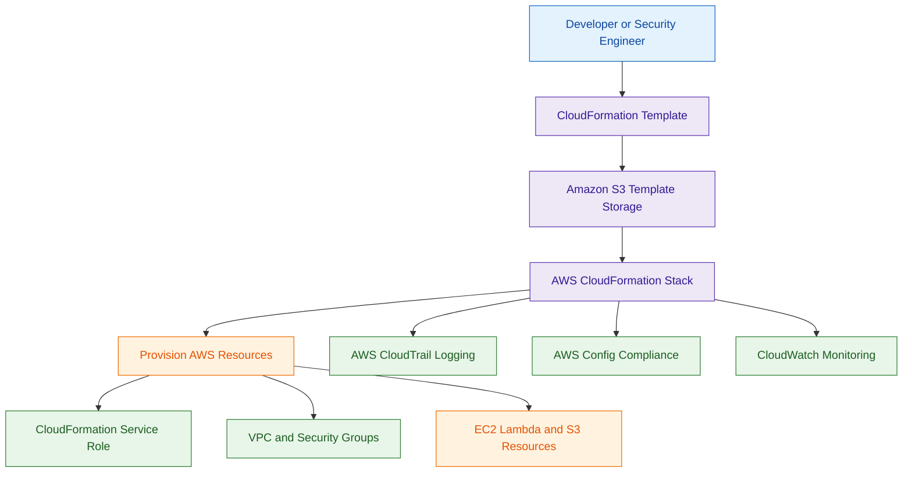

# AWS CloudFormation

## What Is AWS CloudFormation?

AWS CloudFormation is an Infrastructure as Code (IaC) service used to define, provision, and manage AWS resources using templates.

CloudFormation allows organizations to deploy infrastructure consistently using:

- YAML templates
- JSON templates

Resources can include:

- EC2 instances
- IAM roles
- VPCs
- Lambda functions
- S3 buckets
- security groups

Think of CloudFormation as:

> A service for automating AWS infrastructure deployment using code.

---

## Why It Matters for Security

CloudFormation is important for security because it enables:

- consistent infrastructure deployment
- secure configuration standardization
- automated provisioning
- repeatable security controls
- infrastructure auditing
- change tracking

Security teams use CloudFormation to:

- enforce security baselines
- deploy compliant infrastructure
- reduce configuration drift
- automate secure architectures

Infrastructure as Code is a major security best practice.

---

## Core Concepts

- infrastructure defined as code
- templates describe AWS resources
- stacks deploy infrastructure
- changesets preview modifications
- drift detection identifies configuration drift
- IAM controls deployment permissions
- templates can be version controlled

---

## Important Integrations

### AWS IAM

Controls:

- stack deployment permissions
- resource creation permissions
- administrative access

---

### Amazon S3

Used to store:

- CloudFormation templates
- nested stacks
- deployment artifacts

---

### AWS CloudTrail

Logs:

- stack operations
- API activity
- infrastructure changes

---

### Amazon CloudWatch

Provides:

- stack monitoring
- alarms
- operational visibility

---

### AWS Config

Useful for:

- compliance validation
- configuration auditing
- drift monitoring

---

### AWS Service Catalog

Can use CloudFormation templates for approved infrastructure deployments.

---

### AWS Systems Manager

Can automate:

- post-deployment operations
- patching
- remediation workflows

---

## Security Features

### Infrastructure as Code (IaC)

CloudFormation allows security controls to be deployed consistently across environments.

This reduces:

- manual configuration errors
- insecure deployments
- operational inconsistencies

---

### Least Privilege IAM

IAM permissions should restrict:

- stack creation
- resource modification
- template access

CloudFormation service roles should follow least privilege principles.

---

### CloudFormation Service Role

Very important exam concept.

CloudFormation can use a dedicated IAM role called a CloudFormation Service Role to provision resources on behalf of users.

Best practice:
- restrict permissions using least privilege
- avoid using overly permissive administrator roles

---

### Change Sets

Change Sets allow teams to preview infrastructure changes before deployment.

This helps reduce:

- accidental security misconfigurations
- unintended changes
- operational risk

---

### Drift Detection

CloudFormation Drift Detection identifies resources that were manually modified outside CloudFormation.

This helps detect:

- unauthorized changes
- configuration drift
- compliance violations
- operational inconsistencies

---

### Compliance Validation

CloudFormation commonly integrates with:

- AWS Config Rules
- CloudFormation Guard

to validate whether deployed infrastructure meets security and compliance requirements.

Example:
- prevent unencrypted S3 buckets
- restrict public security groups
- enforce tagging standards

---

### Dynamic References for Secrets

Sensitive values should not be hardcoded inside CloudFormation templates.

Best practice:
- use Dynamic References with:
  - AWS Secrets Manager
  - Systems Manager Parameter Store

This helps protect:

- passwords
- API keys
- database credentials
- tokens

---

### Template Security

Templates should be protected using:

- version control
- IAM restrictions
- S3 bucket policies
- encryption

Sensitive values should never be publicly accessible.

---

### Stack Policies

Stack policies can protect critical resources from unintended updates or deletion.

---

## CloudFormation StackSets

CloudFormation StackSets allow administrators to deploy CloudFormation stacks across:

- multiple AWS accounts
- multiple AWS Regions

Common use cases:

- deploying IAM roles organization-wide
- enforcing security baselines
- standardizing Config Rules
- centralized governance deployments

StackSets are heavily used in enterprise AWS Organizations environments.

---

## Architecture Example

### Secure Infrastructure Deployment Workflow

**Use case:** secure and repeatable AWS infrastructure deployment using CloudFormation.

---

## CloudFormation vs Terraform

| AWS CloudFormation | Terraform |
|---|---|
| AWS-native IaC service | third-party IaC platform |
| tightly integrated with AWS | multi-cloud support |
| uses stacks and templates | uses state files and providers |
| managed directly by AWS | managed by HashiCorp |
| commonly used in AWS-native environments | commonly used for hybrid and multi-cloud |

Use CloudFormation when:

- deploying AWS-native infrastructure
- using AWS-managed IaC
- integrating deeply with AWS services

Use Terraform when:

- managing multi-cloud environments
- deploying across multiple providers
- standardizing hybrid infrastructure

---

## Common Exam Traps

### Trap 1 — Hardcoding Secrets in Templates

Sensitive values should use:

- AWS Secrets Manager
- Systems Manager Parameter Store
- dynamic references

instead of hardcoded secrets.

---

### Trap 2 — Overly Broad IAM Permissions

CloudFormation service roles should follow:

- least privilege access

---

### Trap 3 — Ignoring Drift Detection

Resources modified manually outside CloudFormation can create:

- security inconsistencies
- compliance issues
- operational drift

---

### Trap 4 — Deploying Infrastructure Without Review

Use Change Sets to preview infrastructure modifications before deployment.

---

## 5-Second Recall

### Identity

CloudFormation = automated and repeatable AWS infrastructure deployment

---

### Keywords

If the scenario mentions:

- Infrastructure as Code
- standardized AWS environments
- preventing manual configuration drift
- repeatable secure deployments
- infrastructure governance

Answer:

→ AWS CloudFormation

---

### Secret Management Trigger

If the scenario asks how to securely reference secrets inside templates:

Answer:

→ Dynamic References with Secrets Manager

---

### Need drift detection for AWS resources?

→ AWS CloudFormation

---

### Need preview of infrastructure changes?

→ CloudFormation Change Sets

---

### Need multi-account infrastructure governance?

→ CloudFormation StackSets

---

### Need multi-cloud Infrastructure as Code?

→ Terraform

---

## Quick Revision Notes

- CloudFormation = AWS Infrastructure as Code service
- templates define AWS resources
- stacks deploy infrastructure
- Change Sets preview modifications
- Drift Detection identifies unauthorized changes
- StackSets deploy infrastructure across accounts and Regions
- IAM controls deployment permissions
- CloudFormation Service Role is a key security concept
- Config validates compliance
- CloudFormation Guard supports policy validation
- stack policies protect critical resources
- templates should not contain hardcoded secrets
- use Dynamic References with Secrets Manager
