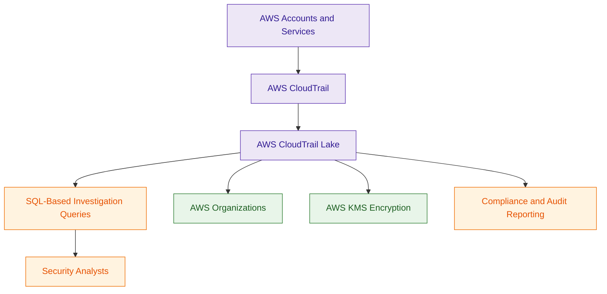

# AWS CloudTrail Lake

## What Is AWS CloudTrail Lake?

AWS CloudTrail Lake is a managed audit and security analytics service built on top of CloudTrail.

It allows organizations to:

- centrally store CloudTrail events
- query audit activity using SQL
- retain logs for long periods
- investigate AWS activity efficiently

CloudTrail Lake simplifies security investigations without requiring separate analytics infrastructure.

Think of CloudTrail Lake as:

> A managed audit log analytics platform for AWS activity.

---

## Why It Matters for Security

CloudTrail Lake helps security teams:

- investigate incidents
- perform forensic analysis
- query historical AWS activity
- centralize audit data
- simplify compliance reporting

Unlike traditional CloudTrail workflows that require:

- S3
- Athena
- custom queries

CloudTrail Lake provides built-in querying and retention capabilities.

It is especially useful for:

- large environments
- centralized investigations
- long-term audit analysis

CloudTrail Lake simplifies long-term audit analytics by combining:

- storage
- retention
- SQL querying
- centralized investigation workflows

into a managed service.

This reduces the operational overhead compared to managing:

- S3 buckets
- Athena
- Glue crawlers
- custom analytics pipelines

---

## Core Concepts

- stores CloudTrail events in event data stores
- supports SQL-based queries
- centralizes audit analytics
- supports long-term retention
- integrates with Organizations
- simplifies investigations and compliance analysis

---

## Important Integrations

### AWS CloudTrail

CloudTrail generates the events stored and analyzed inside CloudTrail Lake.

---

### AWS Organizations

Supports centralized audit analysis across multiple AWS accounts.

---

### AWS IAM

Controls:

- query permissions
- event data store access
- administrative actions

---

### AWS KMS

Encrypts:

- event data stores
- audit records

---

### Amazon EventBridge

Can integrate with automation and event-driven workflows.

---

### Amazon CloudWatch

Useful for:

- operational monitoring
- alarms
- visibility

---

## Security Features

### Centralized Audit Analytics

CloudTrail Lake centralizes audit analysis across:

- AWS accounts
- Regions
- organizational environments

This simplifies:

- investigations
- governance
- compliance workflows

---

### SQL-Based Investigation Queries

Security teams can run SQL queries against CloudTrail activity.

Example use cases:

- identify failed login attempts
- track IAM changes
- investigate suspicious API calls
- analyze historical activity

---

### Built-In SQL Query Engine

CloudTrail Lake supports native SQL-based querying without requiring Athena.

Security teams can directly investigate:

- API activity
- IAM changes
- suspicious actions
- historical audit events

using SQL queries against event data stores.

---

### Long-Term Retention

CloudTrail Lake supports configurable retention periods for audit data.

Useful for:

- compliance requirements
- forensic retention
- long-term investigations

---

### Immutable Audit Storage

CloudTrail Lake is designed for audit and compliance workloads.

Stored audit events cannot be modified after ingestion.

This supports:

- forensic integrity
- compliance requirements
- long-term audit retention

---

### Encryption

CloudTrail Lake supports encryption using:

- AWS KMS

to protect audit data.

---

### Multi-Account Visibility

Organizations can centralize CloudTrail Lake analysis across multiple AWS accounts using AWS Organizations.

---

### CloudTrail Lake Integrations

CloudTrail Lake can ingest:

- AWS CloudTrail events
- external audit events
- partner event sources

using APIs such as:

- PutAuditEvents

This helps centralize audit activity across hybrid and multi-environment infrastructures.

---

## Architecture Example

### Centralized Audit Analytics Workflow

**Use case:** centralized AWS audit analytics and forensic investigation using CloudTrail Lake.

---

## CloudTrail Lake vs Athena

| CloudTrail Lake | Amazon Athena |
|---|---|
| purpose-built for CloudTrail analytics | general-purpose SQL query service |
| managed event data stores | queries S3 data directly |
| built-in audit retention | requires S3 log management |
| optimized for CloudTrail investigations | supports broader analytics use cases |
| simplified audit workflows | more flexible analytics platform |

---

| Feature | S3 + Athena | CloudTrail Lake |
|---|---|---|
| setup complexity | higher | lower |
| infrastructure management | customer-managed | AWS-managed |
| retention management | S3 lifecycle policies | built-in retention |
| supported data | many S3 data sources | CloudTrail-focused audit data |
| SQL support | Athena queries | native SQL queries |
| primary use case | flexible analytics | managed audit investigations |

Use CloudTrail Lake when:

- investigating AWS audit activity
- simplifying CloudTrail analysis
- centralizing audit analytics
- performing forensic investigations

Use Athena when:

- querying many types of S3 data
- building custom analytics workflows
- analyzing broader datasets

---

## Common Exam Traps

### Trap 1 — Confusing CloudTrail and CloudTrail Lake

CloudTrail:
- captures AWS API activity

CloudTrail Lake:
- analyzes and queries audit activity

---

### Trap 2 — Assuming Athena Is Required

CloudTrail Lake provides built-in SQL query capability without requiring Athena.

---

### Trap 3 — Ignoring Retention Requirements

CloudTrail Lake retention settings are important for:

- compliance
- governance
- forensic investigations

---

### Trap 4 — Forgetting Multi-Account Governance

CloudTrail Lake commonly integrates with:

- AWS Organizations

for centralized enterprise auditing.

---

## 5-Second Recall

### Identity

CloudTrail Lake = managed audit analytics platform for CloudTrail data

---

### Keywords

If the scenario mentions:

- SQL queries for CloudTrail
- centralized audit investigations
- long-term CloudTrail analytics
- forensic audit analysis
- managed CloudTrail querying

Answer:

→ AWS CloudTrail Lake

---

### Athena Trigger

If the requirement involves:

- querying many log types
- broad S3 analytics
- flexible analytics workflows

Answer:

→ Amazon Athena

---

### CloudTrail Lake Trigger

If the requirement involves:

- managed audit analytics
- immutable CloudTrail retention
- centralized organization audit investigations
- built-in SQL querying for CloudTrail

Answer:

→ AWS CloudTrail Lake

---

### Need built-in CloudTrail analytics?

→ AWS CloudTrail Lake

---

### Need general S3 analytics?

→ Amazon Athena

---

### Need centralized multi-account audit investigations?

→ CloudTrail Lake + Organizations

---

### Need long-term forensic audit analysis?

→ AWS CloudTrail Lake

---

## Quick Revision Notes

- CloudTrail Lake analyzes CloudTrail audit activity
- uses SQL-based queries
- stores data in event data stores
- supports long-term retention
- Organizations enables centralized auditing
- KMS encrypts audit data
- simplifies forensic investigations
- supports immutable audit storage
- Athena is broader S3 analytics
- CloudTrail captures activity
- CloudTrail Lake analyzes activity
- PutAuditEvents supports external audit ingestion
