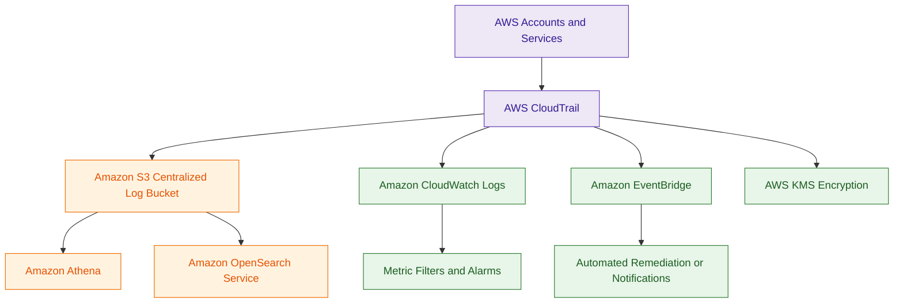

# AWS CloudTrail

## What Is AWS CloudTrail?

AWS CloudTrail is a logging and auditing service that records AWS API activity across an AWS account.

CloudTrail captures:

- API calls
- console activity
- SDK activity
- CLI activity
- service actions

It helps organizations monitor and investigate activity occurring inside AWS environments.

Think of CloudTrail as:

> The audit trail for AWS account activity.

---

## Why It Matters for Security

CloudTrail is one of the most important security services in AWS.

Security teams use CloudTrail for:

- incident investigations
- threat detection
- compliance auditing
- account activity monitoring
- forensic analysis
- change tracking

CloudTrail helps answer questions such as:

- Who performed an action?
- When did it occur?
- Which resource was affected?
- From which IP address?
- Was the request successful?

CloudTrail is foundational for:

- detection
- governance
- incident response

Many AWS security architectures begin with CloudTrail log collection and analysis.

---

## Core Concepts

- records AWS API activity
- supports management and data events
- logs can be stored in S3
- integrates with CloudWatch and EventBridge
- supports multi-account logging
- helps with investigations and auditing
- event history provides recent account activity

---

## Important Integrations

### Amazon S3

Used for:

- long-term CloudTrail log storage
- centralized audit logging
- forensic retention

---

### Amazon CloudWatch

Provides:

- monitoring
- metric filters
- alarms
- detection workflows

---

### Amazon EventBridge

Can trigger:

- automation
- notifications
- remediation workflows

based on CloudTrail events.

---

### AWS IAM

Controls:

- CloudTrail access
- trail management
- log visibility

---

### AWS KMS

Encrypts:

- CloudTrail log files
- centralized logging buckets

---

### AWS Organizations

Supports organization-wide CloudTrail logging across multiple AWS accounts.

---

### Amazon Athena

Can query CloudTrail logs stored in S3 for investigations and analysis.

---

### Amazon OpenSearch Service

Useful for:

- log analytics
- dashboards
- threat hunting
- visualization

---

### AWS Security Hub

Can aggregate security findings generated from CloudTrail analysis.

---

## Security Features

### API Activity Logging

CloudTrail records:

- console logins
- IAM changes
- resource creation
- policy modifications
- service API calls

This provides audit visibility across AWS environments.

---

### Management Events

Management events track:

- account activity
- administrative actions
- control plane operations

Example:

- IAM changes
- EC2 instance creation
- security group modifications

---

### Data Events

Data events provide visibility into resource-level activity such as:

- S3 object access
- Lambda invocation activity

Data events are more detailed but may increase costs.

---

### Log File Integrity Validation

CloudTrail supports log file validation to help detect:

- tampering
- modification
- deletion attempts

Very important forensic capability.

---

### Encryption

CloudTrail logs should use:

- AWS KMS encryption
- secure S3 bucket policies
- restricted IAM access

---

### Real-Time Detection and Automation

CloudTrail events can trigger:

- EventBridge rules
- Lambda remediation workflows
- SNS notifications
- automated incident response

This enables near real-time security detection and remediation workflows.

---

### Historical Investigation and Forensics

CloudTrail logs stored in Amazon S3 support:

- long-term retention
- forensic investigations
- compliance auditing
- historical activity analysis

Services such as Athena and OpenSearch can analyze historical CloudTrail logs.

---

### Metric Filters and Pattern Detection

CloudTrail logs sent to CloudWatch Logs can use Metric Filters to detect suspicious activity patterns.

Example:

- repeated AccessDenied errors
- unauthorized API calls
- root account usage
- security group modifications

Metric Filters commonly trigger CloudWatch Alarms and automated responses.

---

### Organizational Trails

Organizations commonly use Organization Trails with AWS Organizations.

This allows a single CloudTrail configuration to collect logs across:

- multiple AWS accounts
- organizational units
- enterprise environments

Organization Trails are heavily used for:

- centralized governance
- compliance monitoring
- enterprise-wide investigations

---

## Architecture Example

### Centralized AWS Audit Logging

**Use case:** centralized AWS API auditing, monitoring, and security investigation using CloudTrail.

---

## CloudTrail vs CloudWatch Logs

| AWS CloudTrail | CloudWatch Logs |
|---|---|
| records AWS API activity | stores application and system logs |
| focuses on auditing and governance | focuses on operational logging |
| tracks AWS account actions | tracks workload and application activity |
| supports forensic investigations | supports operational monitoring |
| logs control plane activity | logs application runtime activity |

Use CloudTrail when:

- auditing AWS API actions
- investigating account activity
- monitoring IAM changes
- performing forensic analysis

Use CloudWatch Logs when:

- monitoring applications
- storing system logs
- analyzing workload activity
- troubleshooting runtime issues

---

## Common Exam Traps

### Trap 1 — Confusing CloudTrail and CloudWatch

CloudTrail:
- AWS API auditing

CloudWatch:
- operational monitoring and logs

---

### Trap 2 — Forgetting Data Events

S3 object-level access requires:

- CloudTrail Data Events

not just Management Events.

---

### Trap 3 — Storing Logs Without Protection

CloudTrail logs should use:

- KMS encryption
- restricted S3 bucket policies
- log validation

---

### Trap 4 — Using Single-Account Logging Only

Best practice:

- centralize logs across AWS Organizations

---

### Trap 5 — Ignoring Log Integrity Validation

Log validation helps detect:

- tampering
- deleted logs
- modified audit records

---

## 5-Second Recall

### Identity

CloudTrail = AWS API auditing and account activity logging

---

### Keywords

If the scenario mentions:

- AWS API activity
- auditing
- forensic investigations
- IAM changes
- account activity tracking
- who performed an action

Answer:

→ AWS CloudTrail

---

### Real-Time Trigger

If the scenario requires:

- near real-time remediation
- automated security response
- event-driven workflows

Answer:

→ CloudTrail → EventBridge → Lambda

---

### Historical Investigation Trigger

If the scenario involves:

- forensic analysis
- historical investigations
- querying old activity logs

Answer:

→ CloudTrail → S3 → Athena

---

### Pattern Detection Trigger

If the requirement involves:

- counting suspicious API activity
- detecting repeated failures
- monitoring specific events

Answer:

→ CloudTrail → CloudWatch Logs → Metric Filters

---

### Need S3 object-level logging?

→ CloudTrail Data Events

---

### Need centralized AWS audit logging?

→ CloudTrail + S3 + Organizations

---

### Need log analytics for investigations?

→ Athena or OpenSearch with CloudTrail logs

---

### Need operational application logs?

→ CloudWatch Logs

---

## Quick Revision Notes

- CloudTrail records AWS API activity
- supports management and data events
- S3 stores centralized audit logs
- CloudWatch supports alarms and monitoring
- EventBridge enables automation workflows
- Athena queries CloudTrail logs
- OpenSearch supports log analytics
- KMS encrypts CloudTrail logs
- Organizations supports centralized logging
- Organization Trails support multi-account governance
- log file validation detects tampering
- foundational service for detection and investigations
