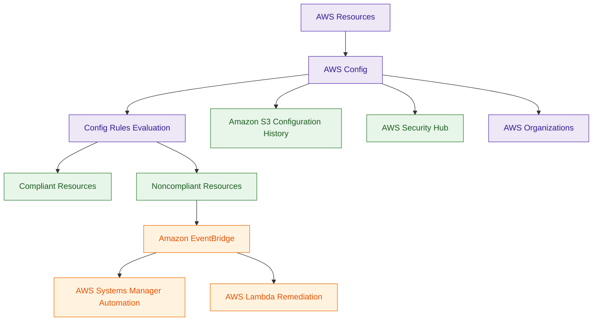

# AWS Config

## What Is AWS Config?

AWS Config is a configuration management and compliance monitoring service that tracks AWS resource configurations over time.

AWS Config helps organizations:

- record resource configurations
- evaluate compliance
- detect configuration drift
- monitor infrastructure changes
- audit AWS environments

Think of AWS Config as:

> A continuous configuration tracking and compliance monitoring service for AWS resources.

---

## Why It Matters for Security

AWS Config is critical for:

- compliance monitoring
- governance
- configuration auditing
- security baseline enforcement
- drift detection
- change tracking

Security teams use AWS Config to:

- detect noncompliant resources
- enforce security standards
- monitor configuration changes
- investigate infrastructure drift
- automate remediation workflows

AWS Config is heavily used in enterprise governance architectures.

AWS Config is foundational for:

- governance
- compliance monitoring
- infrastructure security
- continuous assessment
- self-healing environments

Unlike event-driven services, Config continuously evaluates the current security posture of AWS resources.

---

## Core Concepts

- records AWS resource configurations
- evaluates resources against rules
- tracks configuration history
- supports compliance monitoring
- integrates with Organizations
- enables automated remediation
- supports conformance packs

---

## Important Integrations

### AWS Organizations

Supports centralized compliance management across multiple AWS accounts.

---

### AWS CloudTrail

CloudTrail records API activity while Config tracks resulting resource configuration states.

---

### AWS Systems Manager

Can automate remediation workflows for noncompliant resources.

---

### Amazon EventBridge

Can trigger:

- remediation workflows
- notifications
- compliance automation

based on Config events.

---

### AWS Lambda

Used for:

- custom Config Rules
- automated remediation
- compliance workflows

---

### AWS IAM

Controls:

- Config access
- rule management
- remediation permissions

---

### Amazon S3

Stores:

- configuration snapshots
- configuration history
- compliance records

---

### AWS Security Hub

Can aggregate Config findings into centralized security dashboards.

---

## Security Features

### Configuration Tracking

AWS Config continuously records configuration states for AWS resources.

This helps detect:

- unauthorized changes
- configuration drift
- compliance violations

---

### State-Based Compliance Monitoring

AWS Config focuses on the current configuration state of resources.

Examples:

- Is encryption enabled?
- Is the security group publicly exposed?
- Is MFA enabled?
- Is the S3 bucket compliant?

This differs from CloudTrail, which records API actions and events.

---

### Config Rules

Config Rules evaluate resources against security and compliance requirements.

Examples:

- encrypted EBS volumes
- restricted security groups
- MFA-enabled root account
- S3 bucket encryption enabled

Rules can be:

- AWS managed
- custom Lambda-based rules

---

### Drift Detection

AWS Config helps identify when resources no longer match approved security baselines.

Very important governance capability.

---

### Built-In Remediation Actions

AWS Config can trigger remediation workflows automatically when resources become noncompliant.

Common remediation targets:

- remove public S3 access
- enforce encryption
- correct security group rules
- restore approved configurations

Remediation commonly uses:

- Systems Manager Automation
- AWS Lambda
- EventBridge workflows

---

### Automated Remediation

Noncompliant resources can trigger:

- Systems Manager Automation
- Lambda remediation workflows
- EventBridge automation

for near real-time correction.

---

### Configuration History

AWS Config stores historical resource configurations for:

- investigations
- auditing
- compliance reporting
- forensic analysis

---

### Conformance Packs

Conformance Packs bundle multiple Config Rules together to enforce security and compliance standards at scale.

Common use cases:

- CIS benchmarks
- organizational governance
- regulatory compliance

---

### AWS Config Aggregators

AWS Config Aggregators provide centralized compliance visibility across:

- multiple AWS accounts
- multiple AWS Regions
- AWS Organizations environments

This is heavily used in enterprise governance architectures.

---

## Architecture Example

### Continuous Compliance Monitoring Workflow

**Use case:** continuous AWS compliance monitoring and automated remediation using AWS Config.

---

## AWS Config vs CloudTrail

| AWS Config | AWS CloudTrail |
|---|---|
| tracks resource configuration states | records AWS API activity |
| focuses on compliance and governance | focuses on auditing and investigations |
| evaluates resources against rules | tracks who performed actions |
| detects configuration drift | detects API activity |
| supports compliance automation | supports forensic investigations |

---

| Feature | AWS CloudTrail | AWS Config |
|---|---|---|
| focus | API activity | resource configuration state |
| primary question | Who changed something? | Is the resource compliant? |
| monitoring type | event-based | state-based |
| key use case | auditing and investigations | compliance and governance |
| remediation style | custom automation | built-in remediation workflows |

Use AWS Config when:

- monitoring compliance
- detecting configuration drift
- enforcing security baselines
- tracking resource states

Use CloudTrail when:

- auditing AWS API calls
- investigating account activity
- monitoring IAM changes
- performing forensic analysis

---

## CloudFormation Drift Detection vs AWS Config

| CloudFormation Drift Detection | AWS Config |
|---|---|
| compares resources to CloudFormation templates | compares resources to compliance rules |
| focuses on IaC consistency | focuses on governance and compliance |
| detects template drift | detects policy violations |
| infrastructure deployment focused | continuous compliance focused |

Use CloudFormation Drift Detection when:

- validating Infrastructure as Code consistency

Use AWS Config when:

- enforcing organization-wide compliance policies

---

## Common Exam Traps

### Trap 1 — Confusing Config and CloudTrail

Config:
- tracks resource configuration states

CloudTrail:
- records API activity

---

### Trap 2 — Forgetting Automated Remediation

Config commonly integrates with:

- Systems Manager
- Lambda
- EventBridge

for automated compliance correction.

---

### Trap 3 — Assuming Config Prevents Changes

Config detects and evaluates changes.

It does not directly prevent changes.

---

### Trap 4 — Ignoring Multi-Account Governance

AWS Config commonly integrates with:

- AWS Organizations
- Conformance Packs
- Config Aggregators

for enterprise governance.

---

## 5-Second Recall

### Identity

AWS Config = continuous configuration compliance and governance service

---

### Keywords

If the scenario mentions:

- compliance monitoring
- configuration drift
- security baseline enforcement
- resource configuration history
- continuous compliance

Answer:

→ AWS Config

---

### State Trigger

If the scenario asks:

- Is the resource compliant right now?
- Is encryption enabled?
- Is the configuration approved?

Answer:

→ AWS Config

---

### Action Trigger

If the scenario asks:

- Who changed the resource?
- Which API call modified the bucket?
- Who deleted the IAM role?

Answer:

→ AWS CloudTrail

---

### Self-Healing Trigger

If the requirement involves:

- automatic compliance correction
- reverting insecure changes
- enforcing governance automatically

Answer:

→ AWS Config + Systems Manager or Lambda

---

### Need compliance evaluation rules?

→ Config Rules

---

### Need automated compliance remediation?

→ Config + Systems Manager or Lambda

---

### Need organization-wide compliance governance?

→ AWS Config + Organizations

---

### Need AWS API auditing?

→ AWS CloudTrail

---

## Quick Revision Notes

- AWS Config tracks AWS resource configurations
- Config Rules evaluate compliance
- detects configuration drift
- supports automated remediation
- Systems Manager and Lambda automate corrections
- Conformance Packs enforce standards at scale
- Config Aggregators centralize governance visibility
- S3 stores configuration history
- Organizations enables centralized governance
- Security Hub aggregates compliance findings
- CloudTrail records API activity
- Config tracks resulting resource states
- state-based monitoring is a key concept
