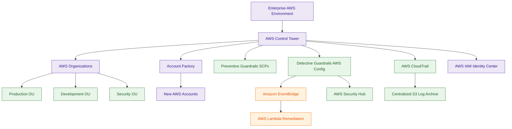

# AWS Control Tower

## What Is AWS Control Tower?

AWS Control Tower is a governance and multi-account management service that automates the setup of secure AWS environments using AWS Organizations.

It helps organizations create and manage:

- governed AWS accounts
- organizational units (OUs)
- centralized logging
- security baselines
- compliance guardrails
- standardized account provisioning

Think of Control Tower as:

> A secure multi-account governance framework for AWS environments.

---

## Why It Matters for Security

AWS Control Tower is foundational for enterprise AWS governance.

Security teams use Control Tower for:

- multi-account governance
- centralized security controls
- standardized account onboarding
- compliance enforcement
- account isolation
- enterprise-scale AWS management

Control Tower helps organizations:

- reduce configuration drift
- standardize security baselines
- enforce governance automatically
- centralize audit visibility
- separate workloads securely

It is heavily used in environments requiring:

- regulated workloads
- centralized governance
- secure account vending
- scalable AWS operations

Control Tower becomes especially important as AWS environments grow across:

- teams
- departments
- business units
- production environments

---

## Core Concepts

- built on AWS Organizations
- automates landing zone deployment
- supports preventive and detective guardrails
- centralizes logging and auditing
- provisions accounts using Account Factory
- organizes accounts into OUs
- standardizes governance across AWS accounts

---

## Important Integrations

### AWS Organizations

Provides:

- multi-account management
- organizational units
- SCP enforcement
- consolidated billing

Control Tower is built on top of AWS Organizations.

---

### AWS Config

Used for:

- detective guardrails
- compliance evaluation
- resource state monitoring

Many Control Tower detective controls rely on AWS Config rules.

---

### AWS CloudTrail

Provides:

- centralized audit logging
- account activity visibility
- API auditing

CloudTrail logs are commonly aggregated into centralized logging accounts.

---

### AWS IAM Identity Center

Provides:

- centralized identity management
- federated access
- enterprise authentication

Often integrated directly into the landing zone.

---

### Amazon EventBridge

Can trigger:

- governance workflows
- remediation automation
- security notifications

based on compliance events.

---

### AWS Lambda

Commonly used for:

- automated remediation
- governance enforcement
- event-driven responses

---

### AWS Security Hub

Can aggregate:

- compliance findings
- security alerts
- guardrail violations

across multiple AWS accounts.

---

### Amazon S3

Stores:

- centralized CloudTrail logs
- Config snapshots
- governance data
- audit archives

---

### AWS KMS

Encrypts:

- centralized logging buckets
- Config data
- CloudTrail logs

---

## Security Features

### Landing Zone Deployment

Control Tower automates secure landing zone creation including:

- AWS Organizations setup
- centralized logging
- account structure
- governance controls
- identity integration

This establishes a secure enterprise AWS foundation.

---

### Preventive Guardrails

Preventive guardrails use Service Control Policies (SCPs) to block noncompliant actions.

Examples:

- denying public S3 access
- preventing CloudTrail deletion
- restricting unsupported AWS Regions

Preventive controls stop actions before they occur.

---

### Detective Guardrails

Detective guardrails identify noncompliant resources using AWS Config.

Examples:

- unencrypted EBS volumes
- unrestricted security groups
- disabled logging configurations

Detective controls identify violations after deployment.

---

### Centralized Logging

Control Tower commonly centralizes:

- CloudTrail logs
- AWS Config snapshots
- governance telemetry

into dedicated audit and logging accounts.

This improves:

- investigations
- compliance auditing
- forensic analysis

---

### Automated Account Provisioning

Account Factory standardizes AWS account creation.

Provisioned accounts commonly include:

- security baselines
- IAM roles
- logging configuration
- networking standards
- governance controls

This reduces inconsistent account setups.

---

### Multi-Account Isolation

Control Tower encourages separation between:

- production
- development
- sandbox
- security operations
- shared services

This reduces blast radius and improves governance.

---

### Organizational Governance

Control Tower simplifies governance across:

- multiple AWS accounts
- business units
- enterprise environments

using centralized policy management.

---

### Governance Automation

Control Tower integrates with:

- EventBridge
- Lambda
- Config
- Security Hub

to support automated governance workflows and remediation pipelines.

---

## Architecture Example

### Enterprise Multi-Account Governance

**Use case:** centralized enterprise governance, secure account provisioning, and automated compliance enforcement across multiple AWS accounts.

---

## Control Tower vs AWS Organizations

| AWS Control Tower | AWS Organizations |
|---|---|
| governance framework | core multi-account management service |
| automates landing zones | manages account hierarchy |
| provides guardrails | provides SCPs |
| standardizes account provisioning | manages AWS accounts |
| includes governance automation | focuses on account organization |

Use Control Tower when:

- building enterprise landing zones
- automating governance
- enforcing account standards
- standardizing AWS environments

Use AWS Organizations when:

- managing account hierarchy
- applying SCPs
- consolidating billing
- organizing AWS accounts

---

## Control Tower vs AWS Config

| AWS Control Tower | AWS Config |
|---|---|
| enterprise governance platform | compliance and configuration tracking |
| manages landing zones | tracks resource state |
| applies governance guardrails | evaluates compliance rules |
| orchestrates multi-account governance | focuses on resource compliance |

Use Control Tower when:

- governing AWS accounts
- automating enterprise setup
- enforcing organization-wide standards

Use Config when:

- monitoring compliance
- tracking configuration drift
- evaluating resource state

---

## Common Exam Traps

### Trap 1 — Confusing Control Tower and Organizations

Organizations:
- foundational account management

Control Tower:
- governance automation built on Organizations

---

### Trap 2 — Confusing Preventive and Detective Guardrails

Preventive:
- block actions using SCPs

Detective:
- identify violations using AWS Config

---

### Trap 3 — Assuming Detective Guardrails Block Actions

Detective guardrails:
- detect violations
- generate findings

They do not prevent resource creation.

---

### Trap 4 — Ignoring Centralized Logging

Control Tower environments commonly centralize:

- CloudTrail logs
- Config snapshots
- audit telemetry

into dedicated accounts.

---

### Trap 5 — Thinking Account Factory Only Creates Accounts

Account Factory also standardizes:

- governance
- IAM roles
- logging
- security baselines
- networking

---

## 5-Second Recall

### Identity

Control Tower = enterprise multi-account governance and landing zone automation

---

### Keywords

If the scenario mentions:

- landing zones
- governed AWS accounts
- account vending
- enterprise governance
- centralized multi-account management
- guardrails
- organizational governance

Answer:

→ AWS Control Tower

---

### Preventive Governance Trigger

If the requirement involves:

- blocking noncompliant actions
- restricting AWS services
- enforcing account restrictions

Answer:

→ Preventive Guardrails using SCPs

---

### Compliance Detection Trigger

If the requirement involves:

- detecting violations
- compliance monitoring
- identifying drift

Answer:

→ Detective Guardrails using AWS Config

---

### Automated Governance Trigger

If the scenario requires:

- automatic remediation
- governance workflows
- event-driven compliance

Answer:

→ Config → EventBridge → Lambda

---

### Need centralized enterprise logging?

→ Control Tower + CloudTrail + S3

---

### Need standardized account provisioning?

→ Account Factory

---

### Need secure multi-account isolation?

→ Control Tower + AWS Organizations + OUs

---

### Need centralized enterprise access?

→ IAM Identity Center integration

---

## Quick Revision Notes

- Control Tower automates AWS landing zones
- built on AWS Organizations
- supports preventive and detective guardrails
- preventive controls use SCPs
- detective controls use AWS Config
- Account Factory provisions governed AWS accounts
- centralized logging is a core architecture pattern
- integrates heavily with CloudTrail and Config
- supports enterprise-scale governance
- improves account standardization
- commonly used for regulated environments
- supports automated governance workflows
- reduces configuration drift across AWS accounts
