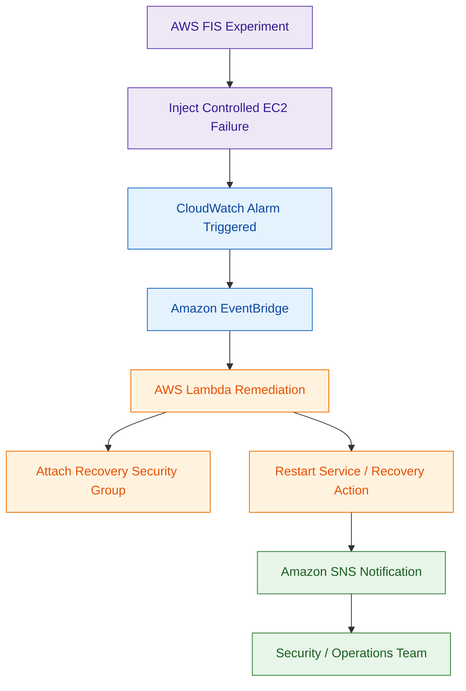

# AWS Fault Injection Service (AWS FIS)

## What Is AWS Fault Injection Service?

AWS Fault Injection Service (AWS FIS) is a managed chaos engineering service used to test how AWS workloads behave during failures.

It allows organizations to safely inject controlled failures into AWS environments to validate:

- resiliency
- recovery procedures
- monitoring systems
- automation workflows
- incident response readiness

AWS FIS can simulate:

- EC2 failures
- CPU stress
- network disruptions
- Availability Zone failures
- EKS pod failures
- API throttling

Think of AWS FIS as:

> A controlled failure-testing platform for validating resilience and recovery.

---

## Why AWS FIS Matters for Security

Security teams use AWS FIS to verify whether:

- alerts trigger correctly
- automated remediation works
- failover mechanisms succeed
- recovery procedures function properly
- monitoring systems detect failures

Modern security architectures must not only detect attacks, but also survive failures and recover safely.

AWS FIS helps validate that readiness.

---

## Core Concepts

- experiments inject controlled failures
- experiment templates define test behavior
- stop conditions prevent unsafe testing
- CloudWatch alarms can stop experiments automatically
- IAM controls experiment permissions
- experiments should start with small blast radius

---

## Common Security Use Cases

### Incident Response Validation

Validate whether:

- EC2 isolation workflows work
- Lambda remediation triggers correctly
- alerts are generated properly

---

### Disaster Recovery Testing

Test:

- failover procedures
- multi-AZ resilience
- recovery automation
- restoration workflows

---

### Monitoring Validation

Verify whether:

- CloudWatch alarms trigger
- EventBridge workflows activate
- SNS notifications work
- Security Hub receives findings

---

### EKS Resilience Testing

Simulate:

- pod failures
- node interruptions
- Kubernetes instability

---

### Security Automation Testing

Validate:

- Lambda remediation
- Systems Manager automation
- rollback procedures
- operational playbooks

---
## Example Use Case: Automated Recovery Validation

---

## Important Integrations

### Amazon CloudWatch

Used for:

- monitoring
- alarms
- stop conditions
- dashboards

---

### Amazon EventBridge

Used to trigger:

- automation workflows
- notifications
- remediation pipelines

---

### AWS Lambda

Commonly performs:

- remediation
- automation logic
- recovery actions

---

### AWS Systems Manager

Useful for:

- operational recovery
- automation
- remediation workflows

---

### Amazon EC2

FIS commonly tests:

- EC2 instance resilience
- Auto Scaling behavior
- recovery workflows

---

### Amazon EKS

Supports:

- Kubernetes fault injection
- pod disruption testing
- node failure simulation

---

### AWS CloudTrail

CloudTrail logs:

- experiment activity
- API calls
- configuration changes

---

## Security Features

### Controlled Experimentation

Experiments are:

- intentional
- monitored
- controlled
- reversible

---

### Stop Conditions

Very important safety feature.

Experiments stop automatically if:

- alarms trigger
- workloads become unstable
- thresholds are exceeded

---

### IAM-Based Access Control

IAM policies should restrict:

- who can run experiments
- target resources
- destructive actions

---

### Operational Validation

AWS FIS validates whether:

- monitoring works
- recovery succeeds
- automation behaves correctly

---

## Common Exam Scenarios

### Scenario 1

A company wants to test whether automated EC2 remediation workflows trigger correctly during failures.

Answer:

AWS Fault Injection Service

---

### Scenario 2

A company needs to simulate Availability Zone failure to validate workload resiliency.

Answer:

AWS Fault Injection Service

---

### Scenario 3

A security team wants to verify that CloudWatch alarms and EventBridge workflows activate during failures.

Answer:

AWS Fault Injection Service

---

### Scenario 4

A company wants controlled chaos engineering experiments for EKS workloads.

Answer:

AWS Fault Injection Service

---

## Common Exam Traps

### Trap 1 — Forgetting Stop Conditions

Always configure:

- CloudWatch alarms
- stop conditions
- rollback planning

---

### Trap 2 — Using Broad IAM Permissions

FIS permissions should follow:

- least privilege access

---

### Trap 3 — Confusing FIS with Load Testing

AWS FIS:
- validates resilience and recovery

Load testing:
- validates scalability and performance

---

### Trap 4 — Testing Production Without Controls

Best practice:

- start small
- limit blast radius
- test gradually

---

## Quick Revision Notes

- AWS FIS = managed chaos engineering service
- used for resilience and recovery testing
- supports EC2 and EKS fault injection
- validates monitoring and remediation workflows
- integrates with CloudWatch alarms
- stop conditions are critical
- EventBridge and Lambda commonly automate responses
- CloudTrail logs experiment activity
- useful for disaster recovery validation
