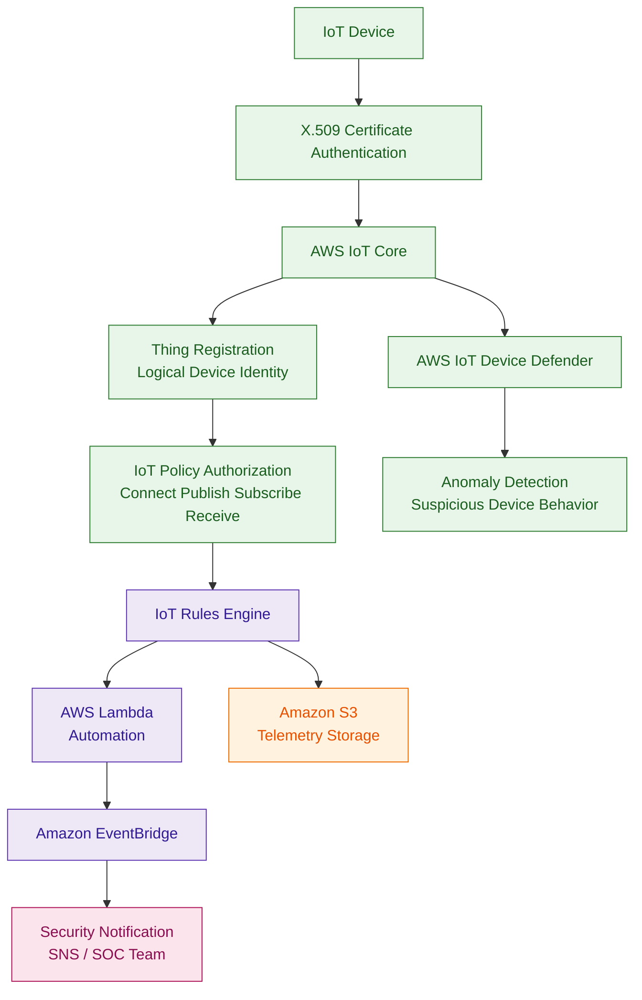

# AWS IoT Core

## What Is AWS IoT Core?

AWS IoT Core is a managed cloud service that allows Internet of Things (IoT) devices to securely connect, communicate, and exchange data with AWS services.

IoT devices can include:

- sensors
- cameras
- medical devices
- industrial equipment
- smart home devices
- vehicles

AWS IoT Core supports protocols such as:

- MQTT
- HTTPS
- WebSockets

Think of AWS IoT Core as:

> A secure communication gateway between IoT devices and AWS cloud services.

---

## Why AWS IoT Core Matters for Security

IoT environments create major security challenges because organizations may manage:

- thousands or millions of devices
- remote deployments
- untrusted networks
- sensitive telemetry data

Security teams must protect:

- device identities
- certificates
- communication channels
- telemetry data
- device permissions
- IoT policies

Compromised IoT devices can become:

- attack entry points
- botnet members
- data exfiltration paths

---

## Core Concepts

- devices authenticate using X.509 certificates
- IoT policies control device permissions
- MQTT is commonly used for messaging
- Device Shadow stores device state
- rules route IoT data to AWS services
- TLS secures communication
- every device should have a unique identity
- a "Thing" represents a registered IoT device in AWS IoT Core

---

## What Is a Thing?

A Thing is a logical representation of an IoT device inside AWS IoT Core.

A Thing commonly includes:

- device identity
- certificates
- metadata
- attached IoT policies
- device attributes

Example:

```text
Thing Name: factory-sensor-01
```

Best practice:
- register each device as its own Thing
- avoid shared identities
- attach least privilege IoT policies

---

## Common Security Use Cases

### Secure Device Communication

IoT Core encrypts communication between:

- devices
- applications
- AWS services

using TLS.

---

### Device Authentication

Devices authenticate using:

- X.509 certificates

Best practice:
- unique certificate per device

---

### Least Privilege Device Access

IoT policies should restrict:

- allowed MQTT topics
- publish actions
- subscribe actions
- receive permissions

---

### Telemetry Monitoring

Organizations can monitor device activity for:

- anomalies
- suspicious behavior
- unusual traffic
- device compromise

---

### Automated Security Actions

IoT events can trigger:

- Lambda remediation
- SNS notifications
- device quarantine workflows
- EventBridge automation

---

## How AWS IoT Core Works

### Basic Workflow

1. Device connects to AWS IoT Core
2. Device authenticates using certificates
3. IoT policy authorizes device actions
4. Device publishes telemetry data
5. Rules engine routes messages
6. AWS services process data and automation workflows

---

### Simple Architecture

```text
IoT Device
     ↓
Certificate Authentication
     ↓
AWS IoT Core
     ↓
IoT Policy Authorization
     ↓
IoT Rules Engine
     ↓
Lambda / S3 / DynamoDB / Analytics
```
---
### Example Use Case: Secure IoT device authentication, authorization, telemetry processing, and anomaly detection using AWS IoT Core.

---

## Important Components

### Things

Things represent IoT devices inside AWS IoT Core.

Each Thing can have:

- certificates
- IoT policies
- metadata
- attributes

---

### Device Certificates

Devices commonly authenticate using:

- X.509 certificates

---

### IoT Policies

IoT policies control data-plane actions such as:

- Connect
- Publish
- Subscribe
- Receive

IoT policies are similar to IAM policies, but they specifically control AWS IoT Core permissions.

---

### MQTT Messaging

MQTT is a lightweight publish/subscribe messaging protocol commonly used for IoT communication.

---

### Device Shadow

Device Shadow stores:

- desired state
- reported state

Useful for disconnected or offline devices.

---

### Rules Engine

The rules engine routes IoT messages to AWS services such as:

- Lambda
- S3
- DynamoDB
- Kinesis
- OpenSearch

---

## Important Integrations

### AWS Lambda

Used for:

- automation
- remediation
- event processing

---

### Amazon S3

Used for:

- telemetry storage
- log retention
- analytics datasets

---

### Amazon DynamoDB

Useful for:

- device metadata
- device state
- operational tracking

---

### Amazon CloudWatch

Provides:

- metrics
- dashboards
- alarms
- monitoring

---

### AWS IoT Device Defender

Very important IoT security service.

Used for:

- auditing IoT configurations
- detecting anomalies
- monitoring device behavior

---

### AWS IAM

IAM controls:

- administrative access
- backend service permissions
- operational access

---

### AWS KMS

KMS helps encrypt:

- backend storage
- telemetry data
- logs

---

### Amazon EventBridge

Can trigger:

- automation
- notifications
- remediation workflows

---

### AWS CloudTrail

CloudTrail logs:

- IoT API activity
- certificate operations
- policy changes

---

## Security Features

### Mutual TLS Authentication

Devices authenticate using TLS certificates.

This secures device communication.

---

### IoT Policy Least Privilege

Even if a device successfully authenticates using a valid certificate, it still requires an AWS IoT policy to perform actions.

IoT policies control permissions such as:

- Connect
- Publish
- Subscribe
- Receive

Best practice:

- restrict devices to only required MQTT topics
- avoid wildcard permissions
- assign unique permissions per device or Thing group

Example:

A temperature sensor should only publish to:

```text
sensors/temperature/device123
```

and should not publish to all topics.

---

### Unique Device Identities

Each device should have:

- unique certificates
- unique Thing registration
- separate permissions

Avoid shared credentials.

---

### Device Defender Audits

Device Defender can identify:

- insecure policies
- overly permissive access
- missing certificates
- anomalous behavior

---

### Encryption in Transit

Communication uses:

- TLS encryption

to secure traffic between devices and AWS.

---

### Device Isolation

Compromised devices can be:

- quarantined
- blocked
- isolated

using IoT policies and automation workflows.

---

## Common Exam Scenarios

### Scenario 1

A company needs secure authentication for millions of IoT devices.

Answer:

Use AWS IoT Core with X.509 certificates.

---

### Scenario 2

A company wants fine-grained topic permissions for devices.

Answer:

Use AWS IoT policies.

---

### Scenario 3

A company needs to detect anomalous IoT device behavior.

Answer:

Use AWS IoT Device Defender.

---

### Scenario 4

A security team wants IoT events to automatically trigger remediation workflows.

Answer:

Use AWS IoT Core with Lambda and EventBridge.

---

### Scenario 5

A company needs secure encrypted communication between devices and AWS.

Answer:

Use TLS with AWS IoT Core.

---

## Common Exam Traps

### Trap 1 — Confusing Authentication and Authorization

Certificate authentication alone is not enough.

Devices also require IoT policies for authorization.

---

### Trap 2 — Using Shared Device Credentials

Best practice:

- unique certificate per device
- unique Thing identity

---

### Trap 3 — Overly Broad IoT Policies

Policies should restrict:

- topics
- actions
- permissions

using least privilege access.

---

### Trap 4 — Confusing IAM Policies and IoT Policies

IAM policies:
- control AWS user and service access

IoT policies:
- control device permissions inside AWS IoT Core

---

### Trap 5 — Ignoring Device Monitoring

IoT devices should be monitored for:

- anomalies
- suspicious activity
- unusual communication patterns

---

## Quick Revision Notes

- AWS IoT Core securely connects IoT devices to AWS
- devices commonly authenticate using X.509 certificates
- IoT policies authorize Connect Publish Subscribe Receive actions
- Things represent registered IoT devices
- MQTT is commonly used for messaging
- Device Shadow stores device state
- Device Defender provides auditing and anomaly detection
- TLS encrypts communication
- Lambda and EventBridge automate responses
- CloudTrail logs IoT API activity
