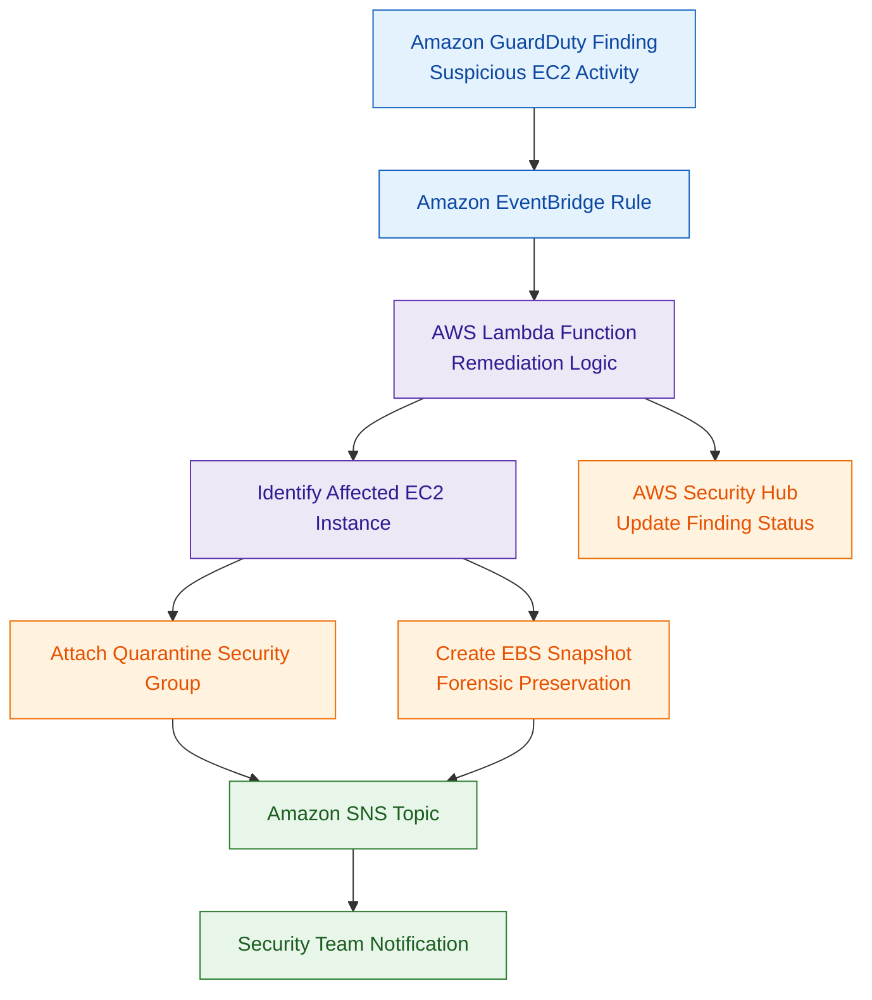

# AWS Lambda

## What Is AWS Lambda?

AWS Lambda is a serverless compute service that runs code in response to events without requiring server management.

Lambda automatically handles:
- infrastructure provisioning
- scaling
- availability
- execution management

Organizations use Lambda for:
- automation
- APIs
- event-driven processing
- security remediation
- serverless applications
- monitoring workflows

Lambda supports multiple programming languages and integrates deeply with AWS services.

---

## Why AWS Lambda Matters for Security

Lambda is heavily used in AWS security architectures because it enables:
- automated incident response
- event-driven remediation
- serverless security workflows
- compliance automation
- log processing
- threat response

Security teams commonly use Lambda to:
- isolate EC2 instances
- revoke credentials
- remediate misconfigurations
- process findings
- automate investigations

Lambda is one of the core services behind:
- EventBridge workflows
- Security Hub automation
- GuardDuty remediation
- Config auto-remediation
- Step Functions orchestration

---

## Core Concepts

- Lambda runs code in response to events
- functions are stateless
- AWS manages infrastructure automatically
- execution permissions are controlled through IAM roles
- functions scale automatically
- Lambda integrates with many AWS services
- functions can run inside VPCs

Think of Lambda as:

> An event-driven automation engine for AWS workloads and security operations.

---

## Common Security Use Cases

### Automated Incident Response

Lambda can automatically respond to:
- GuardDuty findings
- Security Hub findings
- Config violations
- suspicious API activity

Examples:
- isolate EC2 instances
- block malicious IPs
- revoke IAM access

---

### Serverless Security Processing

Lambda can process:
- logs
- alerts
- findings
- security events

without managing infrastructure.

---

### Security Event Remediation

Used for:
- removing public S3 access
- fixing security groups
- enabling encryption
- correcting compliance violations

---

### Log Processing

Lambda commonly processes:
- CloudTrail logs
- VPC Flow Logs
- application logs
- S3 event notifications

---

### Compliance Automation

Can automatically enforce:
- tagging policies
- encryption requirements
- approved configurations

---

### Threat Detection Pipelines

Lambda often acts as the automation layer between:
- detection
- response
- notifications

---

### API Backends

Lambda is commonly used behind:
- Amazon API Gateway
- serverless applications
- microservices

---

## How AWS Lambda Works

### Basic Workflow

1. An event occurs
2. Lambda is triggered
3. The function executes code
4. AWS automatically scales the function
5. Results are returned or actions are performed

---

### Simple Architecture

```text
Security Event
       ↓
Amazon EventBridge
       ↓
AWS Lambda
       ↓
Automated Action
       ↓
Notification / Remediation
```
---
### Example Use case: Automated security remediation with AWS Lambda


---

## Important Components

### Functions

A function contains:
- application logic
- automation code
- remediation workflows

---

### Event Sources

Lambda can be triggered by:
- EventBridge
- S3
- SNS
- SQS
- API Gateway
- CloudWatch
- GuardDuty findings

---

### Execution Roles

Lambda uses IAM execution roles to access AWS services.

Very important security concept.

Best practice:
- least privilege permissions

---

### Layers

Layers allow reusable:
- libraries
- dependencies
- shared code

---

### Environment Variables

Environment variables store:
- configuration values
- settings
- application variables

Sensitive data should be encrypted.

---

### Concurrency

Lambda automatically scales by increasing concurrent executions.

Reserved concurrency can:
- limit scaling
- protect resources
- isolate workloads

---

### Triggers

Triggers determine when Lambda executes.

Examples:
- file uploads
- API calls
- security findings
- scheduled events

---

## Important Integrations

### Amazon EventBridge

Most common integration for:
- event routing
- automated workflows
- security automation

---

### Amazon S3

Lambda can:
- process uploaded files
- scan objects
- trigger workflows
- analyze logs

---

### Amazon SNS

Used for:
- notifications
- alerts
- messaging workflows

---

### Amazon SQS

Useful for:
- decoupled processing
- asynchronous workflows
- buffering events

---

### AWS Step Functions

Step Functions orchestrates:
- multiple Lambda functions
- complex workflows
- retries and branching

---

### AWS IAM

IAM controls:
- execution permissions
- access policies
- invocation permissions

---

### AWS CloudTrail

CloudTrail logs:
- Lambda API activity
- configuration changes
- invocation activity

---

### Amazon CloudWatch

Used for:
- metrics
- logs
- alarms
- monitoring

---

### AWS Config

Config findings can trigger Lambda remediation actions.

---

### Amazon GuardDuty

GuardDuty findings commonly trigger:
- Lambda remediation workflows
- incident response automation

---

### AWS Security Hub

Security Hub findings can invoke:
- Lambda functions
- remediation pipelines
- investigations

---

### Amazon API Gateway

API Gateway commonly invokes:
- Lambda backends
- serverless APIs

---

### AWS Secrets Manager

Lambda commonly retrieves:
- credentials
- API keys
- tokens
- secrets

from Secrets Manager.

---

## Security Features

### IAM Execution Roles

Execution roles define what Lambda can access.

Best practice:
- least privilege permissions

---

### Environment Variable Encryption

Sensitive environment variables can be encrypted using:
- AWS KMS

---

### VPC Integration

Lambda can run inside VPCs to access:
- private databases
- internal services
- private workloads

---

### Resource Policies

Resource-based policies can control:
- who can invoke functions
- cross-account access
- service permissions

---

### Least Privilege Permissions

Functions should only receive:
- minimum required permissions

Avoid:
- wildcard permissions
- overly broad IAM roles

---

### Secrets Management

Sensitive credentials should be stored in:
- AWS Secrets Manager
- Systems Manager Parameter Store

Not directly in code.

---

### Reserved Concurrency

Reserved concurrency can:
- prevent resource exhaustion
- isolate critical functions
- protect downstream services

---

## Monitoring and Logging

### CloudWatch Logs

Lambda automatically sends logs to:
- Amazon CloudWatch Logs

Useful for:
- debugging
- monitoring
- investigations

---

### CloudWatch Metrics

Metrics include:
- invocation count
- errors
- duration
- throttling

---

### X-Ray Tracing

AWS X-Ray helps trace:
- function execution
- distributed workflows
- performance bottlenecks

---

### CloudTrail Logging

CloudTrail records:
- CreateFunction
- UpdateFunctionCode
- DeleteFunction
- permission changes

---

### Error Monitoring

CloudWatch alarms can monitor:
- failures
- timeouts
- excessive errors

---

## Incident Response Use Cases

### EC2 Isolation

Lambda can:
- modify security groups
- quarantine instances
- trigger workflows

---

### Automated Snapshot Creation

Lambda can create:
- EBS snapshots
- forensic backups
- evidence preservation

---

### Security Group Remediation

Can automatically:
- remove risky rules
- block public exposure
- enforce policies

---

### Credential Revocation

Lambda can disable:
- IAM access keys
- compromised credentials
- risky permissions

---

### Security Alerting

Can notify:
- SOC teams
- administrators
- ticketing systems

through SNS or external integrations.

---

## Cost and Performance Considerations

### Execution Duration

Pricing depends partly on:
- execution time

Long-running functions increase cost.

---

### Concurrency

Large spikes can increase:
- concurrency usage
- downstream pressure
- operational risk

---

### Cold Starts

Cold starts occur when Lambda initializes a new execution environment.

More noticeable with:
- VPC-enabled functions
- large dependencies

---

### Memory Allocation

Memory settings affect:
- performance
- CPU allocation
- execution speed
- cost

---

### VPC Networking Overhead

VPC-enabled Lambda functions may introduce:
- additional startup latency
- networking complexity

---

## Service Comparisons

### Lambda vs EC2

| Lambda | EC2 |
|---|---|
| serverless | virtual servers |
| automatic scaling | customer-managed scaling |
| event-driven | long-running workloads |
| no server management | full infrastructure control |

---

### Lambda vs Step Functions

| Lambda | Step Functions |
|---|---|
| executes code | orchestrates workflows |
| single-task execution | multi-step automation |
| compute service | workflow service |

---

### Lambda vs ECS/Fargate

| Lambda | ECS/Fargate |
|---|---|
| short-lived execution | container workloads |
| event-driven | long-running services |
| simpler operations | more container flexibility |

---

## Common Exam Scenarios

### Scenario 1

A company needs to automatically isolate EC2 instances after a GuardDuty finding.

Answer:
Use EventBridge and Lambda.

---

### Scenario 2

A security team needs automated remediation for public S3 buckets.

Answer:
Use AWS Config with Lambda remediation.

---

### Scenario 3

A company wants serverless APIs with backend compute.

Answer:
Use API Gateway with Lambda.

---

### Scenario 4

A company needs automated notifications after security findings.

Answer:
Use Lambda with SNS.

---

### Scenario 5

A company wants to revoke compromised IAM access keys automatically.

Answer:
Use Lambda automation triggered by security findings.

---

### Scenario 6

A company needs orchestration across multiple remediation steps.

Answer:
Use Step Functions with Lambda.

---

## Common Exam Traps

### Trap 1 — Overly Broad IAM Roles

Execution roles should follow:
- least privilege access

Avoid:
- AdministratorAccess
- wildcard permissions

---

### Trap 2 — Storing Secrets in Code

Use:
- Secrets Manager
- Parameter Store

Not:
- hardcoded credentials

---

### Trap 3 — Forgetting VPC Connectivity Requirements

VPC-enabled functions may require:
- NAT Gateway
- VPC endpoints
- proper routing

---

### Trap 4 — Using Lambda for Long-Running Jobs

Lambda has execution duration limits.

Long-running workloads may require:
- ECS
- EC2
- Batch
- Step Functions orchestration

---

### Trap 5 — Confusing Lambda with Workflow Orchestration

Lambda executes code.

Step Functions orchestrates workflows.

---

### Trap 6 — Forgetting Monitoring and Logging

CloudWatch logging and alarms are critical for:
- investigations
- troubleshooting
- operational visibility

---

## Quick Revision Notes

- Lambda = serverless compute service
- heavily used for security automation
- commonly triggered by EventBridge
- uses IAM execution roles
- integrates with GuardDuty and Security Hub
- CloudWatch provides logging and monitoring
- Secrets Manager stores sensitive data
- supports VPC integration
- least privilege permissions are critical
- Step Functions orchestrates Lambda workflows
- Lambda is ideal for event-driven remediation
