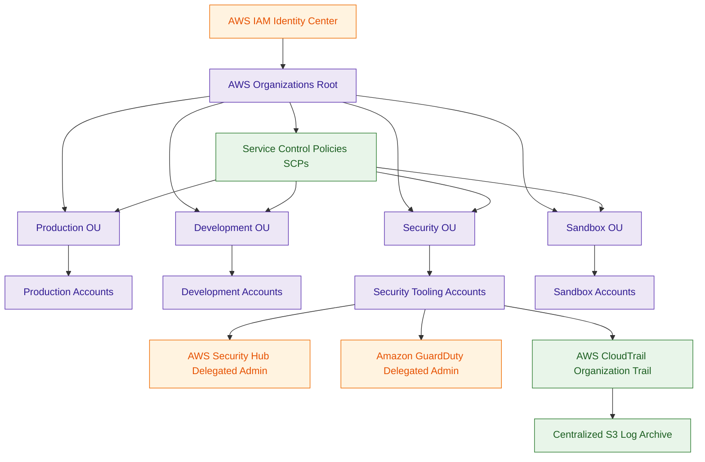

# AWS Organizations

## What Is AWS Organizations?

AWS Organizations is a multi-account governance and management service that helps organizations centrally manage AWS accounts.

It enables enterprises to:

- group AWS accounts
- apply centralized governance
- enforce security controls
- manage permissions boundaries
- simplify billing
- standardize enterprise architectures

AWS Organizations is the foundational governance layer for enterprise AWS environments.

Think of AWS Organizations as:

> The parent governance layer controlling AWS accounts, policies, and organizational security boundaries.

---

## Why It Matters for Security

AWS Organizations is one of the most important enterprise security services in AWS.

Security teams use Organizations for:

- centralized governance
- account isolation
- permission boundaries
- compliance enforcement
- workload separation
- delegated security administration
- organization-wide logging

Organizations helps enterprises:

- reduce blast radius
- isolate workloads securely
- enforce governance consistently
- centralize audit visibility
- standardize security controls

It is heavily used in:

- regulated environments
- enterprise AWS deployments
- multi-team architectures
- centralized SOC environments
- production workload isolation

Most enterprise AWS security architectures begin with:

- AWS Organizations
- Organizational Units (OUs)
- centralized security accounts

---

## Core Concepts

- centralized AWS account management
- supports Organizational Units (OUs)
- supports Service Control Policies (SCPs)
- enables consolidated billing
- supports delegated administration
- foundational for Control Tower
- supports workload isolation
- enables organization-wide governance
- supports enterprise security architectures

---

## Important Integrations

### AWS Control Tower

Provides:

- automated landing zones
- governance automation
- account vending
- guardrails

Control Tower is built on top of AWS Organizations.

---

### AWS IAM Identity Center

Provides:

- centralized authentication
- federated SSO access
- permission set management

Commonly used for enterprise workforce access across AWS accounts.

---

### AWS CloudTrail

Supports:

- organization-wide trails
- centralized audit logging
- enterprise investigations

Organization Trails are heavily used in enterprise environments.

---

### AWS Config

Supports:

- organization-wide compliance visibility
- centralized compliance monitoring
- resource governance

---

### AWS Security Hub

Can aggregate:

- security findings
- compliance results
- alerts

across organization accounts.

---

### Amazon GuardDuty

Supports delegated administrator architectures across Organizations.

Very common enterprise security pattern.

---

### AWS Firewall Manager

Uses Organizations for centralized security policy enforcement.

---

### AWS Resource Access Manager (RAM)

Allows secure resource sharing across AWS accounts.

Examples:
- Transit Gateways
- Route 53 Resolver rules
- subnets
- licenses

---

### Amazon S3

Commonly stores:

- centralized CloudTrail logs
- Config snapshots
- audit archives

---

## Security Features

### Multi-Account Isolation

Organizations encourages separation between:

- production
- development
- sandbox
- security operations
- shared services

This significantly reduces blast radius.

---

### Organizational Units (OUs)

OUs logically group AWS accounts.

Example OUs:

- Production
- Development
- Security
- Sandbox

Governance policies commonly apply at the OU level.

---

### Service Control Policies (SCPs)

SCPs define maximum allowed permissions across accounts and OUs.

SCPs can:

- restrict AWS services
- deny dangerous actions
- prevent privilege escalation
- enforce governance standards

SCPs are one of the most important enterprise governance mechanisms in AWS.

---

### SCP Evaluation Logic

- SCPs never grant permissions
- SCPs only define permission boundaries
- IAM permissions are still required
- explicit deny overrides allow

Even administrators cannot bypass SCP explicit denies.

---

### SCP Inheritance

SCPs applied at the Root level affect:

- all OUs
- all AWS accounts

SCPs applied to a specific OU affect:

- only child OUs
- accounts beneath that OU

This parent-child inheritance model is critical for enterprise governance.

---

### FullAWSAccess Default SCP

By default, AWS Organizations attaches:

- FullAWSAccess

to OUs and accounts.

Without restrictive SCPs:
- IAM permissions alone control access

Organizations commonly add explicit deny SCPs to enforce governance.

---

### Delegated Administration

Organizations supports delegated administrator accounts for services such as:

- GuardDuty
- Security Hub
- Config
- Firewall Manager

This enables centralized security operations architectures.

---

### Centralized Logging

Organizations commonly centralizes:

- CloudTrail logs
- Config snapshots
- audit telemetry

into dedicated security or log archive accounts.

Very important for:
- investigations
- compliance
- forensics

---

### Organization-Wide Audit Visibility

Organization Trails ensure child accounts cannot easily bypass enterprise audit collection.

This creates centralized immutable audit visibility.

---

### Resource Sharing

AWS RAM integrates with Organizations to securely share resources across accounts.

Common examples:
- Transit Gateways
- Route 53 Resolver rules
- VPC subnets
- licenses

---

## Architecture Example

### Enterprise Multi-Account Governance Architecture

**Use case:** centralized enterprise governance, SCP enforcement, delegated security administration, and organization-wide audit logging across AWS accounts.

---

## AWS Organizations vs AWS Control Tower

| AWS Organizations | AWS Control Tower |
|---|---|
| foundational multi-account governance service | governance automation framework |
| manages accounts and OUs | automates landing zones |
| supports SCPs | applies governance guardrails |
| supports consolidated billing | standardizes account provisioning |
| core governance layer | built on top of Organizations |

Use AWS Organizations when:

- structuring enterprise AWS environments
- applying SCPs
- organizing AWS accounts
- enforcing governance boundaries

Use AWS Control Tower when:

- automating landing zones
- simplifying governance operations
- standardizing enterprise AWS deployments

---

## AWS Organizations vs IAM Identity Center

| AWS Organizations | IAM Identity Center |
|---|---|
| governs AWS accounts | manages user authentication |
| applies SCPs | provides SSO access |
| manages account hierarchy | manages workforce identities |
| centralizes governance | centralizes authentication |

Use Organizations when:

- managing account structure
- enforcing permission boundaries
- organizing enterprise AWS environments

Use IAM Identity Center when:

- managing user access
- enabling federated login
- assigning permission sets

---

## Common Exam Traps

### Trap 1 — Confusing Organizations and Control Tower

Organizations:
- foundational governance service

Control Tower:
- governance automation built on Organizations

---

### Trap 2 — Assuming SCPs Grant Permissions

SCPs:
- restrict permissions

IAM policies:
- grant permissions

Both work together.

---

### Trap 3 — Forgetting Explicit Deny Logic

An SCP explicit deny overrides:
- IAM allows
- administrator permissions

Explicit deny always wins.

---

### Trap 4 — Ignoring SCP Inheritance

SCPs applied at the Root level affect:
- every account in the organization

SCPs applied to an OU affect:
- only child accounts and child OUs

---

### Trap 5 — Forgetting FullAWSAccess Default Behavior

Organizations attaches:
- FullAWSAccess

by default.

Restrictive SCPs must be added intentionally.

---

### Trap 6 — Confusing Delegated Administration

Security services commonly use delegated administrator accounts.

Examples:
- GuardDuty
- Security Hub
- Config

Very common enterprise pattern.

---

### Trap 7 — Ignoring Multi-Account Isolation

Organizations is heavily used for:
- workload separation
- blast radius reduction
- environment isolation

---

## 5-Second Recall

### Identity

AWS Organizations = centralized multi-account governance and permission boundary management

---

### Keywords

If the scenario mentions:

- multi-account governance
- Organizational Units
- SCPs
- centralized account management
- permission boundaries
- enterprise AWS structure

Answer:

→ AWS Organizations

---

### Permission Restriction Trigger

If the requirement involves:

- restricting AWS services
- limiting permissions
- enforcing organization-wide controls

Answer:

→ Service Control Policies (SCPs)

---

### Enterprise Isolation Trigger

If the scenario involves:

- workload separation
- blast radius reduction
- environment isolation

Answer:

→ AWS Organizations + OUs

---

### Centralized Logging Trigger

If the requirement involves:

- collecting logs from all AWS accounts
- organization-wide audit visibility
- centralized audit storage

Answer:

→ Organization CloudTrail

---

### SSO Across AWS Accounts Trigger

If the requirement involves:

- centralized login
- workforce SSO
- permission sets

Answer:

→ IAM Identity Center

---

### Need automated landing zones?

→ AWS Control Tower

---

### Need delegated security administration?

→ Organizations + Security Account

---

### Need enterprise governance inheritance?

→ Root → OU → Account hierarchy

---

### Need organization-wide permission boundaries?

→ SCPs

---

## Quick Revision Notes

- foundational enterprise governance service
- supports Organizational Units (OUs)
- supports Service Control Policies (SCPs)
- SCPs restrict maximum permissions
- SCPs never grant permissions
- explicit deny overrides allow
- supports delegated administration
- enables centralized audit logging
- organization trails support enterprise investigations
- heavily integrated with Control Tower
- supports workload isolation
- reduces blast radius
- IAM Identity Center supports centralized SSO
- FullAWSAccess is attached by default
- parent-child SCP inheritance is critical
- foundational service for enterprise AWS security architecture
