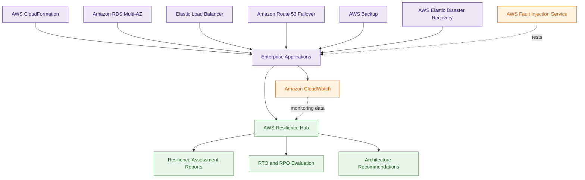
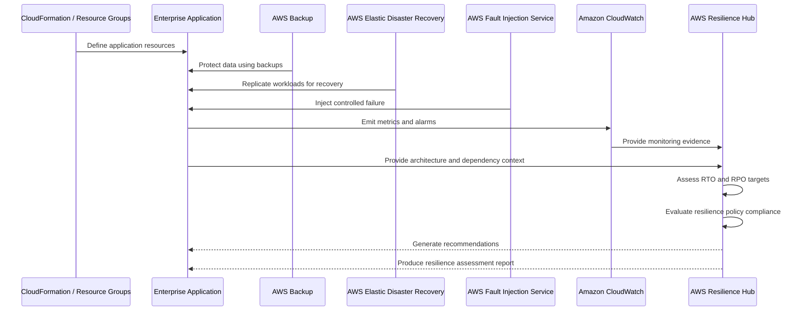

# AWS Resilience Hub

## What Is AWS Resilience Hub?

AWS Resilience Hub is a resilience assessment and disaster recovery planning service that helps organizations evaluate and improve application resilience on AWS.

It analyzes AWS applications against resilience objectives such as:

- Recovery Time Objective (RTO)
- Recovery Point Objective (RPO)
- availability goals
- disaster recovery readiness
- operational continuity

AWS Resilience Hub evaluates architectures and recommends improvements to increase survivability during outages and failures.

Think of AWS Resilience Hub as:

> A centralized resilience assessment platform for validating whether AWS applications can survive disruptions and recover successfully.

---

## Why It Matters for Security

Operational resilience is an important security pillar in AWS.

An application that becomes unavailable due to:
- outages
- ransomware
- misconfigurations
- regional failures
- infrastructure attacks

is not operationally secure.

Security and operations teams use AWS Resilience Hub for:

- disaster recovery planning
- resilience governance
- operational continuity validation
- survivability assessments
- recovery readiness analysis
- resilience reporting

Resilience Hub helps organizations identify:

- single points of failure
- weak failover designs
- insufficient backup strategies
- missing redundancy
- recovery gaps

It is heavily used for:

- mission-critical workloads
- regulated applications
- enterprise resilience governance
- high-availability architectures
- business continuity planning

---

## Core Concepts

- resilience assessment service
- evaluates RTO and RPO goals
- analyzes AWS application architectures
- generates resilience scores
- provides architecture recommendations
- validates operational continuity readiness
- integrates with DR and backup services
- supports centralized resilience governance
- focuses on survivability and recovery readiness

---

## Important Integrations

### AWS Elastic Disaster Recovery (DRS)

Provides:

- continuous replication
- rapid failover recovery
- disaster recovery orchestration

Resilience Hub commonly evaluates DRS-based architectures.

---

### AWS Backup

Provides:

- centralized backup management
- backup policies
- restore operations

Supports resilience and recovery objectives.

---

### AWS Fault Injection Service (FIS)

Provides:

- chaos engineering
- fault simulation
- resilience testing

Very important for validating resilience architectures.

---

### Amazon CloudWatch

Provides:

- monitoring
- alarms
- operational visibility

CloudWatch helps validate failover and recovery operations.

---

### Amazon Route 53

Supports:

- DNS failover
- health checks
- traffic routing

Critical for multi-region recovery architectures.

---

### AWS Systems Manager

Supports:

- operational automation
- incident response workflows
- remediation procedures

Useful during recovery operations.

---

### AWS CloudFormation

Defines:

- application infrastructure
- repeatable architectures
- resilient deployment patterns

Resilience Hub commonly discovers applications through CloudFormation stacks.

---

### Elastic Load Balancing (ELB)

Provides:

- fault tolerance
- traffic distribution
- high availability

Common component in resilient architectures.

---

### Amazon RDS

Supports:

- Multi-AZ deployments
- automated backups
- read replicas

Important for database resilience.

---

## Security Features

### Resilience Assessment

Resilience Hub evaluates applications against resilience policies and operational goals.

Assessments analyze:

- application dependencies
- failover readiness
- backup coverage
- redundancy
- recovery strategies

---

### RTO and RPO Validation

Resilience Hub validates whether applications can meet:

- Recovery Time Objectives (RTO)
- Recovery Point Objectives (RPO)

Important enterprise resilience metrics.

---

### Resilience Scoring

Applications receive resilience scores based on:

- architecture design
- recovery readiness
- operational survivability
- redundancy
- fault tolerance

This helps organizations prioritize resilience improvements.

---

### Architecture Recommendations

Resilience Hub recommends improvements such as:

- Multi-AZ deployments
- cross-region replication
- automated failover
- backup improvements
- load balancing enhancements

---

### Operational Continuity Validation

Resilience Hub helps organizations validate whether applications can continue operating during failures.

This improves:

- business continuity
- operational resilience
- recovery confidence

---

### Disaster Recovery Readiness

Resilience Hub identifies:

- weak recovery designs
- insufficient redundancy
- missing failover mechanisms
- resilience gaps

Very important for regulated workloads.

---

### Chaos Engineering Validation

AWS FIS integration enables resilience testing through controlled fault injection.

Example tests:

- EC2 failures
- Availability Zone outages
- API latency injection
- network disruptions

This validates whether failover mechanisms work correctly.

---

### Centralized Resilience Governance

Organizations can standardize resilience policies across workloads.

Common enterprise use cases include:

- resilience compliance reporting
- DR governance
- survivability assessments

---

### Continuous Recovery Validation

Resilience Hub commonly evaluates architectures using:

- DRS replication
- CloudWatch monitoring
- Route 53 failover
- backup recovery strategies

to validate survivability.

---

## Architecture Example

### Enterprise Disaster Recovery and Resilience Validation

**Use case:** centralized resilience assessment, disaster recovery readiness validation, failover testing, and operational continuity governance.

---

## Resilience Validation Workflow

**Use case:** validating whether disaster recovery architectures meet operational continuity and recovery objectives.

---

## Disaster Recovery Strategy Comparison

| DR Strategy | RTO/RPO Profile | Typical AWS Pattern |
|---|---|
| Backup and Restore | higher RTO/RPO | AWS Backup + restore recovery |
| Pilot Light | medium RTO/RPO | critical services always running |
| Warm Standby | lower RTO/RPO | scaled-down environment always active |
| Multi-Site Active-Active | near-zero RTO | fully active multi-region workloads |

### Key Security Reasoning

- backup and restore is lower cost but slower recovery
- pilot light keeps core systems ready for scaling
- warm standby improves recovery speed
- active-active provides strongest availability
- Route 53 commonly manages failover routing
- Resilience Hub validates whether architectures meet resilience goals

---

## AWS Resilience Hub vs AWS Backup

| AWS Resilience Hub | AWS Backup |
|---|---|
| evaluates resilience posture | manages backups |
| validates RTO and RPO goals | performs backup operations |
| analyzes survivability | stores recovery points |
| governance and assessment focused | data protection focused |

Use Resilience Hub when:

- assessing operational resilience
- validating disaster recovery readiness
- evaluating survivability

Use AWS Backup when:

- protecting data
- automating backups
- restoring workloads

---

## AWS Resilience Hub vs AWS Elastic Disaster Recovery

| AWS Resilience Hub | AWS Elastic Disaster Recovery |
|---|---|
| evaluates resilience readiness | performs recovery execution |
| validates DR objectives | orchestrates failover recovery |
| provides recommendations | continuously replicates workloads |
| assessment and governance focused | disaster recovery execution focused |

Use Resilience Hub when:

- validating resilience posture
- assessing DR architectures
- measuring recovery readiness

Use Elastic Disaster Recovery when:

- recovering workloads
- replicating servers
- performing failover recovery

---

## AWS Resilience Hub vs AWS Trusted Advisor

| AWS Resilience Hub | AWS Trusted Advisor |
|---|---|
| resilience assessment platform | AWS best practice advisory service |
| evaluates survivability | evaluates operational recommendations |
| validates RTO and RPO goals | checks security, cost, and limits |
| disaster recovery focused | broad AWS optimization focused |

Use Resilience Hub when:

- validating operational continuity
- assessing DR readiness
- analyzing survivability

Use Trusted Advisor when:

- reviewing AWS best practices
- identifying optimization opportunities
- checking service recommendations

---

## Common Exam Traps

### Trap 1 — Confusing Resilience Hub and Backup

Resilience Hub:
- evaluates resilience posture

AWS Backup:
- performs backups and restores

---

### Trap 2 — Confusing Resilience Hub and DRS

Resilience Hub:
- resilience assessment and recommendations

Elastic Disaster Recovery:
- actual failover and workload recovery

---

### Trap 3 — Forgetting RTO vs RPO

RTO:
- how quickly systems recover

RPO:
- acceptable data loss window

Very important resilience concepts.

---

### Trap 4 — Assuming Resilience Hub Performs Failover

Resilience Hub evaluates architectures.

It does not directly:
- fail over workloads
- restore backups
- recover applications

---

### Trap 5 — Ignoring Chaos Engineering

AWS FIS is commonly used to validate resilience architectures through controlled failure simulations.

---

### Trap 6 — Ignoring Operational Resilience as a Security Pillar

Operational resilience includes:

- availability
- survivability
- fault tolerance
- continuity
- disaster recovery readiness

---

### Trap 7 — Confusing Continuous Replication and Backup Recovery

AWS Backup:
- scheduled backup recovery

Elastic Disaster Recovery:
- near-continuous replication and failover

---

## 5-Second Recall

### Identity

AWS Resilience Hub = resilience assessment and disaster recovery readiness platform

---

### Keywords

If the scenario mentions:

- RTO validation
- RPO validation
- resilience scoring
- survivability assessment
- operational continuity
- disaster recovery readiness

Answer:

→ AWS Resilience Hub

---

### Recovery Objective Trigger

If the requirement involves:

- measuring RTO goals
- validating RPO targets
- resilience governance

Answer:

→ AWS Resilience Hub

---

### Chaos Engineering Trigger

If the scenario involves:

- fault injection
- outage simulation
- resilience testing

Answer:

→ AWS Fault Injection Service (FIS)

---

### Continuous Replication Trigger

If the requirement involves:

- near-continuous replication
- sub-minute recovery
- rapid failover

Answer:

→ AWS Elastic Disaster Recovery (DRS)

---

### Centralized Backup Trigger

If the requirement involves:

- centralized backup policies
- automated restores
- backup governance

Answer:

→ AWS Backup

---

### Need survivability assessment?

→ AWS Resilience Hub

---

### Need disaster recovery execution?

→ AWS Elastic Disaster Recovery

---

### Need resilience testing?

→ AWS FIS

---

### Need backup management?

→ AWS Backup

---

## Quick Revision Notes

- resilience assessment and governance platform
- validates RTO and RPO objectives
- analyzes AWS application survivability
- generates resilience scores and reports
- provides architecture recommendations
- operational resilience is a security pillar
- integrates with AWS Backup and DRS
- integrates with AWS FIS for chaos engineering
- validates disaster recovery readiness
- evaluates failover architectures
- does not directly perform failover recovery
- centralized resilience visibility platform
- important for business continuity planning
- distinguishes assessment from recovery execution
- foundational enterprise resilience governance service
