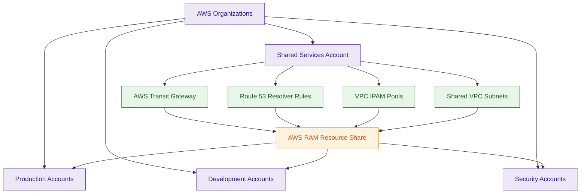
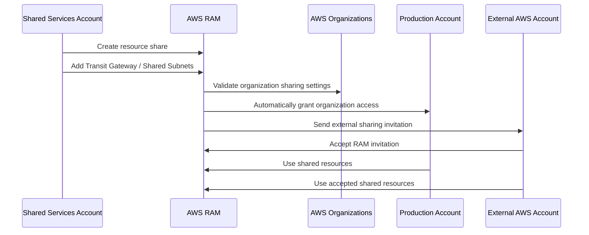

# AWS Resource Access Manager (AWS RAM)

## What Is AWS RAM?

AWS Resource Access Manager (AWS RAM) is a service that allows organizations to securely share AWS resources across multiple AWS accounts.

AWS RAM helps enterprises avoid duplicating infrastructure by enabling centralized resource sharing.

Commonly shared resources include:

- Transit Gateways
- subnets
- Route 53 Resolver rules
- VPC IPAM pools
- License Manager configurations
- Aurora DB clusters

Think of AWS RAM as:

> A centralized cross-account resource sharing service for AWS Organizations and enterprise multi-account architectures.

---

## Why It Matters for Security

AWS RAM is important for enterprise governance and secure multi-account design.

Security and networking teams use AWS RAM for:

- centralized networking architectures
- shared services models
- secure cross-account infrastructure sharing
- governance consistency
- reducing infrastructure duplication
- multi-account connectivity

AWS RAM helps organizations:

- centralize networking resources
- simplify governance
- reduce operational complexity
- preserve account isolation
- securely share infrastructure

It is heavily used in:

- AWS Organizations environments
- hub-and-spoke architectures
- centralized networking models
- Control Tower environments
- enterprise shared services architectures

AWS RAM is foundational for scalable enterprise AWS networking.

---

## Core Concepts

- securely shares AWS resources across accounts
- heavily integrated with AWS Organizations
- supports organization-wide sharing
- supports OU-based sharing
- avoids infrastructure duplication
- supports cross-account resource access
- enables shared services architectures
- preserves account isolation boundaries
- supports centralized enterprise networking

---

## Important Integrations

### AWS Organizations

Provides:

- organization-wide sharing
- OU-based sharing
- centralized governance

AWS RAM is heavily integrated with Organizations.

---

### AWS Transit Gateway

Very commonly shared across AWS accounts using RAM.

Major enterprise networking pattern.

---

### Amazon Route 53 Resolver

Supports sharing:

- Resolver rules
- DNS forwarding configurations

across accounts.

---

### Amazon VPC IP Address Manager (IPAM)

Supports sharing:

- IP pools
- centralized IP governance

across AWS accounts.

---

### AWS License Manager

Supports centralized license governance and sharing.

---

### Amazon Aurora

Supports cross-account sharing in some enterprise architectures.

---

### AWS Control Tower

RAM commonly supports shared services architectures in Control Tower landing zones.

---

### AWS IAM

Controls:

- RAM permissions
- resource sharing access
- administrative permissions

---

## Security Features

### Centralized Resource Sharing

RAM allows centralized resources to be securely shared across AWS accounts.

Common examples:

- Transit Gateways
- shared subnets
- centralized DNS
- IPAM pools

---

### Organization-Wide Sharing

RAM integrates with AWS Organizations to simplify sharing across:

- AWS accounts
- OUs
- enterprise environments

Very important for large organizations.

---

### Organization Sharing Behavior

If RAM sharing is enabled with AWS Organizations:

- resources shared inside the Organization are automatically available
- no invitation acceptance is required

If resources are shared with external AWS accounts:

- the receiving account must manually accept the RAM invitation

Very important distinction for enterprise architectures.

---

### Managed Permissions

AWS RAM supports managed permissions that define:

- read-only access
- associate permissions
- allowed resource actions

This helps organizations securely control shared resource usage.

---

### Shared Services Architecture

RAM enables centralized shared services models.

Common centralized services include:

- networking
- DNS
- IP management
- licensing

Very common enterprise pattern.

---

### Resource Isolation

RAM shares resources while preserving:

- separate AWS accounts
- IAM boundaries
- billing separation
- workload isolation

This reduces blast radius while enabling centralized infrastructure.

---

### Reduced Infrastructure Duplication

Organizations can avoid deploying duplicate infrastructure in every account.

Benefits include:

- simplified governance
- operational consistency
- centralized security inspection
- lower operational overhead

---

### VPC Subnet Sharing

AWS RAM supports subnet sharing between AWS accounts.

This allows:

- multiple AWS accounts
- separate IAM boundaries
- separate billing ownership

while deploying resources into the same centralized VPC.

Very important enterprise networking architecture.

---

### Networking Governance

RAM is heavily used in:

- hub-and-spoke networking
- centralized egress architectures
- shared inspection VPCs
- centralized DNS models

---

## Architecture Example

### Centralized Enterprise Networking with AWS RAM

**Use case:** centralized networking, subnet sharing, and secure shared services architecture across AWS accounts.

---

## Resource Sharing Workflow

**Use case:** demonstrating automatic organization sharing versus external invitation-based resource sharing.

---

## AWS RAM vs VPC Peering

| AWS RAM | VPC Peering |
|---|---|
| shares AWS resources | connects VPC networks |
| centralized infrastructure model | network connectivity model |
| supports shared subnets | requires separate VPCs |
| reduces routing complexity | creates peering relationships |
| enables shared services architectures | enables direct VPC communication |
| preserves centralized VPC design | requires separate VPC management |

Use AWS RAM when:

- sharing centralized infrastructure
- implementing shared services
- sharing subnets
- centralizing networking

Use VPC Peering when:

- directly connecting VPCs
- enabling point-to-point communication
- connecting isolated VPC environments

---

## AWS RAM vs AWS Organizations

| AWS RAM | AWS Organizations |
|---|---|
| shares resources | governs AWS accounts |
| enables cross-account infrastructure access | manages account hierarchy |
| resource sharing platform | governance platform |
| supports shared services architectures | supports SCPs and centralized governance |

Use AWS RAM when:

- sharing Transit Gateways
- sharing Resolver rules
- sharing subnets
- centralizing infrastructure

Use AWS Organizations when:

- managing AWS accounts
- applying SCPs
- enforcing governance policies

---

## Common Exam Traps

### Trap 1 — Confusing RAM and Organizations

Organizations:
- governs AWS accounts

RAM:
- shares AWS resources

Both commonly work together.

---

### Trap 2 — Confusing Resource Sharing and Network Connectivity

RAM:
- shares resources

VPC Peering:
- provides VPC network connectivity

These solve different problems.

---

### Trap 3 — Forgetting Invitation Logic

Inside AWS Organizations:
- sharing can be automatic

Outside AWS Organizations:
- invitation acceptance is required

Very important distinction.

---

### Trap 4 — Assuming RAM Removes Isolation

AWS accounts remain isolated even when resources are shared.

This preserves:

- IAM boundaries
- billing separation
- workload isolation

---

### Trap 5 — Forgetting Shared Subnet Architectures

AWS RAM supports:

- VPC subnet sharing

This allows multiple accounts to deploy resources into a centralized VPC.

---

### Trap 6 — Confusing RAM and Transit Gateway

Transit Gateway:
- routes traffic

RAM:
- shares the Transit Gateway resource

These services commonly work together.

---

### Trap 7 — Forgetting Managed Permissions

RAM managed permissions define:

- allowed actions
- read-only access
- associate permissions

for shared resources.

---

## 5-Second Recall

### Identity

AWS RAM = secure cross-account AWS resource sharing service

---

### Keywords

If the scenario mentions:

- shared Transit Gateway
- centralized networking
- shared subnets
- cross-account resource sharing
- shared services architecture
- centralized VPC

Answer:

→ AWS RAM

---

### Shared Subnet Trigger

If the requirement involves:

- multiple accounts inside one VPC
- centralized subnet ownership
- separate billing with shared networking

Answer:

→ AWS RAM VPC Subnet Sharing

---

### Networking Sharing Trigger

If the scenario involves:

- shared Transit Gateway
- shared Resolver rules
- centralized networking resources

Answer:

→ AWS RAM

---

### Invitation Workflow Trigger

If the requirement involves:

- external AWS accounts
- invitation acceptance
- organization-wide automatic sharing

Answer:

→ AWS RAM sharing behavior

---

### Permission Trigger

If the requirement involves:

- read-only sharing
- associate permissions
- granular shared resource actions

Answer:

→ RAM Managed Permissions

---

### Need direct VPC connectivity?

→ VPC Peering or Transit Gateway

---

### Need centralized shared infrastructure?

→ AWS RAM

---

### Need account governance?

→ AWS Organizations

---

### Need centralized networking with separate accounts?

→ AWS RAM + Shared VPC/Subnets

---

## Quick Revision Notes

- secure cross-account resource sharing service
- heavily integrated with AWS Organizations
- supports organization-wide sharing
- supports OU-based sharing
- supports shared subnet architectures
- commonly used with Transit Gateway
- supports Route 53 Resolver sharing
- supports VPC IPAM sharing
- preserves account isolation boundaries
- reduces infrastructure duplication
- enables centralized networking models
- invitation acceptance required outside Organizations
- managed permissions control shared resource access
- foundational enterprise shared services architecture service
- RAM shares resources, not permissions or governance
