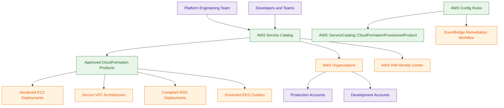
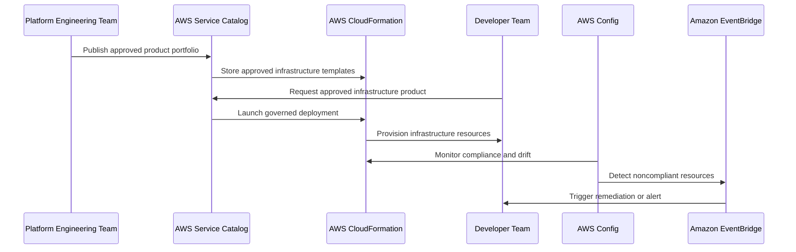

# AWS Service Catalog

## What Is AWS Service Catalog?

AWS Service Catalog is a governance and self-service provisioning service that allows organizations to centrally manage approved AWS infrastructure products and deployment templates.

It enables administrators to create curated catalogs of approved products such as:

- CloudFormation templates
- hardened EC2 deployments
- VPC architectures
- compliant databases
- EKS environments
- security baselines

Users can provision only approved and governed infrastructure products.

Think of AWS Service Catalog as:

> A controlled self-service provisioning platform for standardized and governed AWS deployments.

---

## Why It Matters for Security

AWS Service Catalog is important for:

- infrastructure governance
- standardized deployments
- compliance enforcement
- reducing configuration drift
- secure self-service provisioning
- enterprise platform engineering

Security and platform teams use Service Catalog to:

- enforce approved architectures
- restrict insecure deployments
- standardize security baselines
- reduce manual provisioning risks
- simplify governance

It is heavily used in:

- enterprise AWS environments
- regulated workloads
- internal developer platforms
- multi-account governance
- Control Tower landing zones

Service Catalog helps organizations balance:

- developer agility
- centralized governance
- operational consistency
- security standardization

---

## Core Concepts

- centralized catalog of approved infrastructure products
- supports self-service provisioning
- heavily integrated with CloudFormation
- supports governance and standardization
- controls approved deployment patterns
- supports portfolio-based access
- enables secure developer self-service
- reduces configuration drift
- commonly used in enterprise platform engineering

---

## Important Integrations

### AWS CloudFormation

Service Catalog products commonly use:

- CloudFormation templates
- infrastructure-as-code deployments

CloudFormation is foundational to Service Catalog.

---

### AWS Organizations

Supports:

- multi-account governance
- portfolio sharing
- centralized deployment standardization

---

### AWS IAM Identity Center

Provides:

- centralized authentication
- role-based access
- governed deployment permissions

---

### AWS Control Tower

Service Catalog commonly supports:

- account factory workflows
- governed provisioning
- landing zone architectures

---

### AWS Organizations SCPs

Can restrict:

- unauthorized AWS services
- unsupported deployments
- excessive permissions

Works alongside Service Catalog governance.

---

### AWS Config

Can monitor deployed products for:

- compliance
- configuration drift
- governance violations

Very common governance integration.

---

### AWS Lambda

Supports:

- provisioning automation
- remediation workflows
- governance automation

---

### AWS Systems Manager

Supports:

- operational automation
- patch management
- lifecycle management

for Service Catalog deployments.

---

## Security Features

### Approved Product Catalogs

Administrators define approved infrastructure products.

Examples:

- hardened EC2 templates
- compliant VPC architectures
- encrypted RDS deployments
- governed EKS clusters

Users deploy only approved products.

---

### Controlled Self-Service Provisioning

Developers can provision infrastructure without unrestricted AWS administrative access.

This improves:

- governance
- operational consistency
- deployment security

---

### Standardized Infrastructure

Service Catalog helps enforce:

- approved architectures
- tagging standards
- encryption baselines
- logging requirements
- networking controls

---

### Reduced Configuration Drift

Using approved templates reduces:

- inconsistent deployments
- insecure configurations
- manual provisioning errors

Very important for enterprise governance.

---

### Portfolio-Based Access Control

Administrators can define:

- who can access products
- which teams can deploy products
- which AWS accounts receive portfolios

---

### Infrastructure Governance

Service Catalog enables centralized governance over:

- deployment standards
- infrastructure templates
- approved configurations
- operational baselines

---

### Separation of Duties

Platform teams can:

- define approved infrastructure products

while developers:

- deploy approved products

without requiring broad administrative permissions.

---

### Multi-Account Standardization

Organizations commonly share Service Catalog portfolios across:

- AWS accounts
- Organizational Units (OUs)
- enterprise environments

Very common enterprise governance pattern.

---

### TagOptions Governance

Service Catalog supports TagOptions for enforcing:

- standardized metadata
- governance tagging
- operational categorization

---

### Product Versioning and Drift Management

Service Catalog does not automatically fix all drift.

However, administrators can manage approved product evolution using:

- product versioning
- updated CloudFormation templates
- StackSet updates
- revised security baselines

Example:

- platform team publishes hardened EC2 product
- later updates logging and encryption settings
- teams update provisioned products to newer approved versions

Service Catalog standardizes provisioning while Config commonly monitors drift afterward.

---

### Service Catalog Enforcement with AWS Config

AWS Config can monitor whether infrastructure follows approved provisioning patterns.

In strict enterprise environments, Config rules can detect resources that were not provisioned through approved Service Catalog products.

This supports a:

> Service Catalog only provisioning model.

Common governance workflow:

```text
Approved Service Catalog Product
        ↓
CloudFormation Provisioned Product
        ↓
AWS Config Compliance Validation
        ↓
EventBridge Alert or Automated Remediation
```

This helps detect unmanaged or non-approved infrastructure.

---

## Architecture Example

### Enterprise Governed Self-Service Platform



**Use case:** enterprise self-service infrastructure provisioning with centralized governance, compliance monitoring, and standardized security baselines.

---

## Provisioning Workflow



**Use case:** governed infrastructure provisioning with automated compliance monitoring and remediation workflows.

---

## AWS Service Catalog vs AWS CloudFormation

| AWS Service Catalog | AWS CloudFormation |
|---|---|
| governance and self-service platform | infrastructure-as-code engine |
| controls approved deployments | provisions infrastructure |
| manages products and portfolios | deploys templates |
| enforces governance standards | automates infrastructure creation |

Use Service Catalog when:

- governing self-service provisioning
- enforcing approved deployment patterns
- standardizing infrastructure

Use CloudFormation when:

- defining infrastructure-as-code
- provisioning AWS resources
- automating deployments

---

## AWS Service Catalog vs AWS Marketplace

| AWS Service Catalog | AWS Marketplace |
|---|---|
| internal approved products | third-party vendor products |
| managed by platform teams | managed by external vendors |
| custom enterprise templates | SaaS, AMIs, software subscriptions |
| internal golden deployment patterns | commercial software marketplace |

Use Service Catalog when:

- publishing internal golden templates
- governing enterprise infrastructure
- standardizing deployments

Use AWS Marketplace when:

- purchasing third-party software
- deploying vendor appliances
- subscribing to SaaS offerings

---

## AWS Service Catalog vs AWS Control Tower

| AWS Service Catalog | AWS Control Tower |
|---|---|
| governs infrastructure products | governs AWS accounts |
| manages approved deployment catalogs | manages landing zones |
| workload provisioning focused | multi-account governance focused |
| self-service infrastructure platform | governance automation platform |

Use Service Catalog when:

- standardizing workload deployments
- enabling governed self-service provisioning
- managing approved infrastructure products

Use Control Tower when:

- managing enterprise landing zones
- automating account governance
- standardizing AWS account baselines

---

## Common Exam Traps

### Trap 1 — Confusing Service Catalog and CloudFormation

CloudFormation:
- provisions infrastructure

Service Catalog:
- governs approved infrastructure products

Service Catalog commonly uses CloudFormation internally.

---

### Trap 2 — Assuming Developers Need Full AWS Permissions

Service Catalog enables:

- controlled self-service provisioning

without unrestricted administrative access.

---

### Trap 3 — Forgetting Governance Purpose

Service Catalog focuses heavily on:

- governance
- standardization
- approved deployment patterns

---

### Trap 4 — Confusing Service Catalog and Control Tower

Control Tower:
- governs AWS accounts and landing zones

Service Catalog:
- governs workload provisioning

---

### Trap 5 — Ignoring Portfolio Access Controls

Administrators can control:

- who can deploy products
- which products are available
- organizational sharing boundaries

---

### Trap 6 — Forgetting Compliance Integration

Service Catalog deployments commonly integrate with:

- AWS Config
- SCPs
- EventBridge
- governance automation

---

### Trap 7 — Assuming Service Catalog Automatically Fixes Drift

Service Catalog standardizes initial provisioning.

It does not automatically correct all drift after deployment.

Better governance pattern:
- use product versioning
- update approved baselines
- use StackSet updates
- monitor drift with AWS Config
- automate remediation with EventBridge or Lambda

---

### Trap 8 — Confusing Internal Products and Vendor Products

Service Catalog:
- internal governed products

AWS Marketplace:
- third-party software offerings

---

## 5-Second Recall

### Identity

AWS Service Catalog = governed self-service infrastructure provisioning platform

---

### Keywords

If the scenario mentions:

- approved infrastructure templates
- governed self-service provisioning
- standardized deployments
- internal golden images
- platform engineering
- controlled developer access

Answer:

→ AWS Service Catalog

---

### Governance Trigger

If the requirement involves:

- approved deployment standards
- centralized infrastructure governance
- controlled provisioning patterns

Answer:

→ AWS Service Catalog

---

### Self-Service Trigger

If the scenario involves:

- developers provisioning infrastructure
- restricted deployment options
- approved deployment templates

Answer:

→ AWS Service Catalog

---

### Marketplace Trigger

If the requirement involves:

- third-party software
- vendor appliances
- SaaS subscriptions

Answer:

→ AWS Marketplace

---

### Infrastructure-as-Code Trigger

If the requirement involves:

- provisioning templates
- infrastructure deployment automation
- IaC workflows

Answer:

→ AWS CloudFormation

---

### Need enterprise landing zones?

→ AWS Control Tower

---

### Need approved infrastructure products?

→ AWS Service Catalog

---

### Need compliance monitoring after deployment?

→ AWS Config

---

### Need automated remediation workflows?

→ EventBridge + Lambda

---

### Need infrastructure provisioning engine?

→ AWS CloudFormation

---

## Quick Revision Notes

- governed self-service provisioning platform
- heavily integrated with CloudFormation
- supports approved infrastructure products
- enables secure developer self-service
- supports enterprise governance and standardization
- reduces configuration drift
- supports product versioning
- supports portfolio-based access control
- commonly used with Organizations and Control Tower
- Config commonly monitors deployed products afterward
- EventBridge commonly automates remediation workflows
- Marketplace provides vendor software, not internal products
- Service Catalog governs provisioning while CloudFormation provisions resources
- foundational enterprise platform engineering service
