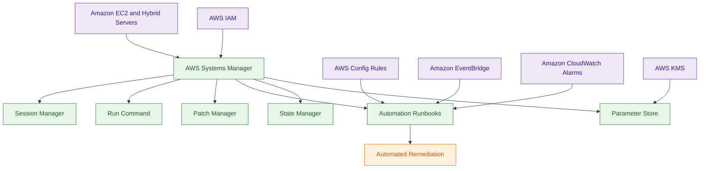
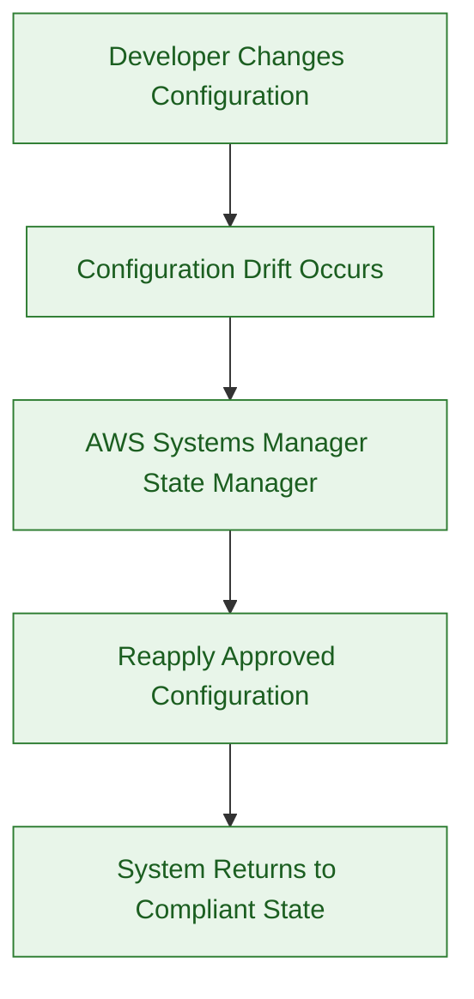
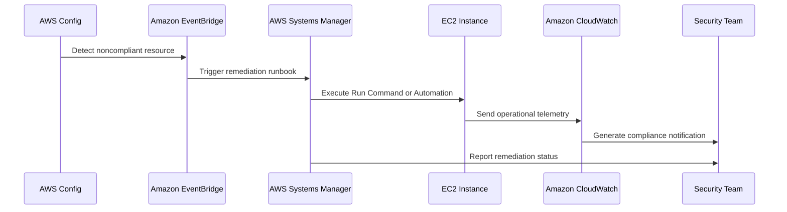

# AWS Systems Manager

## What Is AWS Systems Manager?

AWS Systems Manager is a centralized operational management and automation service for AWS infrastructure and workloads.

It helps organizations manage:

- EC2 instances
- hybrid servers
- operational automation
- patching
- configuration management
- incident response
- secure remote administration

Systems Manager provides centralized operational control across AWS and hybrid environments.

Think of Systems Manager as:

> A centralized operational management, remediation, and fleet governance platform for AWS infrastructure.

---

## Why It Matters for Security

AWS Systems Manager is heavily used for:

- operational security
- patch management
- automated remediation
- incident response
- secure administration
- compliance operations

Security and operations teams use Systems Manager to:

- patch vulnerable systems
- automate remediation workflows
- eliminate direct SSH access
- enforce operational baselines
- securely manage large fleets
- reduce administrative exposure

Systems Manager is foundational for:

- operational governance
- self-healing infrastructure
- secure fleet management
- automated security response
- hybrid infrastructure operations

It commonly acts as the:

> operational glue connecting detection, remediation, compliance, and administration workflows.

---

## Core Concepts

- centralized infrastructure management
- supports AWS and hybrid environments
- secure remote administration
- patch governance and automation
- remediation runbooks
- fleet management
- compliance operations
- operational automation
- configuration enforcement
- self-healing operational workflows
- agent-based infrastructure management

---

## Important Integrations

### Amazon EC2

Primary compute platform managed through Systems Manager.

---

### AWS IAM

Controls:

- Session Manager access
- automation permissions
- Run Command permissions
- operational boundaries

---

### AWS Config

Commonly triggers:

- remediation workflows
- compliance corrections
- operational automation

through Systems Manager Automation.

---

### Amazon EventBridge

Supports:

- event-driven remediation
- incident response workflows
- automation orchestration

---

### Amazon CloudWatch

Provides:

- monitoring
- alarms
- operational telemetry

Commonly integrated into remediation workflows.

---

### AWS Lambda

Supports:

- custom remediation logic
- orchestration workflows
- automation extensions

---

### AWS Organizations

Supports:

- centralized fleet management
- multi-account operations
- enterprise governance

---

### AWS KMS

Encrypts:

- Session Manager sessions
- Parameter Store values
- automation workflows

---

### AWS Secrets Manager

Supports:

- advanced secret management
- credential rotation
- operational secret workflows

---

## Security Features

### Session Manager

Session Manager enables secure shell access without:

- SSH keys
- bastion hosts
- inbound management ports

Very important operational security feature.

---

### Run Command

Run Command executes commands across large fleets without direct administrator login.

Common use cases:

- security validation scripts
- operational remediation
- software installation
- incident response collection

Benefits include:

- centralized auditing
- CloudWatch logging
- S3 output storage
- no interactive shell access required

Very important enterprise security operations feature.

---

### Patch Manager

Patch Manager automates:

- OS patching
- vulnerability remediation
- patch compliance

Supports centralized patch governance.

---

### Automation Runbooks

Systems Manager Automation supports:

- incident response workflows
- remediation procedures
- operational automation

Very common enterprise automation pattern.

---

### Parameter Store

Stores:

- operational parameters
- configuration values
- lightweight secrets

Supports:

- encryption
- versioning
- access control

---

### State Manager

State Manager continuously enforces desired operational configurations.

Examples:

- antivirus installation
- logging agents
- hardened baselines
- security tooling

Very important self-healing operational capability.

---

### Self-Healing Configuration Enforcement

State Manager can automatically reapply approved configurations when drift occurs.

Example:

- developer disables security agent
- State Manager detects configuration drift
- approved configuration is automatically restored

This creates continuous operational enforcement.

---

### Inventory Management

Systems Manager Inventory collects:

- installed software
- operational metadata
- system configuration details

Useful for:

- investigations
- governance
- compliance reporting

---

### Hybrid Infrastructure Support

Systems Manager supports:

- on-premises servers
- hybrid environments
- multi-cloud operational visibility

through managed instances and SSM Agent.

---

### Automated Remediation

Systems Manager commonly performs automated remediation triggered by:

- AWS Config
- EventBridge
- Security Hub
- CloudWatch alarms

---

### Secure Operational Access

Session Manager significantly reduces attack surface by eliminating:

- direct SSH exposure
- bastion host dependency
- open management ports

Very important enterprise security architecture.

---

## Patch Governance Workflow

### Patch Baseline

Defines:

- approved patch rules
- patch classifications
- security update logic

Example:
- install critical security updates only

---

### Patch Groups

Patch Groups organize systems using tags such as:

- Production
- Development
- Testing

Different groups can follow different patch strategies.

---

### Maintenance Windows

Maintenance Windows define:

- patch schedules
- operational timing
- deployment coordination

Example:

- Development patched first
- Production patched later after validation

Very important enterprise patch governance pattern.

---

## Architecture Example

### Automated Security Remediation and Fleet Governance

**Use case:** centralized fleet management, secure administration, patch governance, and automated remediation across enterprise infrastructure.

---

## Self-Healing Operational Workflow

**Use case:** continuously enforcing operational baselines and preventing security drift.

---

## Incident Response Workflow

**Use case:** automated compliance remediation and operational incident response.

---

## Run Command vs Session Manager

| Run Command | Session Manager |
|---|---|
| executes commands remotely | provides interactive shell access |
| automation-focused | administrator access focused |
| runs across large fleets | connects to specific systems |
| centrally audited command execution | secure interactive administration |
| no direct login required | no SSH or bastion required |

Use Run Command when:

- executing scripts across fleets
- collecting operational data
- performing mass remediation
- auditing command execution

Use Session Manager when:

- securely accessing systems
- troubleshooting instances
- replacing SSH access

---

## Parameter Store vs Secrets Manager

| Parameter Store | Secrets Manager |
|---|---|
| lightweight configuration and secrets | advanced secrets lifecycle management |
| lower operational cost | advanced credential management |
| good for config values and API keys | good for credential rotation |
| supports KMS encryption | supports automatic secret rotation |
| operational parameter focused | secret lifecycle focused |

Use Parameter Store when:

- storing configuration values
- storing lightweight secrets
- minimizing operational cost

Use Secrets Manager when:

- rotating credentials
- managing database passwords
- managing cross-account secrets

Parameter Store can reference secrets stored in Secrets Manager.

---

## AWS Systems Manager vs AWS Config

| AWS Systems Manager | AWS Config |
|---|---|
| operational management platform | compliance monitoring platform |
| performs remediation | detects compliance violations |
| manages systems | evaluates resource configurations |
| automation-focused | governance-focused |

Use Systems Manager when:

- automating remediation
- patching systems
- managing operational workflows

Use Config when:

- monitoring compliance
- detecting drift
- evaluating configurations

---

## Common Exam Traps

### Trap 1 — Confusing Config and Systems Manager

AWS Config:
- detects compliance violations

Systems Manager:
- performs remediation and operational automation

Very common architecture pairing.

---

### Trap 2 — Forgetting Session Manager Security Benefits

Session Manager removes the need for:

- inbound SSH ports
- bastion hosts
- SSH key management

Very important enterprise security pattern.

---

### Trap 3 — Confusing Parameter Store and Secrets Manager

Parameter Store:
- lightweight operational configuration and secrets

Secrets Manager:
- advanced secret lifecycle management and credential rotation

Use Secrets Manager when:
- automatic rotation is required
- database credentials must rotate automatically
- cross-account secret sharing is required

---

### Trap 4 — Ignoring Run Command

Run Command supports:

- fleet-wide command execution
- centralized auditing
- operational automation

without interactive administrator login.

---

### Trap 5 — Ignoring Automation Runbooks

Systems Manager Automation is heavily used for:

- incident response
- remediation workflows
- operational automation

---

### Trap 6 — Forgetting Hybrid Support

Systems Manager supports:

- on-premises servers
- hybrid infrastructure

through managed instances and SSM Agent.

---

### Trap 7 — Confusing Detection and Remediation

CloudWatch / Config:
- detect problems

Systems Manager:
- remediates problems

---

### Trap 8 — Forgetting Patch Governance Hierarchy

Patch governance commonly uses:

- Patch Baselines
- Patch Groups
- Maintenance Windows

Very common enterprise operational pattern.

---

## 5-Second Recall

### Identity

AWS Systems Manager = centralized operational management and remediation platform

---

### Keywords

If the scenario mentions:

- patch management
- secure shell access without SSH
- remediation automation
- operational runbooks
- hybrid server management
- fleet governance

Answer:

→ AWS Systems Manager

---

### Secure Administration Trigger

If the requirement involves:

- removing bastion hosts
- eliminating SSH keys
- secure remote administration

Answer:

→ Session Manager

---

### Fleet Automation Trigger

If the scenario involves:

- running commands across many servers
- centralized operational scripts
- audited remote command execution

Answer:

→ Run Command

---

### Patch Governance Trigger

If the requirement involves:

- vulnerability patching
- patch scheduling
- staged patch deployment

Answer:

→ Patch Manager + Maintenance Windows

---

### Automated Remediation Trigger

If the scenario involves:

- automated operational fixes
- remediation workflows
- incident response automation

Answer:

→ Systems Manager Automation

---

### Self-Healing Trigger

If the requirement involves:

- continuously enforcing configurations
- automatically restoring baselines
- operational drift prevention

Answer:

→ State Manager

---

### Compliance Detection Trigger

If the requirement involves:

- compliance monitoring
- drift detection
- resource evaluation

Answer:

→ AWS Config

---

### Need operational secrets storage?

→ Parameter Store or Secrets Manager

---

### Need secure remote administration?

→ Session Manager

---

### Need fleet-wide command execution?

→ Run Command

---

### Need hybrid infrastructure management?

→ AWS Systems Manager

---

## Quick Revision Notes

- centralized operational management platform
- supports AWS and hybrid environments
- Session Manager removes SSH dependency
- Run Command supports fleet-wide automation
- Patch Manager automates vulnerability remediation
- Automation Runbooks support incident response
- State Manager enables self-healing infrastructure
- Parameter Store stores operational parameters
- heavily integrated with Config and EventBridge
- commonly used for automated remediation
- KMS encrypts sessions and parameters
- Patch governance uses baselines, groups, and maintenance windows
- Config detects problems, Systems Manager remediates them
- foundational operational security and fleet governance platform
