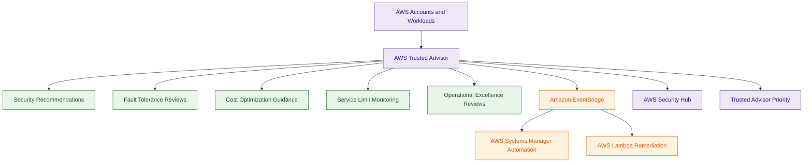
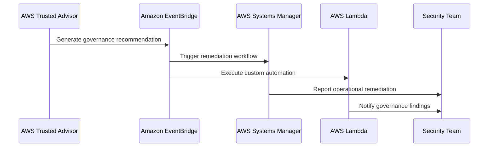

# AWS Trusted Advisor

## What Is AWS Trusted Advisor?

AWS Trusted Advisor is an AWS best-practice recommendation service that analyzes AWS environments and provides guidance for:

- security
- cost optimization
- fault tolerance
- performance
- service limits
- operational excellence

Trusted Advisor continuously evaluates AWS accounts against AWS-recommended operational and security best practices.

Think of Trusted Advisor as:

> An AWS operational and security best-practice advisory service.

---

## Why It Matters for Security

AWS Trusted Advisor helps organizations identify:

- security weaknesses
- exposed resources
- operational risks
- under-protected infrastructure
- governance gaps
- availability risks

Security and operations teams use Trusted Advisor for:

- operational reviews
- governance assessments
- account hygiene checks
- proactive risk reduction
- optimization analysis

Trusted Advisor is commonly used for:

- identifying public S3 buckets
- detecting unrestricted security groups
- reviewing MFA usage
- monitoring IAM best practices
- reviewing resilience gaps

It is heavily used in:

- enterprise governance
- operational reviews
- AWS hygiene assessments
- security posture improvement
- cost and resilience optimization

Trusted Advisor acts as:

> The operational consultant of the AWS ecosystem.

---

## Core Concepts

- AWS best-practice recommendation platform
- continuously evaluates AWS environments
- provides operational and security guidance
- identifies risks and optimization opportunities
- supports multiple operational categories
- dashboard-based advisory service
- account-level governance visibility
- proactive operational hygiene platform

---

## Important Integrations

### AWS Organizations

Supports:

- centralized governance visibility
- multi-account operational reviews
- enterprise account hygiene assessments

---

### AWS Security Hub

Can aggregate Trusted Advisor findings into centralized security dashboards.

---

### Amazon EventBridge

Supports:

- automated governance workflows
- remediation orchestration
- operational automation

based on Trusted Advisor findings.

---

### AWS Systems Manager

Commonly used for:

- remediation automation
- operational corrections
- patching workflows

triggered from Trusted Advisor recommendations.

---

### AWS Lambda

Supports:

- custom remediation logic
- governance automation
- operational workflows

---

### AWS IAM

Trusted Advisor evaluates IAM security best practices such as:

- MFA usage
- root account security
- password policy enforcement

---

### Amazon CloudWatch

Can monitor operational metrics related to Trusted Advisor recommendations.

---

### AWS Support Plans

Some Trusted Advisor checks require:

- Business Support
- Enterprise Support

Very important operational distinction.

---

## Security Features

### Security Best-Practice Checks

Trusted Advisor evaluates common security risks such as:

- unrestricted security groups
- public S3 buckets
- missing MFA
- exposed access keys
- weak IAM configurations

---

### Fault Tolerance Recommendations

Trusted Advisor identifies:

- resilience gaps
- insufficient redundancy
- missing backups
- availability risks

---

### Cost Optimization Guidance

Trusted Advisor recommends:

- rightsizing workloads
- removing idle resources
- reducing operational waste

Important operational governance capability.

---

### Service Limits Monitoring

Trusted Advisor monitors:

- AWS service quotas
- approaching operational limits
- scalability risks

Important for operational continuity.

---

### Operational Excellence Checks

Trusted Advisor supports operational governance across:

- account hygiene
- security posture
- resilience
- operational health

---

### Continuous Recommendations

Trusted Advisor continuously reevaluates AWS environments for:

- operational improvements
- governance recommendations
- risk reduction opportunities

---

### Automated Governance Integration

Trusted Advisor findings commonly integrate with:

- EventBridge
- Lambda
- Systems Manager

for automated governance workflows.

---

### Enterprise Governance Visibility

Organizations commonly use Trusted Advisor for:

- governance reporting
- operational reviews
- security posture visibility
- optimization tracking

---

## Trusted Advisor Core Security Checks

The following security checks are available even with basic AWS support plans:

- S3 Bucket Permissions
- Security Groups - Specific Ports Unrestricted
- IAM Use
- MFA on Root Account
- IAM Password Policy
- Amazon EBS Public Snapshots
- Amazon RDS Public Snapshots

These checks focus on foundational AWS security hygiene.

---

## Advanced Trusted Advisor Checks

Higher-tier AWS Support plans provide additional checks such as:

- exposed access keys
- advanced fault tolerance analysis
- operational optimization recommendations

Some advanced security recommendations require:

- Business Support
- Enterprise Support

Very important operational distinction.

---

## Trusted Advisor Priority

Trusted Advisor Priority provides:

- curated operational risks
- prioritized security recommendations
- AWS expert guidance

It is designed for enterprise support environments where AWS account teams help prioritize operational and security risks.

Very important enterprise governance capability.

---

## Trusted Advisor Categories

### Security

Examples:

- MFA on root account
- unrestricted security groups
- exposed IAM access keys

---

### Fault Tolerance

Examples:

- Multi-AZ recommendations
- backup recommendations
- resilience improvements

---

### Performance

Examples:

- throughput optimization
- workload efficiency improvements

---

### Cost Optimization

Examples:

- idle EC2 instances
- unattached EBS volumes
- unused Elastic IPs

---

### Service Limits

Examples:

- nearing EC2 quotas
- VPC limits
- IAM limits

---

### Operational Excellence

Examples:

- governance recommendations
- workload operational improvements
- AWS best-practice guidance

---

## Architecture Example

### Enterprise Governance and Operational Advisory Workflow

**Use case:** centralized governance reviews, operational hygiene analysis, and automated remediation workflows using Trusted Advisor recommendations.

---

## Governance and Remediation Workflow

**Use case:** automating governance and operational remediation workflows from Trusted Advisor recommendations.

---

## AWS Trusted Advisor vs AWS Config

| AWS Trusted Advisor | AWS Config |
|---|---|
| best-practice recommendation platform | compliance evaluation platform |
| suggests improvements | continuously evaluates configurations |
| broad operational guidance | resource-level governance |
| operational hygiene focused | compliance enforcement focused |

Use Trusted Advisor when:

- reviewing AWS operational best practices
- identifying optimization opportunities
- improving governance hygiene

Use Config when:

- monitoring compliance
- evaluating resource configurations
- detecting configuration drift

---

## AWS Trusted Advisor vs AWS Security Hub

| AWS Trusted Advisor | AWS Security Hub |
|---|---|
| recommendation and advisory service | centralized security findings platform |
| governance and optimization focused | alert aggregation focused |
| broad AWS best-practice checks | centralized security visibility |
| operational hygiene platform | security operations platform |

Use Trusted Advisor when:

- reviewing AWS best practices
- improving governance hygiene
- identifying optimization opportunities

Use Security Hub when:

- aggregating findings
- prioritizing security alerts
- centralizing security visibility

---

## AWS Trusted Advisor vs Amazon Inspector

| AWS Trusted Advisor | Amazon Inspector |
|---|---|
| account-level governance checks | workload vulnerability scanning |
| high-level AWS recommendations | deep CVE analysis |
| evaluates AWS best practices | evaluates software vulnerabilities |
| governance and hygiene focused | workload security focused |

Use Trusted Advisor when:

- reviewing AWS operational hygiene
- checking MFA and S3 exposure
- identifying governance risks

Use Inspector when:

- scanning EC2 vulnerabilities
- detecting CVEs
- evaluating package security

---

## AWS Trusted Advisor vs AWS Resilience Hub

| AWS Trusted Advisor | AWS Resilience Hub |
|---|---|
| broad operational recommendations | deep resilience assessment platform |
| high-level governance checks | application survivability analysis |
| account hygiene focused | disaster recovery readiness focused |
| operational optimization platform | resilience governance platform |

Use Trusted Advisor when:

- reviewing AWS operational best practices
- improving governance hygiene
- identifying optimization opportunities

Use Resilience Hub when:

- validating RTO/RPO objectives
- assessing DR architectures
- evaluating survivability

---

## Common Exam Traps

### Trap 1 — Confusing Trusted Advisor and Config

Trusted Advisor:
- suggests AWS best practices

AWS Config:
- continuously evaluates compliance

Very common governance distinction.

---

### Trap 2 — Assuming Trusted Advisor Automatically Remediates Issues

Trusted Advisor identifies recommendations.

Services such as:
- Systems Manager
- Lambda
- EventBridge

commonly perform remediation.

---

### Trap 3 — Confusing Trusted Advisor and Security Hub

Trusted Advisor:
- operational recommendations

Security Hub:
- centralized security findings aggregation

---

### Trap 4 — Forgetting Support Plan Requirements

Basic support plans include only limited Trusted Advisor checks.

Advanced checks commonly require:

- Business Support
- Enterprise Support

Example:
- exposed access key monitoring

---

### Trap 5 — Confusing Trusted Advisor and Resilience Hub

Trusted Advisor:
- broad operational guidance

Resilience Hub:
- deep resilience assessment

---

### Trap 6 — Assuming Trusted Advisor Only Covers Security

Trusted Advisor also evaluates:

- cost optimization
- resilience
- service quotas
- operational excellence
- performance

---

### Trap 7 — Ignoring Automated Governance Workflows

Trusted Advisor findings commonly integrate with:

- EventBridge
- Lambda
- Systems Manager

for automated governance and remediation workflows.

---

### Trap 8 — Confusing Governance Hygiene and Vulnerability Scanning

Trusted Advisor:
- checks AWS operational hygiene

Amazon Inspector:
- scans workloads for vulnerabilities and CVEs

---

## 5-Second Recall

### Identity

AWS Trusted Advisor = AWS operational and security best-practice advisory service

---

### Keywords

If the scenario mentions:

- AWS best practices
- operational recommendations
- unrestricted security groups
- MFA recommendations
- service quota monitoring
- governance hygiene

Answer:

→ AWS Trusted Advisor

---

### Governance Hygiene Trigger

If the requirement involves:

- AWS account hygiene
- operational optimization
- governance reviews
- best-practice recommendations

Answer:

→ AWS Trusted Advisor

---

### Compliance Trigger

If the scenario involves:

- resource compliance
- drift detection
- continuous configuration evaluation

Answer:

→ AWS Config

---

### Security Findings Trigger

If the requirement involves:

- centralized security findings
- alert aggregation
- security prioritization

Answer:

→ AWS Security Hub

---

### Vulnerability Trigger

If the scenario involves:

- CVE scanning
- workload vulnerabilities
- package inspection

Answer:

→ Amazon Inspector

---

### Resilience Trigger

If the requirement involves:

- validating RTO/RPO
- disaster recovery readiness
- survivability assessments

Answer:

→ AWS Resilience Hub

---

### Need AWS operational best-practice guidance?

→ AWS Trusted Advisor

---

### Need automated remediation?

→ EventBridge + Systems Manager + Lambda

---

### Need deep compliance governance?

→ AWS Config

---

### Need workload vulnerability scanning?

→ Amazon Inspector

---

## Quick Revision Notes

- AWS operational and security advisory platform
- evaluates AWS best practices and governance hygiene
- checks unrestricted security groups and MFA usage
- supports fault tolerance recommendations
- monitors AWS service quotas
- integrates with EventBridge and Systems Manager
- Security Hub aggregates findings, Trusted Advisor gives recommendations
- Config evaluates compliance, Trusted Advisor suggests improvements
- Inspector scans workloads, Trusted Advisor reviews governance hygiene
- Resilience Hub evaluates survivability, Trusted Advisor gives operational guidance
- some advanced checks require higher-tier support plans
- Trusted Advisor Priority provides curated enterprise risk visibility
- foundational AWS governance and operational review platform
