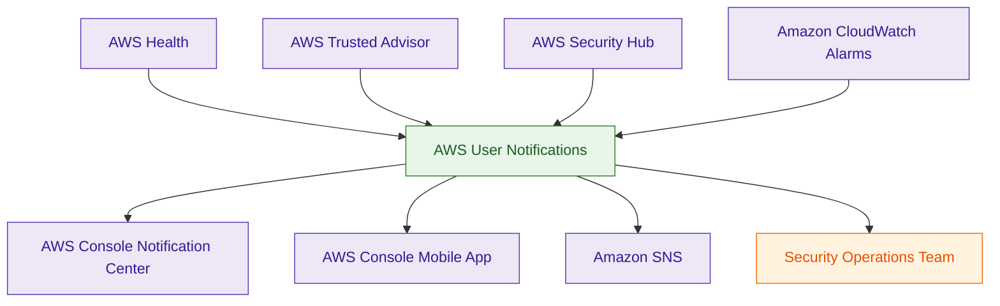
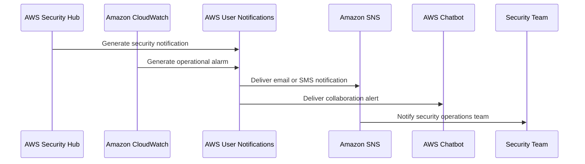

# AWS User Notifications

## What Is AWS User Notifications?

AWS User Notifications is a centralized AWS notification aggregation and management service that helps organizations organize, filter, and deliver AWS operational notifications.

It allows users to receive notifications from AWS services such as:

- AWS Health
- AWS Trusted Advisor
- AWS Security Hub
- Amazon CloudWatch
- operational account events
- governance alerts

AWS User Notifications centralizes AWS operational awareness across multiple services and accounts.

Think of AWS User Notifications as:

> A centralized operational notification and governance visibility platform for AWS environments.

---

## Why It Matters for Security

AWS User Notifications improves:

- operational awareness
- governance visibility
- incident coordination
- centralized alert management
- operational monitoring

Security and operations teams use User Notifications for:

- centralized operational alerts
- account health monitoring
- governance notifications
- security awareness
- compliance visibility

It is commonly used for:

- AWS Health advisories
- Security Hub alerts
- Trusted Advisor findings
- CloudWatch alarm notifications
- maintenance event visibility

AWS User Notifications helps organizations reduce:

- fragmented alerting
- missed operational events
- inconsistent notification visibility

It acts as:

> The centralized operational inbox for AWS governance and operational events.

---

## Core Concepts

- centralized AWS notification aggregation
- customizable notification subscriptions
- operational awareness platform
- supports governance visibility
- multi-channel notification delivery
- centralized event filtering
- human-focused operational visibility
- multi-account notification governance

---

## Important Integrations

### AWS Health

Provides:

- AWS infrastructure events
- maintenance advisories
- service disruptions

Very common operational integration.

---

### AWS Trusted Advisor

Provides:

- governance recommendations
- operational optimization alerts
- account hygiene notifications

---

### AWS Security Hub

Provides:

- security findings notifications
- compliance alerts
- governance visibility events

---

### Amazon CloudWatch

Provides:

- alarms
- operational monitoring alerts
- threshold notifications

---

### Amazon SNS

Supports notification delivery through:

- email
- SMS
- integrations
- operational workflows

---

### Amazon EventBridge

Commonly integrates behind the scenes for event routing and operational automation.

---

### AWS Organizations

Supports:

- centralized governance visibility
- multi-account notification management
- enterprise operational awareness

---

### AWS Chatbot

Can deliver notifications into:

- Slack
- Microsoft Teams

for operational collaboration.

---

## Security Features

### Centralized Notification Aggregation

User Notifications centralizes AWS operational notifications into a unified operational view.

This improves:

- governance awareness
- operational visibility
- incident coordination

---

### Aggregated Operational Visibility

Organizations can aggregate notifications from multiple AWS services including:

- AWS Health
- Trusted Advisor
- Security Hub
- CloudWatch

---

### Event Filtering

User Notifications supports filtering based on:

- event type
- AWS service
- account scope
- operational category

This reduces alert fatigue and operational noise.

---

### Multi-Account Governance Visibility

Organizations can centralize notifications across:

- AWS accounts
- organizational units
- enterprise environments

Very important enterprise governance pattern.

---

### Notification Routing

Notifications can be delivered to:

- email
- AWS Console Notification Center
- AWS Console Mobile App
- AWS Chatbot
- SNS workflows

---

### Reduced Alert Fragmentation

Instead of monitoring multiple AWS service dashboards independently, User Notifications provides centralized operational visibility.

---

### Human-Centric Operational Awareness

AWS User Notifications is designed primarily for:

- cloud administrators
- operations teams
- security analysts
- governance teams

rather than application-to-application messaging.

---

### AWS Console Notification Center

AWS User Notifications powers centralized operational visibility in:

- AWS Console Notification Center
- AWS Console Mobile App
- operational governance dashboards

This provides human-friendly aggregation of AWS operational events.

---

### Aggregation Regions

AWS User Notifications supports aggregation regions that centralize notifications from multiple AWS Regions into a single operational view.

This simplifies:

- enterprise operations
- governance visibility
- cross-region monitoring
- centralized operational awareness

---

## Notification Configuration Components

### Event Rules

Define:

- which AWS services generate notifications
- which operational events are monitored

---

### Aggregation Settings

Define:

- grouping behavior
- notification frequency
- operational event consolidation

Helps reduce alert fatigue.

---

### Delivery Channels

Define:

- where notifications are delivered

Examples:

- email
- AWS Console Notification Center
- AWS Chatbot
- mobile notifications

---

## Architecture Example

### Centralized AWS Operational Notification Platform

**Use case:** centralized operational awareness and governance notifications across AWS environments.

---

## Notification Workflow

**Use case:** centralized operational and security notification aggregation with multi-channel delivery.

---

## AWS User Notifications vs Amazon SNS

| AWS User Notifications | Amazon SNS |
|---|---|
| centralized notification aggregation | notification delivery service |
| designed for human operators | designed for applications and systems |
| governance visibility focused | messaging infrastructure focused |
| aggregates AWS operational events | distributes messages and notifications |
| console and operational visibility oriented | high-throughput event delivery focused |

Use User Notifications when:

- centralizing operational awareness
- aggregating governance alerts
- simplifying AWS operational visibility

Use SNS when:

- delivering notifications
- building pub/sub architectures
- integrating systems and applications

---

## AWS User Notifications vs Amazon EventBridge

| AWS User Notifications | Amazon EventBridge |
|---|---|
| notification aggregation platform | event routing platform |
| operational visibility focused | automation orchestration focused |
| manages operational subscriptions | routes and transforms events |
| human-facing governance visibility | integration and automation focused |

Use User Notifications when:

- centralizing operational notifications
- improving governance visibility
- aggregating AWS alerts

Use EventBridge when:

- automating workflows
- routing events
- orchestrating integrations

---

## AWS User Notifications vs AWS Health Dashboard

| AWS User Notifications | AWS Health Dashboard |
|---|---|
| centralized notification management | AWS infrastructure health visibility |
| aggregates multiple AWS service events | focuses on AWS service disruptions |
| customizable delivery and filtering | operational status reporting |
| governance visibility platform | AWS infrastructure advisory platform |

Use User Notifications when:

- centralizing operational awareness
- managing AWS notifications
- routing governance alerts

Use AWS Health when:

- reviewing service disruptions
- checking maintenance advisories
- monitoring AWS infrastructure health

---

## Common Exam Traps

### Trap 1 — Confusing User Notifications and SNS

User Notifications:
- aggregates AWS operational notifications

SNS:
- delivers messages and notifications

---

### Trap 2 — Confusing User Notifications and EventBridge

EventBridge:
- routes and orchestrates events

User Notifications:
- centralizes operational visibility

---

### Trap 3 — Assuming User Notifications Generates Findings

User Notifications consumes events from services such as:

- Security Hub
- AWS Health
- Trusted Advisor
- CloudWatch

It does not generate findings itself.

---

### Trap 4 — Forgetting Human-Focused Design

User Notifications is designed primarily for:

- administrators
- governance teams
- operations personnel

SNS is more application-focused.

---

### Trap 5 — Ignoring Aggregation Regions

User Notifications supports centralized multi-region operational visibility using aggregation regions.

Very important enterprise governance capability.

---

### Trap 6 — Confusing AWS Health and Security Hub

AWS Health:
- AWS infrastructure and maintenance events

Security Hub:
- security findings and compliance alerts

Both commonly integrate with User Notifications.

---

### Trap 7 — Assuming Manual EventBridge Configuration Is Required

AWS User Notifications directly integrates with supported AWS services.

Administrators usually configure notification rules directly within User Notifications rather than manually building EventBridge routing rules.

---

## 5-Second Recall

### Identity

AWS User Notifications = centralized AWS operational notification aggregation platform

---

### Keywords

If the scenario mentions:

- centralized AWS notifications
- operational alert aggregation
- governance visibility
- centralized AWS operational inbox
- notification filtering
- multi-service AWS alerts

Answer:

→ AWS User Notifications

---

### Governance Visibility Trigger

If the requirement involves:

- centralized operational awareness
- governance notification visibility
- multi-account operational alerts

Answer:

→ AWS User Notifications

---

### Messaging Trigger

If the scenario involves:

- pub/sub messaging
- high-throughput notifications
- application messaging

Answer:

→ Amazon SNS

---

### Event Routing Trigger

If the requirement involves:

- event orchestration
- routing AWS events
- automation workflows

Answer:

→ Amazon EventBridge

---

### Health Monitoring Trigger

If the requirement involves:

- AWS service disruptions
- maintenance advisories
- infrastructure health visibility

Answer:

→ AWS Health

---

### Need centralized AWS operational notifications?

→ AWS User Notifications

---

### Need application messaging?

→ Amazon SNS

---

### Need event routing and orchestration?

→ Amazon EventBridge

---

### Need centralized security findings?

→ AWS Security Hub

---

## Quick Revision Notes

- centralized AWS notification aggregation platform
- aggregates notifications from AWS services
- commonly integrates with Health and Security Hub
- supports operational governance visibility
- designed primarily for human operational awareness
- supports aggregation regions for centralized monitoring
- powers AWS Console Notification Center
- SNS delivers notifications, User Notifications aggregates them
- EventBridge routes events, User Notifications centralizes visibility
- reduces fragmented operational alerting
- supports enterprise governance and operational awareness
- foundational AWS operational visibility service
