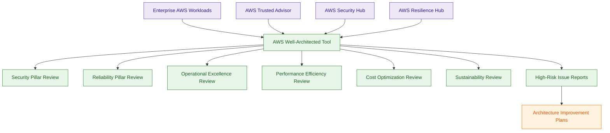
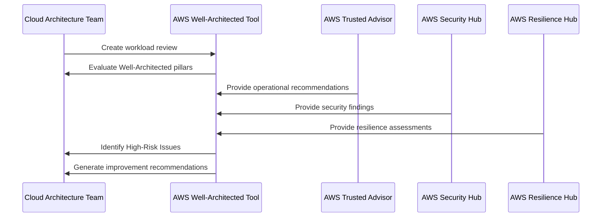

# AWS Well-Architected Tool

## What Is AWS Well-Architected Tool?

AWS Well-Architected Tool is an AWS architecture review and governance service that helps organizations evaluate workloads against AWS best practices.

It assesses workloads across the AWS Well-Architected Framework pillars:

- Security
- Reliability
- Performance Efficiency
- Cost Optimization
- Operational Excellence
- Sustainability

The tool helps teams identify:

- architectural risks
- governance gaps
- operational weaknesses
- security improvements
- resilience opportunities

Think of AWS Well-Architected Tool as:

> A structured AWS architecture assessment and governance review platform.

---

## Why It Matters for Security

AWS Well-Architected Tool is heavily used for:

- architecture governance
- security reviews
- resilience assessments
- operational maturity evaluations
- cloud adoption governance

Security and platform teams use the tool to:

- evaluate workload security posture
- identify architectural weaknesses
- improve governance maturity
- standardize AWS best practices
- reduce operational risks

It is commonly used during:

- workload reviews
- migration assessments
- production readiness reviews
- operational governance audits
- architecture modernization projects

The Well-Architected Tool helps organizations move from:

> reactive infrastructure management

to:

> proactive architecture governance.

---

## Core Concepts

- workload architecture assessment platform
- based on AWS Well-Architected Framework
- identifies high-risk architectural issues
- structured review methodology
- governance and operational maturity focused
- workload-centric evaluation model
- continuous architecture improvement
- architecture review automation
- supports architectural best-practice governance

---

## Important Integrations

### AWS Trusted Advisor

Trusted Advisor findings can complement Well-Architected reviews with operational recommendations.

---

### AWS Security Hub

Security findings commonly support Security Pillar evaluations.

---

### AWS Resilience Hub

Supports deeper resilience analysis and survivability validation.

---

### AWS Config

Provides compliance visibility for architecture governance reviews.

---

### AWS Organizations

Supports:

- multi-account governance
- enterprise architecture standardization
- centralized workload reviews

---

### AWS Control Tower

Well-Architected reviews commonly evaluate workloads deployed in Control Tower landing zones.

---

### Amazon CloudWatch

Supports operational visibility and monitoring assessments.

---

### AWS IAM

Security Pillar reviews commonly evaluate:

- least privilege
- MFA usage
- IAM governance

---

### AWS Systems Manager

Supports operational excellence and remediation workflows.

---

## Security Features

### Security Pillar Assessments

The Security Pillar evaluates areas such as:

- IAM governance
- logging and monitoring
- infrastructure protection
- incident response
- data protection

Very important for SCS-C03 governance reasoning.

---

### High-Risk Issue Identification

The tool identifies:

- High-Risk Issues (HRIs)
- governance gaps
- architectural weaknesses

HRIs represent major AWS best-practice concerns.

---

### Workload Reviews

Architectures are reviewed as workloads rather than isolated resources.

This improves:

- operational context
- governance reasoning
- architectural consistency

---

### Continuous Improvement Model

Well-Architected reviews are iterative and designed for continuous architecture improvement.

Organizations commonly perform recurring reviews over time.

---

### Reliability and Resilience Evaluation

The Reliability Pillar evaluates:

- fault tolerance
- disaster recovery readiness
- operational survivability
- workload availability

---

### Operational Excellence Governance

Operational Excellence assessments evaluate:

- automation maturity
- operational procedures
- monitoring practices
- governance workflows

---

### Architecture Governance Standardization

Organizations use the tool to standardize:

- review processes
- architectural baselines
- operational maturity evaluations

---

### Lens-Based Assessments

AWS Well-Architected Tool supports specialized review lenses such as:

- Serverless Lens
- SaaS Lens
- Financial Services Lens
- Machine Learning Lens

Lenses provide workload-specific governance guidance.

---

## AWS Well-Architected Framework Pillars

### Security

Focuses on:

- IAM
- data protection
- infrastructure security
- detection and response

---

### Reliability

Focuses on:

- fault tolerance
- disaster recovery
- workload recovery
- operational continuity

---

### Operational Excellence

Focuses on:

- automation
- operational procedures
- monitoring
- governance maturity

---

### Performance Efficiency

Focuses on:

- workload optimization
- scalability
- efficient architecture design

---

### Cost Optimization

Focuses on:

- reducing operational waste
- efficient AWS consumption
- workload cost governance

---

### Sustainability

Focuses on:

- energy efficiency
- environmental impact reduction
- sustainable cloud operations

---

## Architecture Example

### Enterprise Architecture Governance Workflow

**Use case:** enterprise architecture governance, workload maturity assessments, and operational risk reduction using AWS best-practice reviews.

---

## Architecture Review Workflow

**Use case:** structured enterprise workload governance and architecture maturity assessment.

---

## AWS Well-Architected Tool vs AWS Trusted Advisor

| AWS Well-Architected Tool | AWS Trusted Advisor |
|---|---|
| structured workload assessment platform | operational recommendation platform |
| architecture governance focused | operational hygiene focused |
| evaluates workloads holistically | evaluates AWS best practices broadly |
| review and maturity focused | recommendation and optimization focused |

Use Well-Architected Tool when:

- reviewing workload architectures
- performing governance assessments
- identifying architectural risks

Use Trusted Advisor when:

- reviewing AWS best practices
- identifying operational improvements
- improving account hygiene

---

## AWS Well-Architected Tool vs AWS Config

| AWS Well-Architected Tool | AWS Config |
|---|---|
| architecture review platform | compliance monitoring platform |
| workload governance focused | resource compliance focused |
| evaluates architectural maturity | evaluates resource configurations |
| periodic architecture assessments | continuous compliance evaluation |

Use Well-Architected Tool when:

- assessing workload maturity
- performing architecture reviews
- identifying governance improvements

Use Config when:

- monitoring compliance
- detecting drift
- evaluating resource configurations

---

## AWS Well-Architected Tool vs AWS Resilience Hub

| AWS Well-Architected Tool | AWS Resilience Hub |
|---|---|
| broad workload architecture reviews | deep resilience assessment platform |
| evaluates multiple governance pillars | focuses on survivability and DR |
| architecture maturity focused | resilience validation focused |
| holistic AWS governance platform | operational continuity platform |

Use Well-Architected Tool when:

- reviewing overall workload architecture
- identifying governance improvements
- evaluating operational maturity

Use Resilience Hub when:

- validating RTO/RPO goals
- evaluating disaster recovery readiness
- assessing survivability

---

## Common Exam Traps

### Trap 1 — Confusing Well-Architected Tool and Trusted Advisor

Well-Architected Tool:
- structured workload governance reviews

Trusted Advisor:
- operational recommendations and hygiene checks

---

### Trap 2 — Assuming Well-Architected Tool Automatically Remediates Issues

The tool identifies:

- risks
- governance gaps
- architectural weaknesses

It does not directly remediate infrastructure.

---

### Trap 3 — Confusing Config and Well-Architected Tool

AWS Config:
- continuously evaluates resources

Well-Architected Tool:
- performs architecture-level reviews

---

### Trap 4 — Forgetting High-Risk Issues (HRIs)

HRIs represent major architectural or governance concerns identified during reviews.

Very important Well-Architected concept.

---

### Trap 5 — Assuming It Only Covers Security

The tool evaluates:

- Security
- Reliability
- Operational Excellence
- Performance Efficiency
- Cost Optimization
- Sustainability

---

### Trap 6 — Confusing Resilience Reviews and Broad Governance Reviews

Resilience Hub:
- survivability and DR analysis

Well-Architected Tool:
- holistic architecture governance

---

### Trap 7 — Ignoring Lens-Based Reviews

Lenses provide specialized workload guidance for architectures such as:

- serverless
- SaaS
- machine learning

---

## 5-Second Recall

### Identity

AWS Well-Architected Tool = structured workload architecture assessment and governance platform

---

### Keywords

If the scenario mentions:

- workload architecture review
- architectural maturity
- high-risk issues
- governance assessments
- Well-Architected pillars
- workload best-practice reviews

Answer:

→ AWS Well-Architected Tool

---

### Architecture Governance Trigger

If the requirement involves:

- workload maturity assessments
- architecture governance reviews
- identifying architectural weaknesses

Answer:

→ AWS Well-Architected Tool

---

### Operational Hygiene Trigger

If the scenario involves:

- operational recommendations
- account optimization
- AWS best-practice suggestions

Answer:

→ AWS Trusted Advisor

---

### Compliance Trigger

If the requirement involves:

- continuous compliance evaluation
- drift detection
- resource governance

Answer:

→ AWS Config

---

### Resilience Trigger

If the requirement involves:

- RTO/RPO validation
- disaster recovery readiness
- survivability assessments

Answer:

→ AWS Resilience Hub

---

### Need structured architecture reviews?

→ AWS Well-Architected Tool

---

### Need operational best-practice recommendations?

→ AWS Trusted Advisor

---

### Need continuous compliance monitoring?

→ AWS Config

---

### Need survivability assessments?

→ AWS Resilience Hub

---

## Quick Revision Notes

- structured workload architecture assessment platform
- based on AWS Well-Architected Framework
- evaluates six architecture pillars
- identifies High-Risk Issues (HRIs)
- heavily focused on governance and operational maturity
- workload-centric review model
- supports lens-based assessments
- Trusted Advisor provides recommendations, Well-Architected performs structured reviews
- Config monitors compliance, Well-Architected evaluates architectures
- Resilience Hub validates survivability, Well-Architected evaluates broader governance maturity
- foundational enterprise architecture governance service
