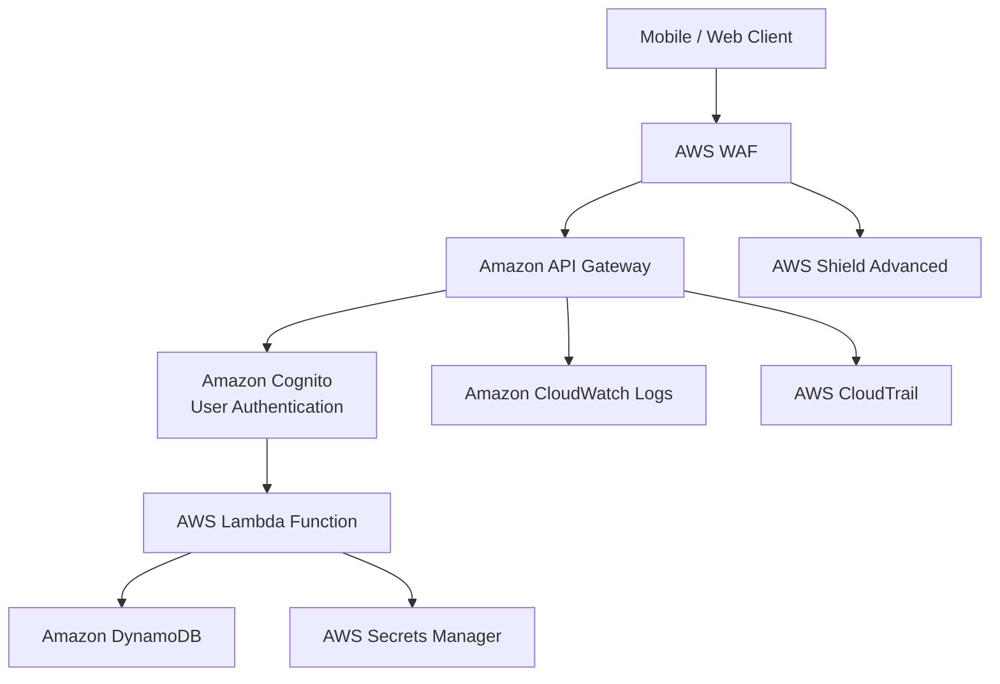

# Amazon API Gateway

## What Is Amazon API Gateway?

Amazon API Gateway is a fully managed service used to create, publish, secure, monitor, and manage APIs at scale.

API Gateway allows applications to securely expose backend services to:
- web applications
- mobile applications
- external users
- internal systems

API Gateway is commonly used with:
- AWS Lambda
- microservices
- container applications
- serverless architectures

It supports:
- REST APIs
- HTTP APIs
- WebSocket APIs

---

## Why API Gateway Matters for SCS-C03

API Gateway is heavily used in modern AWS architectures where organizations need to:
- securely expose APIs
- authenticate users
- protect backend services
- apply throttling and rate limiting
- monitor API activity
- secure serverless applications

API Gateway is commonly associated with:
- Amazon Cognito
- AWS WAF
- IAM authorization
- Lambda authorizers
- private APIs
- DDoS protection

A strong understanding of API Gateway security controls is important for designing secure application architectures in AWS.

---

## Core Concepts

- API Gateway acts as the front door for applications
- supports authentication and authorization
- integrates with Lambda and backend services
- supports throttling and rate limiting
- can expose public or private APIs
- supports request validation
- integrates with AWS security services

Think of API Gateway as:

> A secure managed entry point for APIs and backend services.

---

## Common Security Use Cases

### Secure API Exposure

Used to securely expose:
- Lambda functions
- microservices
- backend applications
- internal APIs

---

### Authentication and Authorization

Used to enforce:
- user authentication
- token validation
- IAM authorization
- role-based API access

Common integrations:
- Amazon Cognito
- IAM
- Lambda authorizers

---

### Protecting Serverless APIs

Used to securely expose:
- Lambda-based applications
- serverless APIs
- event-driven workloads

---

### API Throttling and Rate Limiting

Used to:
- prevent abuse
- reduce bot traffic
- limit API usage
- reduce denial-of-service risks

---

### Private APIs

Used to expose APIs only inside:
- Amazon VPCs
- internal applications
- private enterprise networks

Private APIs use:
- interface VPC endpoints

---

### API Monitoring and Logging

Used to monitor:
- API requests
- failed authentication attempts
- suspicious traffic
- API errors

Common integrations:
- CloudWatch
- CloudTrail

---

### DDoS and Web Protection

API Gateway commonly integrates with:
- AWS WAF
- AWS Shield

Used to:
- block malicious traffic
- filter attacks
- reduce API abuse

---

## How API Gateway Works

### Basic Flow

1. A client sends an API request
2. API Gateway validates the request
3. Authentication and authorization are performed
4. The request is forwarded to the backend service
5. The response is returned to the client

---

### Simple Architecture

```text
Client Application
        ↓
AWS WAF
        ↓
Amazon API Gateway
        ↓
Authentication
        ↓
AWS Lambda / Backend Service
        ↓
Database or Application
```
---
### Example Architecture

Use case: secure serverless API architecture.

This architecture demonstrates:

- authenticated API access
- WAF protection against web attacks
- Lambda-based backend processing
- centralized logging and auditing
- secure secret retrieval
- DDoS protection for public APIs.
---

## Important Integrations

### AWS Lambda

Most common integration.

API Gateway is commonly used to securely invoke:
- Lambda functions
- serverless applications

---

### Amazon Cognito

Used for:
- user authentication
- JWT token validation
- user pools
- identity federation

Very important security integration.

---

### AWS IAM

Supports IAM-based authorization for APIs.

Used for:
- least privilege access
- signed API requests
- internal AWS applications

---

### AWS WAF

Used to protect APIs against:
- SQL injection
- bot traffic
- malicious requests
- layer 7 attacks

---

### AWS CloudTrail

CloudTrail logs:
- API Gateway management activity
- configuration changes
- administrative actions

Useful for:
- auditing
- investigations
- compliance

---

### Amazon CloudWatch

Used for:
- metrics
- alarms
- logging
- monitoring API activity

---

### AWS Shield

Used for:
- DDoS protection
- application availability
- attack mitigation

---

### AWS Certificate Manager (ACM)

Used to:
- provision TLS certificates
- enable HTTPS endpoints
- secure API communication

---

### Amazon VPC

Private APIs can be exposed securely inside VPCs using:
- interface VPC endpoints

---

### AWS Secrets Manager

Backend services commonly retrieve:
- API credentials
- database passwords
- tokens

through Secrets Manager.

---

## Security Features

### IAM Authorization

API Gateway supports:
- IAM authentication
- SigV4 signed requests

Useful for:
- internal APIs
- AWS-native applications

---

### Cognito Authentication

Supports:
- user pools
- JWT validation
- federated identities

Common for:
- mobile applications
- web applications

---

### Lambda Authorizers

Custom authorization logic using Lambda functions.

Useful for:
- custom token validation
- third-party identity systems

---

### Resource Policies

Used to restrict:
- source IP addresses
- VPC access
- account-level access

Very important security control.

---

### API Keys and Usage Plans

Used for:
- client identification
- request throttling
- usage tracking

Not considered strong authentication by themselves.

---

### TLS Encryption

API Gateway supports:
- HTTPS endpoints
- TLS encryption in transit

---

### Private APIs

Allows APIs to remain accessible only within:
- private networks
- VPCs
- internal systems

---

### Request Validation

Used to:
- validate request structure
- reject malformed requests
- improve API security

---

### WAF Integration

Used to:
- filter malicious traffic
- block attacks
- apply managed security rules

---

## Cost and Performance Considerations

### API Caching

Caching improves:
- response times
- backend performance
- scalability

---

### Throttling

Used to:
- prevent abuse
- limit excessive requests
- protect backend systems

---

### Request Costs

Pricing depends on:
- API requests
- caching
- data transfer

---

### Logging Costs

Extensive CloudWatch logging can increase costs.

Organizations should balance:
- visibility
- retention
- cost

---

## Service Comparisons

### API Gateway vs Application Load Balancer

| API Gateway | Application Load Balancer |
|---|---|
| API-focused | traffic load balancing |
| authentication features | Layer 7 routing |
| serverless integration | container and EC2 focused |
| throttling and usage plans | no API management features |

---

### API Gateway vs Lambda URLs

| API Gateway | Lambda URLs |
|---|---|
| advanced API management | simple Lambda endpoint |
| authentication and throttling | lightweight access |
| WAF integration | fewer controls |
| production-grade APIs | simpler workloads |

---

### Cognito vs Lambda Authorizers

| Cognito | Lambda Authorizers |
|---|---|
| managed authentication | custom authorization |
| JWT validation | custom token logic |
| easier operationally | more flexible |
| common for user authentication | custom identity integrations |

---

## Common Exam Scenarios

### Scenario 1

A company needs to expose Lambda functions securely to mobile users with authentication.

Answer:
API Gateway with Amazon Cognito

---

### Scenario 2

A company needs to protect public APIs against SQL injection and bot attacks.

Answer:
API Gateway with AWS WAF

---

### Scenario 3

An organization needs internal APIs accessible only within a VPC.

Answer:
Private API Gateway with interface VPC endpoints

---

### Scenario 4

A company needs to limit excessive API requests from clients.

Answer:
API Gateway throttling and usage plans

---

## Common Exam Traps

### Trap 1 — Forgetting WAF Protection

Public APIs commonly require:
- AWS WAF
- throttling
- rate limiting

---

### Trap 2 — Confusing Authentication Methods

Use:
- Cognito for user authentication
- IAM for AWS-native access
- Lambda authorizers for custom authorization logic

---

### Trap 3 — Exposing Internal APIs Publicly

Sensitive internal APIs should use:
- private APIs
- VPC endpoints
- resource policies

---

### Trap 4 — Forgetting Resource Policies

Resource policies are commonly used to restrict:
- IP addresses
- VPCs
- accounts

---

## Quick Revision Notes

- API Gateway = managed API service
- commonly used with Lambda
- supports Cognito authentication
- integrates with AWS WAF
- supports private APIs
- supports throttling and rate limiting
- resource policies restrict access
- CloudWatch and CloudTrail provide monitoring
- common in serverless architectures
- supports TLS encryption
