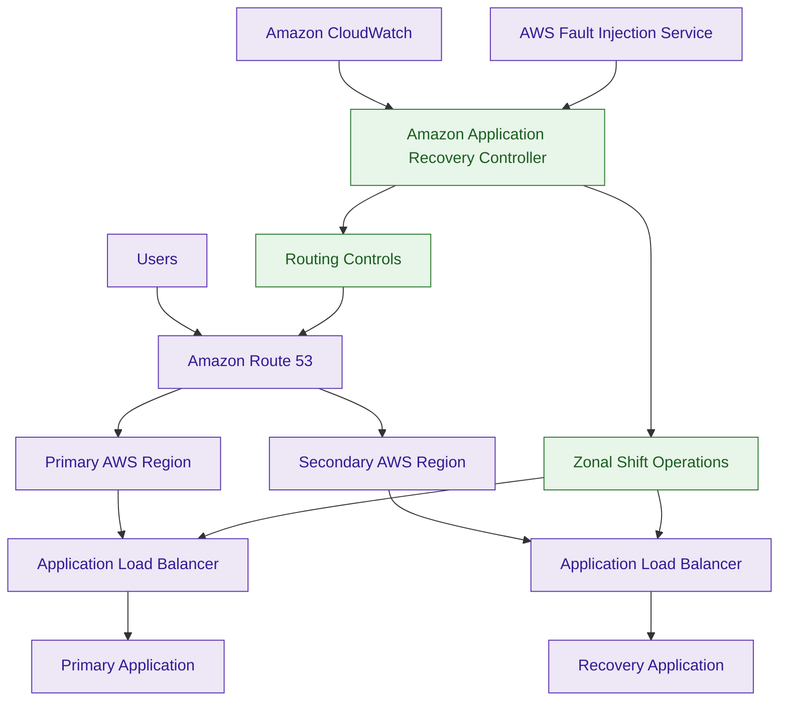
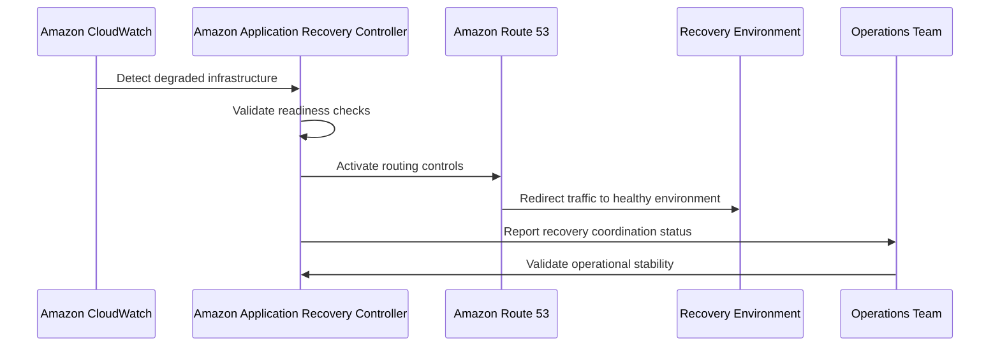

# Amazon Application Recovery Controller (ARC)

## What Is Amazon Application Recovery Controller?

Amazon Application Recovery Controller (ARC) is an AWS resilience orchestration and disaster recovery control service that helps organizations improve workload availability and operational survivability.

ARC provides capabilities for:

- readiness checks
- routing controls
- zonal shift operations
- failover coordination
- disaster recovery governance

It helps organizations safely coordinate recovery during:

- Availability Zone failures
- regional disruptions
- degraded infrastructure events
- operational outages
- disaster recovery scenarios

Think of ARC as:

> A resilience control plane and recovery orchestration platform for highly available AWS applications.

---

## Why It Matters for Security

Operational resilience is a critical security pillar.

Applications that become unavailable during outages, attacks, or infrastructure failures are operationally insecure.

Security and reliability teams use ARC for:

- failover governance
- operational survivability
- controlled disaster recovery
- resilient traffic management
- recovery coordination

ARC helps organizations:

- reduce downtime
- improve recovery confidence
- validate failover readiness
- prevent cascading failures
- coordinate recovery safely

It is heavily used in:

- mission-critical applications
- enterprise disaster recovery
- multi-region architectures
- high-availability environments
- resilience engineering

ARC is foundational for:

- controlled failover operations
- resilient application recovery
- operational continuity governance

---

## Core Concepts

- resilience orchestration platform
- failover coordination and control
- readiness validation
- routing control operations
- zonal traffic shifting
- disaster recovery governance
- operational survivability management
- centralized recovery control plane

---

## Core ARC Components

### Readiness Checks

Readiness checks validate whether disaster recovery environments are prepared for failover.

Examples:

- sufficient infrastructure capacity
- configuration consistency
- service quota readiness
- dependency validation
- scaling preparedness

Very important disaster recovery validation capability.

---

### Routing Controls

Routing controls provide operational traffic control mechanisms for:

- failover coordination
- recovery operations
- manual traffic isolation
- controlled routing changes

Routing controls act as operational recovery switches.

---

### Zonal Shift

Zonal Shift temporarily moves traffic away from impaired Availability Zones during:

- degraded infrastructure events
- partial failures
- operational instability
- grey failure scenarios

Very important high-availability capability.

---

## Important Integrations

### Amazon Route 53

Provides:

- DNS failover
- traffic routing
- health checks

ARC integrates heavily with Route 53 routing controls.

---

### Elastic Load Balancing (ELB)

Supports:

- zonal traffic isolation
- load distribution
- zonal shift operations

ARC integrates with ELB for Availability Zone traffic management.

---

### Amazon CloudWatch

Provides:

- operational telemetry
- alarms
- outage visibility

CloudWatch commonly triggers recovery workflows.

---

### AWS Resilience Hub

Provides broader resilience assessment and survivability analysis.

ARC focuses on operational failover coordination.

---

### AWS Fault Injection Service (FIS)

Supports:

- chaos engineering
- outage simulation
- resilience validation

Very important resilience testing integration.

---

### AWS Systems Manager

Supports:

- operational automation
- incident coordination
- remediation workflows

---

### Amazon EC2 Auto Scaling

Supports:

- recovery scaling
- workload survivability
- failover capacity management

---

### AWS Global Accelerator

Supports resilient global traffic routing architectures.

---

## Security Features

### Manual Routing Controls

ARC routing controls can operate as manual recovery switches.

This allows operators to:

- intentionally stop traffic
- prevent unstable failback behavior
- coordinate controlled recovery workflows
- avoid failover oscillation

Unlike purely automatic failover systems, ARC allows controlled operational decision-making during incidents.

Very important enterprise resilience capability.

---

### Highly Available ARC Control Plane

ARC uses a highly available distributed control plane spanning multiple AWS Regions.

This allows routing controls to remain operational even if the primary application region becomes unavailable.

Very important disaster recovery design characteristic.

---

### Zonal Shift Operations

ARC supports zonal shift operations that temporarily move traffic away from impaired Availability Zones.

This reduces impact from:

- zonal degradation
- partial outages
- unstable infrastructure

Very important resilience capability.

---

### Readiness Validation

ARC validates whether workloads are operationally prepared for failover before recovery actions occur.

This improves:

- recovery confidence
- operational consistency
- survivability governance

---

### Capacity and Readiness Validation

Readiness checks can validate disaster recovery preparedness such as:

- Auto Scaling capacity
- service quotas
- dependency readiness
- infrastructure availability

ARC helps ensure recovery environments can actually support failover traffic before routing changes occur.

---

### Controlled Failover Coordination

ARC supports safer failover workflows by coordinating:

- routing changes
- operational recovery
- traffic isolation
- recovery sequencing

This helps prevent:

- incomplete failovers
- cascading outages
- unstable recovery operations

---

### Multi-Region Recovery Support

ARC commonly supports architectures using:

- multi-region deployments
- Route 53 failover
- Global Accelerator
- distributed application workloads

---

### Resilience Governance

Organizations commonly use ARC for:

- disaster recovery governance
- failover readiness validation
- resilience coordination
- operational survivability management

---

## Architecture Example

### Enterprise Multi-Region Recovery Control Architecture

**Use case:** enterprise multi-region failover orchestration, zonal traffic isolation, and operational recovery governance.

---

## Recovery Coordination Workflow

**Use case:** coordinated disaster recovery and controlled failover operations.

---

## Amazon ARC vs AWS Resilience Hub

| Amazon ARC | AWS Resilience Hub |
|---|---|
| operational recovery control platform | resilience assessment platform |
| coordinates failover operations | evaluates resilience posture |
| routing and recovery focused | survivability analysis focused |
| operational failover orchestration | resilience scoring and recommendations |

Use ARC when:

- coordinating failover
- controlling recovery operations
- managing routing changes

Use Resilience Hub when:

- evaluating survivability
- validating RTO/RPO goals
- assessing resilience posture

---

## Amazon ARC vs Route 53 Failover

| Amazon ARC | Route 53 Failover |
|---|---|
| recovery orchestration platform | DNS failover mechanism |
| validates recovery readiness | routes traffic using health checks |
| controlled operational failover | reactive DNS failover |
| routing governance focused | traffic routing focused |

Use ARC when:

- coordinating recovery workflows
- validating failover readiness
- controlling failover behavior

Use Route 53 when:

- routing DNS traffic
- performing health-check failover
- redirecting traffic automatically

Route 53 failover is like an automatic circuit breaker.

ARC is like a mission control center coordinating recovery operations.

---

## Amazon ARC vs AWS Fault Injection Service

| Amazon ARC | AWS Fault Injection Service |
|---|---|
| recovery orchestration platform | chaos engineering platform |
| coordinates failover operations | injects controlled failures |
| operational survivability focused | resilience testing focused |
| controls recovery behavior | validates recovery readiness |

Use ARC when:

- coordinating operational recovery
- controlling failover workflows
- managing recovery operations

Use FIS when:

- simulating outages
- testing resilience
- validating failover behavior

---

## Common Exam Traps

### Trap 1 — Confusing ARC and Resilience Hub

ARC:
- coordinates operational recovery

Resilience Hub:
- evaluates survivability and resilience posture

---

### Trap 2 — Confusing ARC and Route 53

Route 53:
- performs DNS failover

ARC:
- coordinates controlled failover operations

---

### Trap 3 — Assuming ARC Replicates Infrastructure

ARC does not:

- replicate databases
- move backups
- rebuild infrastructure

Instead, ARC validates whether recovery environments are ready for failover.

---

### Trap 4 — Forgetting Manual Routing Controls

ARC supports manual operational routing controls to avoid unstable failover oscillation during incidents.

Very important enterprise resilience capability.

---

### Trap 5 — Forgetting Zonal Shift

ARC supports zonal traffic shifting for degraded Availability Zones.

Very important operational survivability feature.

---

### Trap 6 — Confusing Testing and Recovery Coordination

FIS:
- injects failures

ARC:
- coordinates recovery operations

---

### Trap 7 — Assuming ARC Replaces Monitoring

CloudWatch:
- detects issues

ARC:
- coordinates recovery and failover

---

### Trap 8 — Ignoring Readiness Checks

ARC validates:

- failover readiness
- infrastructure preparedness
- capacity availability
- operational survivability

before recovery operations occur.

---

## 5-Second Recall

### Identity

Amazon ARC = resilience orchestration and failover coordination platform

---

### Keywords

If the scenario mentions:

- routing controls
- readiness checks
- zonal shift
- coordinated failover
- recovery orchestration
- operational survivability

Answer:

→ Amazon Application Recovery Controller (ARC)

---

### Controlled Recovery Trigger

If the requirement involves:

- coordinated failover
- manual recovery controls
- operational routing governance

Answer:

→ Amazon ARC

---

### DNS Routing Trigger

If the requirement involves:

- DNS failover
- health-check routing
- automatic traffic redirection

Answer:

→ Amazon Route 53

---

### Resilience Assessment Trigger

If the requirement involves:

- survivability analysis
- RTO/RPO validation
- resilience scoring

Answer:

→ AWS Resilience Hub

---

### Chaos Engineering Trigger

If the scenario involves:

- outage simulation
- fault injection
- resilience testing

Answer:

→ AWS Fault Injection Service (FIS)

---

### Need zonal traffic isolation?

→ Amazon ARC Zonal Shift

---

### Need controlled recovery orchestration?

→ Amazon ARC

---

### Need DNS failover?

→ Amazon Route 53

---

### Need resilience testing?

→ AWS Fault Injection Service

---

## Quick Revision Notes

- resilience orchestration and failover control platform
- supports readiness checks and routing controls
- supports zonal shift operations
- coordinates operational recovery workflows
- heavily integrated with Route 53
- CloudWatch detects failures, ARC coordinates recovery
- FIS tests resilience, ARC controls failover
- Resilience Hub evaluates survivability, ARC manages recovery operations
- readiness checks validate capacity and failover preparedness
- routing controls support manual recovery coordination
- highly available distributed control plane
- foundational enterprise resilience orchestration service
