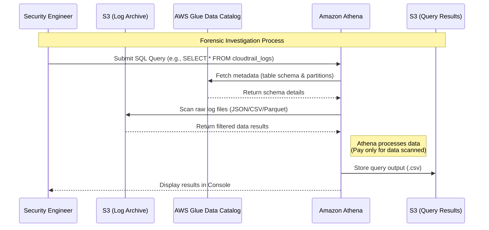

# Amazon Athena

## What Is Amazon Athena?

Amazon Athena is a serverless query service that allows you to analyze data stored in Amazon S3 using standard SQL.

Athena does not require:
- servers
- infrastructure management
- databases

You simply:
1. store data in Amazon S3
2. define a schema
3. run SQL queries

Athena is commonly used by security teams to investigate logs and analyze large amounts of security data.

---

## Why Athena Matters for SCS-C03

Athena appears frequently in AWS security scenarios because it is heavily used for:

- CloudTrail investigations
- VPC Flow Log analysis
- AWS WAF log analysis
- incident response
- threat hunting
- querying Security Lake data
- compliance reporting

Athena is one of the most common services used for:

> Analyze logs stored in S3 with minimal operational overhead.

---

## Core Concepts

- Athena queries data directly from Amazon S3
- Athena is fully serverless
- Athena uses SQL
- Athena commonly integrates with AWS Glue Data Catalog
- Athena pricing depends on data scanned
- Athena does not store the data itself

Think of Athena as:

> SQL on top of S3

---

## Common Security Use Cases

### Querying CloudTrail Logs

Used to investigate:
- IAM activity
- suspicious API calls
- privilege escalation
- deleted resources
- failed login attempts

Example:
- identify who deleted an S3 bucket
- identify unusual AssumeRole activity

---

### Investigating VPC Flow Logs

Used to:
- identify suspicious traffic
- detect data exfiltration
- investigate denied traffic
- analyze unusual ports and IPs

Example:
- detect outbound traffic to suspicious IP addresses

---

### Analyzing AWS WAF Logs

Used for:
- SQL injection investigations
- bot traffic analysis
- blocked request analysis
- identifying attack patterns

---

### Incident Response

Security teams use Athena during investigations to:
- trace attacker activity
- correlate events
- analyze historical logs
- investigate compromised resources

---

### Threat Hunting

Used to:
- identify abnormal API behavior
- search for suspicious access patterns
- analyze unusual S3 downloads
- identify IAM misuse

---

### Compliance Reporting

Used to:
- generate audit reports
- analyze long-term logs
- support PCI DSS and HIPAA investigations
- provide security evidence

---

## How Athena Works

### Basic Flow

1. Logs are stored in Amazon S3
2. AWS Glue defines the schema
3. Athena runs SQL queries
4. Results are returned

---

### Simple Architecture

```text
AWS Logs
   ↓
Amazon S3
   ↓
AWS Glue Data Catalog
   ↓
Amazon Athena
   ↓
SQL Queries / Investigations
```

---

## Important Integrations

### Amazon S3

Athena queries data stored in S3.

Common data sources:
- CloudTrail logs
- VPC Flow Logs
- WAF logs
- Security Lake data

---

### AWS Glue

Glue Data Catalog stores:
- schemas
- table definitions
- partitions

Glue Crawlers can automatically discover schemas.

---

### AWS CloudTrail

One of the most important integrations.

Athena is commonly used to analyze:
- management events
- API calls
- IAM activity
- account changes

---

### Amazon Security Lake

Security Lake centralizes security logs into S3.

Athena is commonly used to query Security Lake data.

---

### Amazon QuickSight

Athena query results can be visualized using dashboards and reports.

---
### Example Architecture

---
## Example Query

  SELECT eventName, userIdentity.userName
  FROM cloudtrail_logs
  WHERE errorCode IS NOT NULL;

---
## Security Features

### IAM Access Control

Athena access is controlled using:
- IAM policies
- S3 permissions
- Glue permissions

---

### Encryption Support

Athena supports:
- SSE-S3
- SSE-KMS
- client-side encryption

Both:
- source data
- query results

can be encrypted.

---

### Fine-Grained Access

Can restrict access to:
- databases
- tables
- columns

using:
- IAM
- Lake Formation

---

## Cost and Performance Considerations

Athena pricing is based on:

> amount of data scanned

---

### Reduce Athena Cost

#### Use Partitioning

Example:

```text
logs/year=2025/month=01/day=10/
```

Athena scans only required partitions.

---

#### Use Columnar Formats

Recommended formats:
- Parquet
- ORC

Benefits:
- lower scan size
- lower cost
- faster queries

---

#### Avoid Scanning Unnecessary Data

Best practice:
- query only required columns
- limit time ranges
- partition large datasets

---

## Service Comparisons

### Athena vs OpenSearch

| Athena | OpenSearch |
|---|---|
| SQL on S3 | indexed search engine |
| serverless | managed search cluster |
| cheaper for large log archives | faster real-time search |
| investigation-focused | analytics-focused |

---

### Athena vs CloudWatch Logs Insights

| Athena | CloudWatch Logs Insights |
|---|---|
| queries S3 logs | queries CloudWatch logs |
| long-term investigations | operational troubleshooting |
| SQL-based | custom query language |
| lower cost for archived logs | better for real-time operations |

---

## Common Exam Scenarios

### Scenario 1

A company stores CloudTrail logs in S3 and needs to analyze them using SQL with minimal operational overhead.

Answer:
Amazon Athena

---

### Scenario 2

A security team needs to investigate suspicious VPC traffic stored in S3.

Answer:
Amazon Athena

---

### Scenario 3

A company needs a low-cost way to analyze years of archived AWS logs.

Answer:
Amazon Athena with partitioning and S3 lifecycle policies

---

### Scenario 4

A security engineer needs to query AWS WAF logs stored in S3.

Answer:
Amazon Athena

---

## Common Exam Traps

### Trap 1 — Choosing OpenSearch Instead of Athena

Use Athena when:
- logs already exist in S3
- SQL analysis is required
- low operational overhead is needed
- real-time indexing is not required

---

### Trap 2 — Forgetting AWS Glue

Athena commonly depends on:
- Glue Data Catalog
- Glue Crawlers

---

### Trap 3 — Ignoring Partitioning

Partitioning is one of the most important Athena optimization concepts.

---

### Trap 4 — Treating Athena Like a Database

Athena does not store data.

It queries data stored in Amazon S3.

---

## Quick Revision Notes

- Athena = SQL queries on S3
- fully serverless
- heavily used for security investigations
- commonly used with CloudTrail
- integrates with AWS Glue
- pricing depends on scanned data
- partitioning reduces cost
- Parquet improves performance
- common in incident response scenarios
