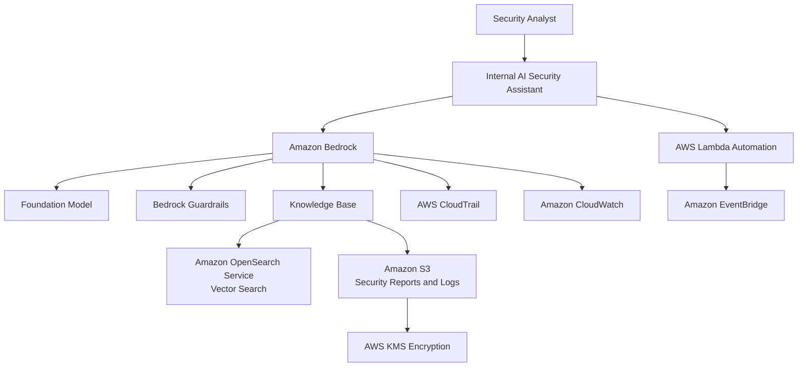

# Amazon Bedrock

## What Is Amazon Bedrock?

Amazon Bedrock is a fully managed generative AI service that allows organizations to build and scale AI applications using foundation models from AWS and third-party providers.

Bedrock supports use cases such as:

- AI assistants
- chatbots
- document summarization
- content generation
- security analysis
- automation
- retrieval-augmented generation (RAG)

Bedrock provides access to multiple foundation models without managing infrastructure.

Think of Amazon Bedrock as:

> A managed generative AI platform for building secure AI-powered applications.

---

## Why Amazon Bedrock Matters for Security

Generative AI introduces major security concerns around:

- sensitive data exposure
- prompt injection
- model misuse
- unauthorized access
- logging and monitoring
- data governance

Security teams must understand how to secure:

- prompts
- AI-generated responses
- model access
- knowledge bases
- API usage
- IAM permissions

Organizations increasingly use Bedrock for:

- security copilots
- automated investigations
- threat analysis
- security summarization
- operational automation

---

## Core Concepts

- Bedrock provides managed foundation models
- applications interact using APIs
- IAM controls model access
- prompts are sent to foundation models
- knowledge bases support RAG architectures
- Bedrock integrates with AWS security services
- customer data is not used to train foundation models by default

---

## Common Security Use Cases

### Security AI Assistants

Organizations can build AI assistants for:

- SOC analysts
- operational teams
- incident responders
- internal support systems

---

### Security Investigation Summarization

Bedrock can summarize:

- GuardDuty findings
- CloudTrail activity
- incident reports
- investigation timelines

---

### Threat Intelligence Analysis

Used to analyze:

- indicators of compromise
- threat reports
- suspicious activity
- security findings

---

### Automated Security Reporting

Bedrock can generate:

- incident summaries
- executive reports
- compliance documentation
- operational insights

---

### Retrieval-Augmented Generation (RAG)

Organizations can securely query internal knowledge bases using:

- Bedrock Knowledge Bases
- vector search
- OpenSearch integrations

---

### Security Automation

Bedrock can integrate with:

- Lambda
- EventBridge
- Security Hub
- ticketing systems

for automated workflows.

---

## How Amazon Bedrock Works

### Basic Workflow

1. User or application sends a prompt
2. Bedrock processes the request
3. Foundation model generates a response
4. Optional knowledge base retrieval occurs
5. Results are returned to the application
6. Logging and monitoring capture activity

---

### Simple Architecture

```text
User / Application
        ↓
Amazon Bedrock
        ↓
Foundation Model
        ↓
Knowledge Base / Data Source
        ↓
AI Response
```
---
### Example Use Case: Secure AI-Powered Security Investigation Assistant

---

## Important Components

### Foundation Models

Bedrock provides access to models from providers such as:

- Anthropic
- AI21 Labs
- Meta
- Cohere
- Amazon Titan

---

### Prompts

Prompts are inputs sent to foundation models.

Sensitive prompts should be protected carefully.

---

### Knowledge Bases

Knowledge Bases support:

- retrieval-augmented generation
- document querying
- enterprise search

---

### Guardrails

Bedrock Guardrails help control:

- unsafe responses
- harmful content
- sensitive information exposure

---

### Embeddings

Embeddings convert data into vector representations for semantic search and RAG workflows.

---

### Agents

Agents can automate:

- workflows
- reasoning tasks
- API interactions
- operational actions

---

## Important Integrations

### AWS IAM

IAM controls:

- model access
- API permissions
- administrative access

---

### Amazon OpenSearch Service

OpenSearch is commonly used in Bedrock architectures for:

- vector search
- embeddings storage
- semantic retrieval
- retrieval-augmented generation (RAG)

This allows AI applications to securely search internal knowledge bases and security datasets.

---

### Amazon S3

Used for:

- document storage
- training datasets
- knowledge base content

---

### AWS Lambda

Used for:

- automation
- orchestration
- AI workflows

---

### Amazon EventBridge

Can trigger:

- AI workflows
- automation
- notifications

---

### AWS CloudTrail

CloudTrail logs:

- API activity
- model invocation
- configuration changes

---

### Amazon CloudWatch

Provides:

- monitoring
- metrics
- logging
- alarms

---

### AWS KMS

KMS helps encrypt:

- stored documents
- vector databases
- AI-related data

---

### AWS Security Hub

Security findings and alerts can integrate into AI-driven operational workflows.

---

## Security Features

### Principle of Least Privilege for AI Workloads

The IAM role used by AI applications should only access:

- approved Bedrock models
- required Knowledge Bases
- authorized S3 buckets
- permitted APIs

Example:

An internal security assistant may require:

- bedrock:InvokeModel
- access to a specific Knowledge Base
- read access to a specific S3 bucket

but should not have unrestricted access to all Bedrock resources or all S3 buckets.

Least privilege access is critical for:
- sensitive AI workflows
- internal security assistants
- enterprise RAG systems

### IAM-Based Access Control

IAM policies should restrict:

- model invocation
- knowledge base access
- administrative permissions

---

### Generative AI Guardrails

Bedrock Guardrails help protect AI applications from:

- unsafe responses
- toxic content
- prompt abuse
- sensitive data exposure
- restricted topic generation

This is important for implementing secure generative AI applications.

Guardrails are major security controls for:

- AI assistants
- internal copilots
- RAG systems
- enterprise AI applications

---

### Encryption

Data can be encrypted using:

- AWS KMS

for storage and integrations.

---

### Protecting Knowledge Base Data

Knowledge base data stored in services such as Amazon S3 should be protected using:

- AWS KMS encryption
- bucket policies
- IAM least privilege permissions
- access logging

Even though Bedrock provides the AI capability, organizations must still secure the underlying data sources.

---

### Customer Data Protection

By default, customer prompts and responses are not used to train foundation models.

Very important security concept.

---

### Logging and Monitoring

CloudTrail and CloudWatch help monitor:

- API usage
- suspicious access
- operational activity

---

### Least Privilege Access

Applications should only access:

- required models
- approved knowledge bases
- necessary APIs

---

## Quick Service Identity Triggers

- Need generative AI protections or output filtering?
  → Bedrock Guardrails

- Need semantic vector search for AI assistants?
  → Amazon OpenSearch Service

- Need AI-powered automation workflows?
  → Lambda + EventBridge

- Need secure AI knowledge base storage?
  → Amazon S3 + KMS + IAM

- Need centralized AI API logging?
  → CloudTrail + CloudWatch

---

## Common Exam Scenarios

### Scenario 1

A company wants to build a secure generative AI assistant without managing infrastructure.

Answer:

Amazon Bedrock

---

### Scenario 2

A company needs semantic search over internal security documentation.

Answer:

Use Bedrock Knowledge Bases with vector search.

---

### Scenario 3

A company wants to prevent unsafe AI-generated responses.

Answer:

Use Bedrock Guardrails.

---

### Scenario 4

A security team needs centralized logging for Bedrock API activity.

Answer:

Use AWS CloudTrail and CloudWatch.

---

### Scenario 5

A company needs to secure model access using least privilege permissions.

Answer:

Use AWS IAM policies.

---
## 5-Second Recall for AI Security

### The Guardrail

If the scenario mentions:

- filtering toxic content
- preventing sensitive data leakage
- restricting unsafe AI responses
- GenAI OWASP protections

Answer:

→ Bedrock Guardrails

---

### The Knowledge Base

If the requirement is:

- securely querying internal documents
- enterprise AI search
- retrieval-augmented generation (RAG)
- semantic retrieval over private data

Answer:

→ Knowledge Bases for Amazon Bedrock

Common integrations:

- Amazon S3
- Amazon OpenSearch Service

---

### The Audit Trail

If the scenario asks:

- who invoked the AI model
- who modified Guardrails
- who changed permissions
- how to audit Bedrock API activity

Answer:

→ AWS CloudTrail
---

## Common Exam Traps

### Trap 1 — Forgetting Guardrails

Guardrails help reduce:

- unsafe outputs
- harmful responses
- data leakage risks

---

### Trap 2 — Ignoring Prompt Security

Sensitive information should not be exposed through prompts or AI responses.

---

### Trap 3 — Assuming Customer Data Trains Models Automatically

By default, Bedrock does not use customer prompts or outputs to train foundation models.

---

### Trap 4 — Overly Broad IAM Permissions

Applications should only access:

- approved models
- required resources
- authorized knowledge bases

---

### Trap 5 — Forgetting Data Protection Responsibilities

Even with Bedrock, organizations must still secure:

- S3 buckets
- vector databases
- IAM permissions
- encryption keys

---

## Quick Revision Notes

- Amazon Bedrock = managed generative AI service
- supports multiple foundation models
- commonly used for AI assistants and RAG
- IAM controls model access
- Guardrails help control unsafe responses
- OpenSearch commonly supports vector search
- CloudTrail logs Bedrock API activity
- customer prompts are not used for model training by default
- Bedrock integrates with Lambda and EventBridge
- Knowledge Bases support enterprise AI search
- KMS and bucket policies protect AI knowledge base data
