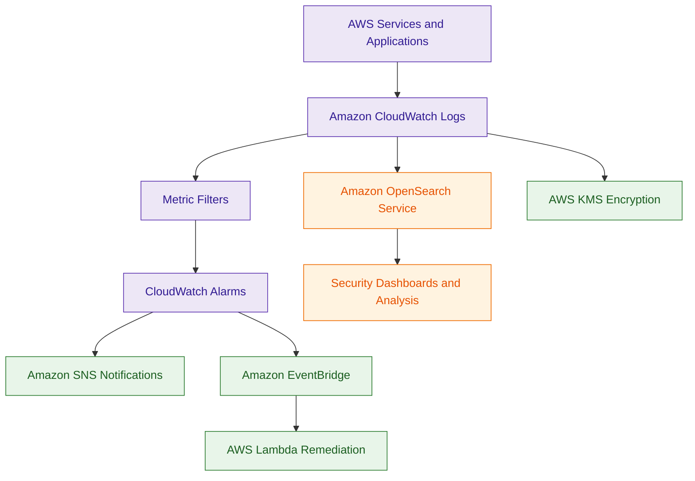

# Amazon CloudWatch

## What Is Amazon CloudWatch?

Amazon CloudWatch is a monitoring and observability service for AWS resources, applications, and operational workloads.

CloudWatch collects and analyzes:

- metrics
- logs
- events
- alarms

It helps organizations monitor system health, detect issues, and automate operational responses.

Think of Amazon CloudWatch as:

> The monitoring and operational visibility platform for AWS workloads.

---

## Why It Matters for Security

CloudWatch is critical for:

- security monitoring
- operational visibility
- threat detection
- anomaly identification
- automated remediation
- incident response

Security teams use CloudWatch to:

- detect suspicious activity
- monitor logs
- trigger alerts
- automate remediation workflows
- analyze operational anomalies

CloudWatch is heavily integrated into modern AWS security architectures.

CloudWatch is a foundational service for:

- operational monitoring
- workload visibility
- application security monitoring
- real-time detection
- automated incident response

While CloudTrail focuses on AWS API activity, CloudWatch helps monitor what is happening inside workloads and applications.

---

## Core Concepts

- collects metrics and logs
- supports alarms and notifications
- integrates with EventBridge
- supports dashboards and observability
- enables automated operational responses
- stores CloudWatch Logs
- supports Metric Filters for detection

---

## Important Integrations

### AWS CloudTrail

CloudTrail logs are commonly sent to CloudWatch Logs for:

- monitoring
- Metric Filters
- alarm generation
- detection workflows

---

### Amazon EventBridge

Can trigger:

- automation
- remediation workflows
- notifications

based on CloudWatch events and alarms.

---

### AWS Lambda

Used for:

- automated remediation
- operational automation
- event-driven responses

---

### Amazon SNS

CloudWatch alarms commonly send notifications through SNS.

---

### AWS IAM

Controls:

- dashboard access
- logs access
- alarm management
- monitoring permissions

---

### AWS KMS

Encrypts:

- CloudWatch Logs
- sensitive monitoring data

---

### Amazon OpenSearch Service

Useful for:

- log analytics
- visualization
- dashboards
- operational investigations

---

### AWS Systems Manager

Can automate:

- remediation workflows
- operational actions
- incident response activities

---

## Security Features

### CloudWatch Logs

CloudWatch Logs stores:

- application logs
- VPC Flow Logs
- Lambda logs
- CloudTrail logs
- system logs

Centralized logging is a major security best practice.

---

### Metric Filters

Metric Filters detect patterns inside logs.

Common security examples:

- AccessDenied events
- unauthorized API calls
- root account usage
- failed login attempts

Metric Filters can trigger alarms and automated responses.

---

### Real-Time Detection Workflows

CloudWatch Metric Filters and Alarms support near real-time detection of suspicious activity.

Common examples:

- repeated failed logins
- unauthorized SSH access
- excessive application errors
- suspicious authentication attempts

CloudWatch Alarms can trigger automated remediation workflows.

---

### CloudWatch Alarms

CloudWatch Alarms help detect operational and security issues.

Examples:

- CPU spikes
- unauthorized activity
- suspicious API usage
- excessive failed logins

---

### Automated Remediation

CloudWatch alarms can trigger:

- Lambda functions
- EventBridge workflows
- Systems Manager automation

for near real-time remediation.

---

### CloudWatch Logs Insights

CloudWatch Logs Insights allows teams to query and analyze logs directly inside CloudWatch using query syntax.

Useful for:

- troubleshooting
- operational analysis
- security investigations
- rapid log searches

Unlike Athena:
- Logs Insights works directly on CloudWatch Logs
- Athena primarily queries logs stored in Amazon S3

---

### Subscription Filters

CloudWatch Logs Subscription Filters can stream logs to services such as:

- AWS Lambda
- Amazon OpenSearch Service
- Kinesis Data Firehose

This enables:

- centralized log analytics
- SIEM integrations
- real-time processing pipelines

---

### Dashboards and Visibility

CloudWatch Dashboards provide centralized operational visibility for:

- security monitoring
- application monitoring
- infrastructure health

---

### Encryption

CloudWatch Logs can use:

- AWS KMS encryption

to protect sensitive log data.

---

## Architecture Example

### Real-Time Security Monitoring Workflow

**Use case:** real-time AWS monitoring, detection, and automated remediation using Amazon CloudWatch.

---

## CloudWatch vs CloudTrail

| Amazon CloudWatch | AWS CloudTrail |
|---|---|
| monitoring and observability | AWS API auditing |
| stores operational logs | records AWS API activity |
| supports alarms and dashboards | supports investigations and governance |
| monitors workloads and applications | monitors AWS account activity |
| operational visibility platform | audit logging platform |

---

| Feature | CloudTrail | CloudWatch Logs |
|---|---|---|
| focus | AWS API activity | application and operational activity |
| primary use case | governance and auditing | monitoring and observability |
| common triggers | API calls | metrics and log patterns |
| detection style | forensic and audit-focused | real-time operational detection |
| common integrations | Athena and Organizations | Metric Filters and Alarms |

Use CloudWatch when:

- monitoring applications
- detecting operational anomalies
- storing logs
- creating alarms
- automating responses

Use CloudTrail when:

- auditing AWS API actions
- investigating account activity
- monitoring IAM changes
- performing forensic analysis

---

## Common Exam Traps

### Trap 1 — Confusing CloudWatch and CloudTrail

CloudWatch:
- operational monitoring and observability

CloudTrail:
- AWS API auditing

---

### Trap 2 — Forgetting Metric Filters

Metric Filters are commonly used for:

- security detection
- alerting
- suspicious activity monitoring

---

### Trap 3 — Monitoring Without Automation

CloudWatch commonly integrates with:

- Lambda
- EventBridge
- Systems Manager

for automated remediation.

---

### Trap 4 — Storing Logs Without Encryption

Sensitive logs should use:

- AWS KMS encryption
- IAM access restrictions

---

## 5-Second Recall

### Identity

CloudWatch = AWS monitoring, observability, and alerting platform

---

### Keywords

If the scenario mentions:

- monitoring
- dashboards
- alarms
- metrics
- operational visibility
- Metric Filters
- automated remediation

Answer:

→ Amazon CloudWatch

---

### Governance Trigger

If the scenario involves:

- AWS API auditing
- IAM changes
- governance investigations
- account activity analysis

Answer:

→ AWS CloudTrail

---

### Operational Monitoring Trigger

If the scenario involves:

- application logs
- SSH login attempts
- real-time dashboards
- performance monitoring
- operational anomalies

Answer:

→ Amazon CloudWatch Logs

---

### Dashboard and Search Trigger

If the requirement involves:

- real-time log dashboards
- operational search
- fast log visualization

Answer:

→ Amazon OpenSearch Service

---

### Fast Log Query Trigger

If the requirement involves:

- querying CloudWatch logs directly
- fast troubleshooting
- operational investigations

Answer:

→ CloudWatch Logs Insights

---

### Need suspicious activity detection from logs?

→ CloudWatch Logs + Metric Filters

---

### Need automated operational remediation?

→ CloudWatch + EventBridge + Lambda

---

### Need AWS API auditing?

→ AWS CloudTrail

---

### Need centralized log monitoring?

→ Amazon CloudWatch Logs

---

## Quick Revision Notes

- CloudWatch provides monitoring and observability
- CloudWatch Logs stores operational and security logs
- Metric Filters detect suspicious patterns
- alarms support automated detection
- EventBridge and Lambda enable remediation workflows
- dashboards provide operational visibility
- Logs Insights queries logs directly in CloudWatch
- Subscription Filters stream logs to analytics platforms
- KMS encrypts sensitive logs
- CloudTrail commonly feeds CloudWatch Logs
- OpenSearch supports log analytics
- foundational service for operational monitoring
