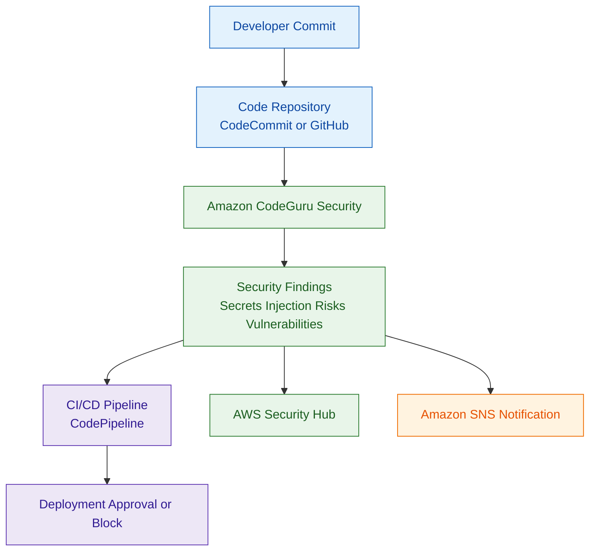

# Amazon CodeGuru Security

## What Is Amazon CodeGuru Security?

Amazon CodeGuru Security is a machine learning-powered code analysis service that helps identify security vulnerabilities in application source code.

It scans code for:

- insecure coding patterns
- security vulnerabilities
- credential exposure
- injection risks
- hardcoded secrets
- insecure APIs

CodeGuru Security integrates into development workflows to help teams detect issues before deployment.

Think of Amazon CodeGuru Security as:

> An automated application security scanning service for identifying insecure code patterns.

---

## Why Amazon CodeGuru Security Matters for Security

Modern cloud security requires shifting security earlier into the software development lifecycle.

Security teams must identify vulnerabilities before applications reach production.

CodeGuru Security helps detect:

- insecure application code
- hardcoded credentials
- injection vulnerabilities
- insecure cryptography
- risky coding patterns

This supports:

- DevSecOps
- secure software development
- CI/CD security
- proactive vulnerability management

---

## Core Concepts

- scans application source code
- uses machine learning and security detectors
- integrates into CI/CD workflows
- identifies common vulnerabilities
- supports multiple programming languages
- findings help developers remediate issues early

---

## Common Security Use Cases

### Secure Code Reviews

Automatically scan code for:

- insecure coding patterns
- risky implementations
- security vulnerabilities

---

### CI/CD Security Scanning

Integrate security scanning into:

- pull requests
- code repositories
- deployment pipelines

---

### Credential Exposure Detection

Detect:

- hardcoded passwords
- API keys
- tokens
- secrets

inside application code.

---

### Injection Vulnerability Detection

Identify risks such as:

- SQL injection
- command injection
- unsafe deserialization

---

### Secure Development Practices

Help developers follow:

- secure coding standards
- vulnerability remediation
- DevSecOps workflows

---

## How Amazon CodeGuru Security Works

### Basic Workflow

1. Developer commits code
2. CodeGuru Security scans the repository
3. Security detectors analyze code patterns
4. Findings are generated
5. Developers remediate vulnerabilities
6. Secure code progresses through CI/CD

---

### Simple Architecture

```text
Developer Commit
        ↓
Code Repository
        ↓
Amazon CodeGuru Security
        ↓
Security Findings
        ↓
Developer Remediation
```
---
### Example Use Case: Secure CI/CD Code Scanning Workflow


---

## Important Components

### Security Detectors

CodeGuru Security uses detectors to identify:

- vulnerable code patterns
- insecure APIs
- exposed secrets
- injection risks

---

### Repository Scanning

Scans repositories for:

- application vulnerabilities
- insecure configurations
- risky coding behavior

---

### Findings

Generated findings include:

- vulnerability details
- affected code
- remediation guidance

---

### CI/CD Integration

Can integrate into:

- CodePipeline
- GitHub workflows
- pull request scanning
- automated pipelines

---

## Important Integrations

### AWS CodePipeline

Used to integrate automated security scanning into CI/CD workflows.

---

### AWS CodeCommit

Repositories stored in CodeCommit can be scanned for vulnerabilities.

---

### GitHub

Supports repository scanning and pull request workflows.

---

### Amazon EventBridge

Can trigger:

- notifications
- automation
- remediation workflows

based on findings.

---

### AWS Security Hub

Security findings can integrate into centralized security visibility workflows.

---

### Amazon SNS

Useful for:

- security notifications
- development alerts
- pipeline notifications

---

### AWS IAM

IAM controls:

- repository access
- scanning permissions
- administrative access

---

### AWS CloudTrail

CloudTrail records:

- scanning activity
- configuration changes
- API actions

---

## Security Features

### Automated Vulnerability Detection

Automatically detects:

- insecure code
- vulnerable implementations
- exposed secrets

---

### Shift-Left Security

Moves security earlier into development workflows.

This reduces:

- production vulnerabilities
- deployment risk
- remediation cost

---

### Secrets Detection

Can identify:

- hardcoded credentials
- API keys
- authentication tokens

inside repositories.

---

### CI/CD Security Enforcement

Organizations can block deployments if:

- critical findings exist
- vulnerabilities remain unresolved

---

### Least Privilege Access

IAM permissions should restrict:

- repository access
- scanning permissions
- administrative actions

---

## Why Amazon CodeGuru Security Matters for SCS-C03

### Vulnerability Discovery

CodeGuru Security helps discover vulnerabilities during the development process before applications are deployed.

This supports:

- secure software development
- DevSecOps
- early vulnerability remediation
- pipeline security

---

### CI/CD Pipeline Security

Security findings can influence deployment workflows.

Organizations commonly use CodeGuru Security with:

- CodePipeline
- pull request workflows
- deployment approval gates

to block insecure code from reaching production.

---

### Centralized Security Visibility

Security findings can integrate with AWS Security Hub for:

- centralized visibility
- operational monitoring
- security investigations

---

## CodeGuru Security vs Amazon Inspector

| Amazon CodeGuru Security | Amazon Inspector |
|---|---|
| scans source code | scans running workloads and packages |
| identifies insecure coding patterns | identifies software vulnerabilities |
| used before deployment | used after deployment or packaging |
| supports SAST workflows | supports runtime and package assessment |
| focuses on developer security | focuses on workload vulnerability management |

Use CodeGuru Security when:

- scanning source code
- identifying insecure coding patterns
- securing CI/CD workflows

Use Amazon Inspector when:

- scanning EC2 instances
- scanning Lambda functions
- scanning container images
- identifying package vulnerabilities

---

## Common Exam Scenarios

### Scenario 1

A company wants automated security scanning for application source code before deployment.

Answer:

Amazon CodeGuru Security

---

### Scenario 2

A development team needs to identify hardcoded credentials in repositories.

Answer:

Amazon CodeGuru Security

---

### Scenario 3

A company wants security findings integrated into CI/CD workflows.

Answer:

Use CodeGuru Security with CodePipeline.

---

### Scenario 4

A company needs centralized visibility into code security findings.

Answer:

Integrate findings with AWS Security Hub.

---

### Scenario 5

A company wants automated detection of insecure coding patterns during pull requests.

Answer:

Use Amazon CodeGuru Security.

---

## Common Exam Traps

### Trap 1 — Confusing Runtime Security and Code Scanning

CodeGuru Security:
- scans source code before deployment

Runtime protection services:
- monitor live workloads after deployment

---

### Trap 2 — Assuming IAM Replaces Secure Coding

IAM controls access.

CodeGuru Security helps identify insecure application code.

---

### Trap 3 — Ignoring Hardcoded Secrets

Hardcoded credentials are major security risks.

Use:

- Secrets Manager
- Parameter Store

instead of embedding secrets in code.

---

### Trap 4 — Forgetting CI/CD Integration

Security scanning is most effective when integrated early into development pipelines.

---

### Trap 5 — Assuming Code Scanning Eliminates All Security Risks

Code scanning improves security posture but does not replace:

- penetration testing
- runtime monitoring
- secure architecture reviews

---

## 5-Second Recall for Application Security

### Identity

Amazon CodeGuru Security = machine learning-powered static application security testing (SAST)

---

### Keywords

If the scenario mentions:

- scanning source code
- detecting SQL injection in code
- hardcoded secret detection
- vulnerability scanning before deployment
- secure CI/CD scanning

Answer:

→ Amazon CodeGuru Security

---

### Common Integrations

CodeGuru Security commonly integrates with:

- CodePipeline
- GitHub
- Security Hub

---

### Need runtime workload protection?

→ GuardDuty / Inspector

---

### Need centralized findings visibility?

→ AWS Security Hub

---

## Quick Revision Notes

- CodeGuru Security scans source code for vulnerabilities
- supports secure software development and DevSecOps
- detects insecure coding patterns and secrets
- integrates with CI/CD pipelines
- findings can integrate with Security Hub
- IAM controls repository and scanning access
- CloudTrail logs scanning activity
- helps shift security earlier into development workflows
- CodeGuru Security focuses on source code scanning
- Inspector focuses on runtime and package vulnerabilities
