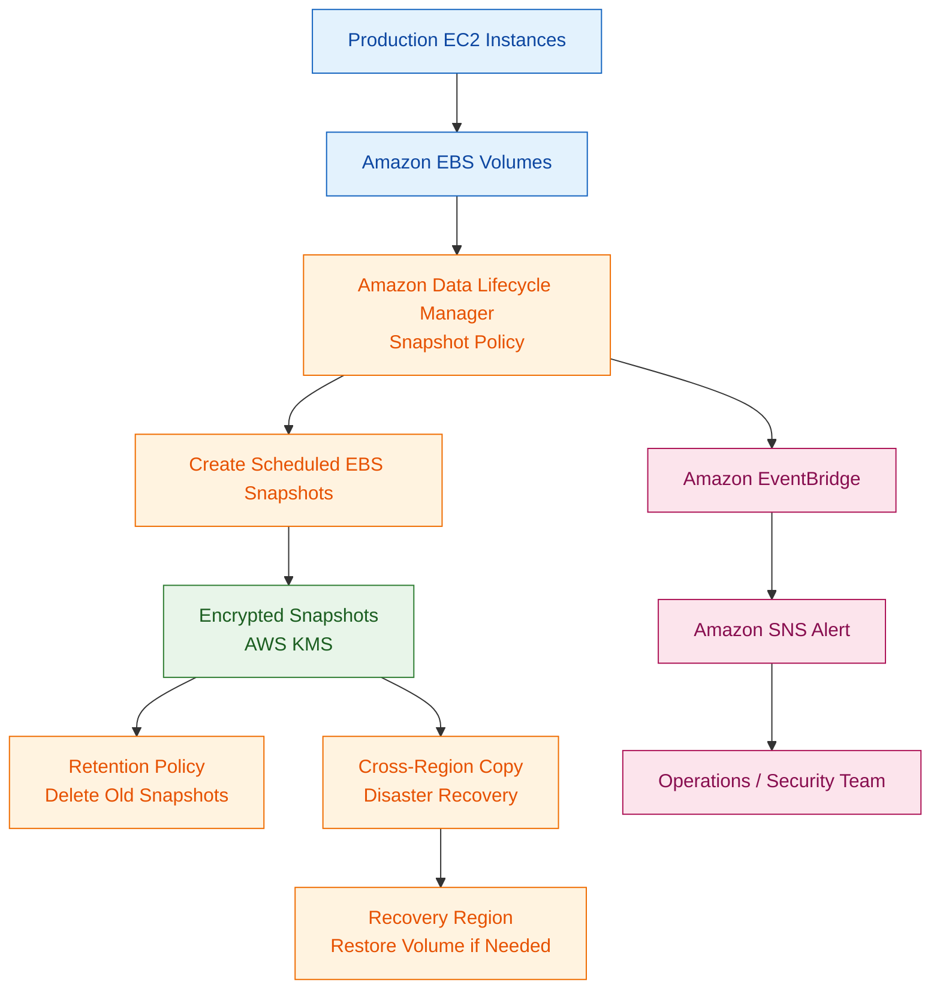

# Amazon Data Lifecycle Manager

## What Is Amazon Data Lifecycle Manager?

Amazon Data Lifecycle Manager (Amazon DLM) is a service used to automate the creation, retention, and deletion of Amazon EBS snapshots and Amazon Machine Images (AMIs).

DLM helps organizations:
- automate backup operations
- manage snapshot lifecycles
- reduce operational overhead
- support disaster recovery
- preserve forensic evidence
- enforce retention policies

DLM primarily focuses on:
- EBS snapshot automation
- AMI lifecycle management

---

## Why Amazon Data Lifecycle Manager Matters for Security

Security teams commonly use DLM for:
- automated backup creation
- forensic evidence preservation
- ransomware recovery preparation
- disaster recovery
- compliance retention requirements

DLM helps ensure:
- backups are created consistently
- snapshots are retained properly
- critical data is recoverable
- operational errors are reduced

Modern security operations often require:
- automated recovery preparation
- evidence preservation workflows
- cross-Region backup resilience

---

## Core Concepts

- DLM automates EBS snapshots
- lifecycle policies define automation behavior
- snapshots can be retained automatically
- snapshots can be copied across Regions
- DLM commonly uses resource tags
- AMI lifecycle management is supported
- encrypted snapshots support secure backups

Think of DLM as:

> An automated lifecycle management service for snapshots and recovery operations.

---

## Common Security Use Cases

### Automated EBS Snapshot Management

Automatically creates snapshots for:
- EC2 workloads
- production systems
- critical infrastructure

---

### Incident Response Snapshot Preservation

Security teams commonly preserve EBS snapshots before:
- remediation
- instance isolation
- malware cleanup
- forensic analysis

---

### Backup Retention Policies

DLM automatically:
- retains backups
- deletes expired snapshots
- enforces lifecycle rules

---

### Compliance Retention

Useful for workloads requiring:
- backup retention
- auditability
- disaster recovery preparation
- operational consistency

---

### Disaster Recovery Preparation

Cross-Region snapshot copies improve:
- resiliency
- regional recovery capability
- ransomware recovery readiness

---

### Automated AMI Lifecycle Management

DLM can automate:
- AMI creation
- AMI retention
- AMI cleanup

Useful for:
- golden images
- patch baselines
- immutable infrastructure

---

## How Amazon Data Lifecycle Manager Works

### Basic Workflow

1. Define a lifecycle policy
2. Select target resources using tags
3. DLM creates snapshots automatically
4. Snapshots are retained according to policy
5. Old snapshots are deleted automatically
6. Snapshots can optionally be copied to another Region

---

### Simple Architecture

```text
EC2 Instances
      ↓
Amazon EBS Volumes
      ↓
Data Lifecycle Manager Policy
      ↓
Automated Encrypted Snapshots
      ↓
Retention and Cross-Region Copies
```
### Example Use case: Automated encrypted EBS snapshot lifecycle with cross-Region disaster recovery.


---

## Important Components

### Lifecycle Policies

Lifecycle policies define:
- backup schedules
- retention periods
- target resources
- automation rules

---

### EBS Snapshot Policies

Used to automate:
- EBS snapshot creation
- retention management
- snapshot cleanup

---

### AMI Management Policies

Used to automate:
- AMI creation
- AMI retention
- image cleanup

---

### Resource Tags

DLM commonly uses tags to identify:
- protected resources
- target volumes
- backup scope

Example:
- `Backup=True`

---

### Retention Rules

Retention rules define:
- how long snapshots are stored
- when snapshots are deleted
- lifecycle duration

---

### Cross-Region Copy

Snapshots can be copied to another AWS Region for:
- disaster recovery
- ransomware resilience
- regional redundancy

---

## Important Integrations

### Amazon EC2

DLM protects:
- EC2 workloads
- attached EBS volumes
- recovery operations

---

### Amazon EBS

Core integration.

DLM primarily automates:
- EBS snapshots
- EBS recovery workflows

---

### AWS IAM

IAM controls:
- lifecycle policy access
- snapshot permissions
- recovery permissions

---

### AWS KMS

KMS encrypts:
- EBS volumes
- snapshots
- copied snapshots

Very important for:
- compliance
- sensitive workloads

---

### AWS CloudTrail

CloudTrail logs:
- lifecycle policy changes
- snapshot activity
- deletion activity
- IAM actions

Useful for:
- auditing
- investigations
- compliance reviews

---

### Amazon EventBridge

Can monitor:
- snapshot creation events
- lifecycle operations
- backup workflows

Can trigger:
- notifications
- remediation workflows

---

### AWS Organizations

Useful for:
- centralized governance
- multi-account backup strategies
- compliance management

---

### AWS Backup

AWS Backup provides broader backup orchestration across multiple AWS services.

DLM focuses primarily on:
- EBS snapshots
- AMI lifecycle automation

---

## Security Features

### Automated Snapshot Retention

Helps ensure:
- backups are consistently available
- retention policies are enforced
- operational mistakes are reduced

---

### Encrypted Snapshots

Snapshots can be encrypted using:
- AWS KMS

Protects:
- sensitive data
- backup storage
- disaster recovery copies

---

### Cross-Region Disaster Recovery

Cross-Region copies improve:
- recovery readiness
- regional resilience
- ransomware recovery capability

---

### Immutable Backup Concepts

Snapshots help preserve:
- point-in-time recovery states
- forensic evidence
- recovery copies

Important during:
- incident response
- ransomware investigations

---

### Tag-Based Automation

Policies can automatically protect resources based on:
- tags
- environment labels
- backup classifications

---

### Least Privilege Permissions

IAM policies should restrict:
- snapshot deletion
- lifecycle modification
- recovery permissions

---

## Monitoring and Logging

### CloudTrail Logging

CloudTrail records:
- snapshot operations
- policy changes
- retention actions
- IAM activity

---

### Snapshot Activity Monitoring

Security teams should monitor:
- failed snapshot jobs
- unauthorized deletion attempts
- missing backups

---

### EventBridge Notifications

Can generate alerts for:
- backup failures
- lifecycle events
- operational anomalies

---

### Compliance Tracking

Useful for:
- audit evidence
- backup verification
- disaster recovery reporting

---

## Incident Response Use Cases

### Preserving Forensic Evidence

Before remediation, investigators often create:
- EBS snapshots
- preserved recovery points

This protects evidence from modification.

---

### Snapshot Before Remediation

Very common workflow:

```text
GuardDuty Finding
        ↓
EventBridge
        ↓
Lambda or Step Functions
        ↓
Create EBS Snapshot
        ↓
Quarantine EC2 Instance
```

---

### Malware Investigation Support

Snapshots allow investigators to:
- analyze malware safely
- preserve compromised disks
- review historical data

---

### Ransomware Recovery Preparation

Automated backups improve:
- recovery speed
- business continuity
- restoration capability

---

## Cost and Performance Considerations

### Snapshot Storage Costs

Snapshots consume storage and increase costs over time.

Retention policies should balance:
- recovery requirements
- operational cost
- compliance obligations

---

### Retention Optimization

Organizations should avoid:
- excessive retention
- duplicate snapshots
- unnecessary copies

---

### Cross-Region Replication Costs

Cross-Region copies improve resilience but increase:
- storage costs
- transfer costs

---

### AMI Cleanup

Unused AMIs and snapshots should be cleaned up regularly to reduce:
- storage consumption
- operational clutter

---

## Service Comparisons

### DLM vs AWS Backup

| DLM | AWS Backup |
|---|---|
| focused on EBS and AMIs | centralized multi-service backups |
| snapshot lifecycle automation | enterprise backup orchestration |
| simpler operational model | broader service support |

---

### DLM vs Manual Snapshots

| DLM | Manual Snapshots |
|---|---|
| automated | manual operations |
| policy-driven | operational overhead |
| scalable | inconsistent execution |

---

### Snapshot Policies vs AMI Policies

| Snapshot Policies | AMI Policies |
|---|---|
| protect EBS data | manage machine images |
| backup-focused | deployment-focused |
| recovery workflows | image lifecycle workflows |

---

## Common Exam Scenarios

### Scenario 1

A company needs automated EBS snapshots for production EC2 instances.

Answer:
Use Amazon Data Lifecycle Manager.

---

### Scenario 2

A security team needs automated snapshot preservation before EC2 remediation.

Answer:
Use DLM with automated workflows.

---

### Scenario 3

A company needs cross-Region snapshot copies for disaster recovery.

Answer:
Use DLM cross-Region copy policies.

---

### Scenario 4

A company wants tag-based automated snapshot protection.

Answer:
Use DLM lifecycle policies with resource tags.

---

### Scenario 5

A company needs automated AMI cleanup and retention management.

Answer:
Use DLM AMI lifecycle policies.

---

## Common Exam Traps

### Trap 1 — Confusing DLM with AWS Backup

DLM:
- focused on EBS snapshots and AMIs

AWS Backup:
- centralized multi-service backup platform

---

### Trap 2 — Forgetting Snapshot Encryption

Sensitive backups commonly require:
- KMS encryption
- encrypted snapshots
- secure recovery copies

---

### Trap 3 — Missing Retention Policies

Without retention rules:
- storage costs increase
- backup management becomes difficult

---

### Trap 4 — Assuming Snapshots Are Automatically Immutable

Additional protections may still be needed against:
- unauthorized deletion
- ransomware targeting backups

---

### Trap 5 — Forgetting Cross-Region Recovery

Single-Region backups may not provide sufficient disaster recovery protection.

---

## Quick Revision Notes

- DLM automates EBS snapshot management
- supports AMI lifecycle management
- commonly used for backup automation
- useful for forensic preservation
- supports encrypted snapshots with KMS
- uses tag-based lifecycle policies
- supports cross-Region snapshot copies
- commonly integrated with incident response workflows
- CloudTrail logs lifecycle operations
- DLM is more specialized than AWS Backup
