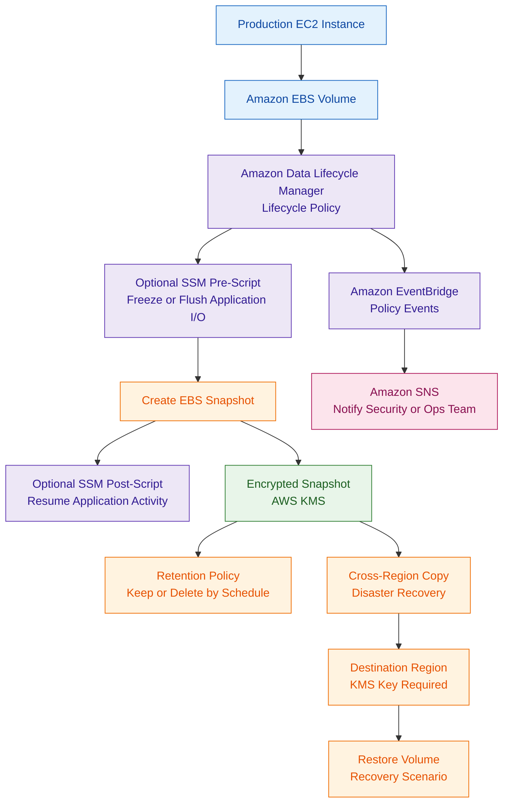

# Amazon Data Lifecycle Manager

## What Is Amazon Data Lifecycle Manager?

Amazon Data Lifecycle Manager, also called Amazon DLM, is used to automate the creation, retention, and deletion of Amazon EBS snapshots and EBS-backed Amazon Machine Images.

DLM helps organizations manage backup lifecycles for EC2-based workloads without manually creating and deleting snapshots.

It is mainly used for:

- EBS snapshot automation
- EBS-backed AMI lifecycle management
- backup retention
- disaster recovery preparation
- forensic snapshot preservation
- cost control for old snapshots

Think of Amazon DLM as:

> A policy-based automation service for managing EBS snapshots and EBS-backed AMIs.

---

## Why Amazon Data Lifecycle Manager Matters for Security

Amazon DLM is important in security because snapshots are often needed for:

- recovery
- ransomware preparation
- forensic preservation
- incident response
- compliance retention
- disaster recovery

Security teams commonly use snapshots before making changes to suspicious or compromised systems.

For example, before isolating or cleaning an EC2 instance, a team may preserve the attached EBS volumes as snapshots for later investigation.

---

## Core Concepts

- DLM automates EBS snapshot creation
- DLM can manage EBS-backed AMI lifecycles
- lifecycle policies define schedules and retention
- policies can target resources by tags
- snapshots can be copied across Regions
- snapshots can be encrypted with AWS KMS
- DLM can support application-consistent snapshots using AWS Systems Manager pre and post scripts
- DLM is focused mainly on EBS and EC2 image lifecycle automation

---

## Common Security Use Cases

### Automated EBS Snapshot Management

DLM can automatically create snapshots for EBS volumes attached to EC2 workloads.

This is useful for:

- production systems
- critical workloads
- compliance environments
- recovery planning

---

### Incident Response Snapshot Preservation

Before remediation, security teams may create snapshots to preserve evidence.

This helps with:

- forensic analysis
- malware investigation
- timeline reconstruction
- recovery after compromise

---

### Backup Retention Policies

DLM can automatically retain and delete snapshots based on lifecycle policies.

This helps avoid:

- unmanaged snapshots
- excessive storage costs
- missing recovery points
- manual backup mistakes

---

### Compliance Retention

Some workloads require consistent backup retention for audit or regulatory reasons.

DLM helps enforce:

- snapshot schedules
- retention windows
- backup consistency
- repeatable backup operations

---

### Disaster Recovery Preparation

DLM can copy snapshots across Regions.

This supports:

- regional recovery
- disaster recovery planning
- additional backup resilience

---

### Automated AMI Lifecycle Management

DLM can manage EBS-backed AMIs.

This is useful for:

- golden AMI lifecycles
- image retention
- image cleanup
- standardized EC2 deployments

---

### Application-Consistent Snapshots

DLM can integrate with AWS Systems Manager to run pre and post scripts for application-consistent snapshots.

This is useful for:

- databases
- transactional applications
- enterprise workloads

A pre script can freeze or flush I/O before snapshot creation, and a post script can resume normal operations after the snapshot is created.

AWS documents this capability for workloads such as Windows VSS, SAP HANA, and self-managed databases using SSM documents.  

---

## How Amazon Data Lifecycle Manager Works

### Basic Workflow

1. Create a lifecycle policy
2. Select target resources, usually by tags
3. Define snapshot or AMI schedule
4. Configure retention rules
5. Optionally configure encryption and cross-Region copy
6. DLM creates and manages snapshots automatically

---

### Simple Architecture

```text
EC2 Instance
     ↓
EBS Volume
     ↓
DLM Lifecycle Policy
     ↓
Automated Snapshot
     ↓
Retention / Cross-Region Copy / Recovery
```
---
### Example Use Case: Automated Secure EBS Snapshot and Disaster Recovery Workflow

---

## Important Components

### Lifecycle Policies

Lifecycle policies define:

- what resources are protected
- when snapshots or AMIs are created
- how long they are retained
- whether they are copied to another Region

---

### EBS Snapshot Policies

Snapshot policies automate:

- EBS snapshot creation
- retention
- deletion
- optional cross-Region copy

---

### AMI Lifecycle Policies

AMI lifecycle policies automate:

- EBS-backed AMI creation
- AMI retention
- AMI cleanup

---

### Resource Tags

DLM commonly targets resources by tags.

Example:

```text
Backup = True
Environment = Production
```

This allows backup policies to apply automatically to matching resources.

---

### Retention Rules

Retention rules define how long snapshots or AMIs are kept.

This helps control:

- recovery windows
- storage cost
- compliance requirements

---

### Cross-Region Copy

Snapshots can be copied to another AWS Region for disaster recovery.

This improves resilience if the primary Region becomes unavailable.

---

### Cross-Region Encryption Considerations

If snapshots are encrypted with a customer managed KMS key, the copy process must have permissions to use the required KMS keys.

For encrypted cross-Region copies, the DLM service role needs permission to use both the source and destination KMS keys.  

---

## Important Integrations

### Amazon EC2

DLM is commonly used with EC2 workloads that use EBS volumes.

---

### Amazon EBS

EBS is the primary service protected by DLM.

DLM automates:

- EBS snapshots
- EBS snapshot retention
- EBS snapshot deletion

---

### AWS KMS

KMS is used to encrypt:

- EBS volumes
- EBS snapshots
- copied snapshots

KMS permissions are especially important for encrypted cross-Region copies.

---

### AWS Systems Manager

Systems Manager can be used with DLM pre and post scripts to create application-consistent snapshots.

This is important when snapshots must capture a clean application state.

---

### AWS CloudTrail

CloudTrail records API activity related to:

- lifecycle policy changes
- snapshot operations
- AMI operations
- IAM actions

---

### Amazon EventBridge

EventBridge can detect DLM-related events and route them to notification or remediation workflows.

Example:

```text
DLM policy failure
        ↓
EventBridge
        ↓
SNS notification
```

---

### Amazon SNS

SNS can notify security or operations teams when:

- snapshot creation fails
- lifecycle policies fail
- recovery workflows require attention

---

### AWS Backup

AWS Backup is often compared with DLM.

DLM focuses mainly on EBS snapshots and EBS-backed AMI lifecycle management.

AWS Backup provides broader backup governance across multiple AWS services.

---

## Security Features

### Automated Snapshot Retention

DLM helps ensure snapshots are created and retained consistently.

This reduces the risk of missing recovery points.

---

### Encrypted Snapshots

Snapshots can be encrypted with AWS KMS.

This is important for:

- sensitive data
- compliance workloads
- forensic evidence protection

---

### Cross-Region Disaster Recovery

Cross-Region snapshot copies help support disaster recovery.

This can improve recovery options if a Region becomes unavailable.

---

### Application-Consistent Snapshot Support

DLM can run Systems Manager pre and post scripts to help create application-consistent snapshots.

This is important when crash-consistent snapshots are not enough.

---

### Tag-Based Automation

DLM can apply policies based on resource tags.

This helps automate protection for newly created workloads.

---

### Least Privilege Permissions

DLM permissions should be controlled carefully.

Security teams should restrict who can:

- create lifecycle policies
- modify lifecycle policies
- delete snapshots
- modify KMS permissions

---

### Ransomware Recovery Considerations

DLM helps automate snapshot creation and retention, but it is not the strongest option for immutable backup protection.

If an attacker gains broad administrative permissions, snapshots may still be at risk.

For stronger ransomware resilience, AWS Backup features such as Backup Vault Lock or logically air-gapped vaults may be more appropriate. AWS Backup Vault Lock can make backups immutable in compliance mode.  

---

## Monitoring and Logging

### CloudTrail Logging

CloudTrail records DLM-related API actions.

Useful for:

- audits
- investigations
- policy change tracking
- snapshot deletion analysis

---

### EventBridge Notifications

EventBridge can route lifecycle events to:

- SNS
- Lambda
- Step Functions
- ticketing workflows

---

### Snapshot Activity Monitoring

Security teams should monitor for:

- failed snapshot creation
- unexpected snapshot deletion
- lifecycle policy changes
- cross-Region copy failures

---

### Compliance Tracking

Snapshot policies and retention behavior can support:

- audit reviews
- recovery reporting
- operational assurance

---

## Incident Response Use Cases

### Preserving Forensic Evidence

During an EC2 investigation, EBS snapshots can preserve disk state before remediation.

This helps avoid destroying useful evidence.

---

### Snapshot Before Remediation

A common response workflow:

```text
Security Finding
      ↓
Create EBS Snapshot
      ↓
Quarantine or remediate EC2 instance
      ↓
Analyze snapshot separately
```

---

### Malware Investigation Support

Snapshots can help investigators:

- inspect file systems
- review malware artifacts
- analyze suspicious binaries
- preserve evidence safely

---

### Ransomware Recovery Preparation

Automated snapshots help maintain recovery points before a ransomware event occurs.

For stronger protection against backup deletion, use AWS Backup with immutable backup controls.

---

## Cost and Performance Considerations

### Snapshot Storage Costs

Snapshots consume storage.

Uncontrolled snapshot growth can increase costs.

---

### Retention Optimization

Retention policies should balance:

- recovery needs
- compliance requirements
- storage cost

---

### Cross-Region Copy Costs

Cross-Region copies improve resilience but add:

- storage cost
- data transfer cost
- KMS management considerations

---

### AMI Cleanup

Unused AMIs and related snapshots should be cleaned up to avoid unnecessary storage cost.

---

## Service Comparisons

### Amazon DLM vs AWS Backup

| Amazon DLM | AWS Backup |
|---|---|
| Focused mainly on EBS snapshots and EBS-backed AMIs | Centralized backup service for multiple AWS services |
| Lightweight lifecycle automation | Enterprise backup governance |
| Good for EC2 and EBS snapshot automation | Good for organization-wide backup strategy |
| Supports snapshot and AMI lifecycle policies | Supports backup plans, vaults, and advanced governance |
| Helps with retention and cross-Region copies | Supports Backup Vault Lock for immutable backups |

Use Amazon DLM when:

- you need simple EBS snapshot automation
- you need AMI lifecycle management
- you want tag-based snapshot policies for EC2 workloads

Use AWS Backup when:

- you need centralized backup across many AWS services
- you need immutable backup protection
- you need organization-wide backup governance
- you need stronger ransomware recovery controls

---

### DLM vs Manual Snapshots

| DLM | Manual Snapshots |
|---|---|
| Automated | Manual |
| Policy-driven | Human-driven |
| Consistent | Error-prone |
| Scalable | Operational overhead |

---

### Snapshot Policies vs AMI Policies

| Snapshot Policies | AMI Policies |
|---|---|
| Protect EBS data | Manage machine images |
| Backup-focused | Image lifecycle-focused |
| Useful for recovery | Useful for deployment baselines |

---

## Common Exam Scenarios

### Scenario 1

A company needs simple automated snapshots for EBS volumes attached to EC2 instances.

Answer:

Amazon Data Lifecycle Manager

---

### Scenario 2

A company needs automated lifecycle management for EBS-backed AMIs.

Answer:

Amazon Data Lifecycle Manager

---

### Scenario 3

A workload needs application-consistent EBS snapshots for a database.

Answer:

Amazon Data Lifecycle Manager with Systems Manager pre and post scripts

---

### Scenario 4

A company needs immutable backup protection against ransomware across multiple AWS services.

Answer:

AWS Backup with Backup Vault Lock

---

### Scenario 5

A company needs cross-Region copies of EBS snapshots for disaster recovery.

Answer:

Amazon Data Lifecycle Manager cross-Region copy policy

---

## Common Exam Traps

### Trap 1 — Confusing DLM with AWS Backup

DLM is mainly for EBS snapshots and EBS-backed AMIs.

AWS Backup is broader and supports centralized backup governance across multiple services.

---

### Trap 2 — Assuming DLM Provides Strong Immutability

DLM provides lifecycle automation.

For stronger immutable backup protection, AWS Backup Vault Lock is the better fit.

---

### Trap 3 — Forgetting KMS Permissions for Cross-Region Copies

Encrypted cross-Region snapshot copies require correct permissions for the source and destination KMS keys.

---

### Trap 4 — Ignoring Application Consistency

For databases or transactional workloads, crash-consistent snapshots may not be enough.

Application-consistent snapshots may require Systems Manager pre and post scripts.

---

### Trap 5 — Missing Retention Rules

Without proper retention rules, snapshot storage can grow quickly and increase cost.

---

## Quick Revision Notes

- DLM automates EBS snapshots and EBS-backed AMI lifecycles
- DLM uses lifecycle policies
- DLM commonly targets resources by tags
- DLM supports retention and deletion automation
- DLM supports cross-Region snapshot copies
- DLM can use KMS-encrypted snapshots
- KMS permissions matter for encrypted cross-Region copies
- DLM can use Systems Manager pre and post scripts for application-consistent snapshots
- DLM is useful for EC2 incident response and forensic preservation
- AWS Backup is better for centralized multi-service backup governance
- AWS Backup Vault Lock is used for stronger immutable backup protection
