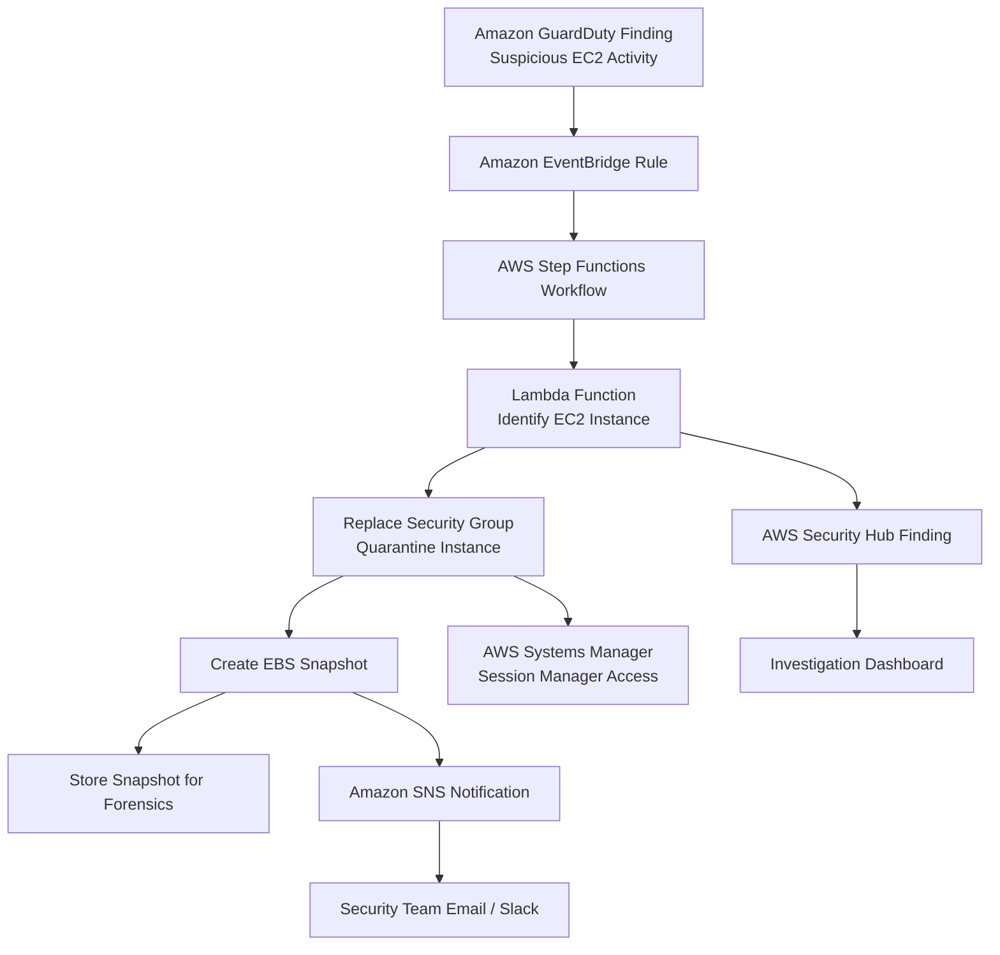

# Amazon EC2

## What Is Amazon EC2?

Amazon Elastic Compute Cloud (Amazon EC2) is a compute service that provides virtual servers in AWS.

EC2 instances are used to run:
- applications
- web servers
- backend services
- databases
- security tools
- custom workloads

EC2 gives teams control over:
- operating system
- instance type
- networking
- storage
- access method
- security configuration

---

## Why EC2 Matters for Security

EC2 is important for AWS security because many workloads still run on virtual machines.

Security teams must understand how to protect, monitor, investigate, and isolate EC2 instances.

EC2 is commonly involved in:
- network security
- IAM role usage
- malware investigations
- vulnerability management
- incident response
- forensic analysis
- secure remote access

---

## Core Concepts

- EC2 instances run inside a VPC
- security groups control instance-level traffic
- IAM roles provide temporary AWS credentials
- instance profiles attach IAM roles to EC2 instances
- EBS volumes provide block storage
- key pairs can be used for SSH access
- Systems Manager can replace direct SSH access
- IMDSv2 protects instance metadata access

Think of EC2 as:

> A virtual server that must be secured at the identity, network, operating system, and storage layers.

---

## Common Security Use Cases

### Secure Application Hosting

EC2 is commonly used to host:
- web applications
- backend APIs
- internal services
- business applications

Security controls usually include:
- security groups
- IAM roles
- encrypted EBS volumes
- CloudWatch monitoring
- patch management

---

### Bastion Hosts

A bastion host is an EC2 instance used to access private resources.

Modern AWS designs often reduce or replace bastion hosts with:
- AWS Systems Manager Session Manager
- EC2 Instance Connect
- AWS Verified Access

Bastion hosts should be tightly controlled if used.

---

### Security Monitoring

EC2 workloads can be monitored using:
- Amazon CloudWatch
- VPC Flow Logs
- Amazon GuardDuty
- Amazon Inspector
- AWS Config
- AWS Security Hub

---

### Malware Investigation

EC2 instances can be investigated when suspicious activity occurs.

Common steps:
- preserve evidence
- take EBS snapshots
- isolate the instance
- review logs
- investigate network activity

---

### Incident Response

EC2 is often part of security response workflows.

Examples:
- isolate compromised instances
- remove risky security group rules
- capture snapshots
- revoke compromised credentials
- notify security teams

---

### Isolation and Quarantine

A suspicious EC2 instance can be isolated by:
- changing its security group
- applying restrictive network controls
- using Systems Manager automation
- moving it to a quarantine workflow

---

### Forensics and Snapshot Analysis

EBS snapshots are commonly used to preserve disk evidence.

Snapshots allow investigators to:
- analyze the disk safely
- avoid modifying the original instance
- preserve evidence for later review

---

## EC2 Security Components

### Security Groups

Security groups act as virtual firewalls for EC2 instances.

Important points:
- stateful
- attached to network interfaces
- allow rules only
- commonly used to control inbound and outbound access

---

### Network ACLs

Network ACLs operate at the subnet level.

Important points:
- stateless
- allow and deny rules
- affect all resources in the subnet
- useful for subnet-level traffic control

---

### IAM Roles

IAM roles provide temporary AWS credentials to EC2 instances.

Best practice:
- use IAM roles instead of storing access keys on instances

---

### Instance Profiles

An instance profile allows an IAM role to be attached to an EC2 instance.

Applications running on the instance use the role permissions through temporary credentials.

---

### Key Pairs

Key pairs are used for SSH access to Linux instances.

Security considerations:
- protect private keys
- avoid shared keys
- rotate access when needed
- prefer Session Manager when possible

---

### IMDSv2

Instance Metadata Service v2 helps protect instance metadata from abuse.

It uses session-based requests and is recommended over IMDSv1.

Important for protecting:
- IAM role credentials
- instance metadata
- temporary credentials

---

### EBS Encryption

EBS volumes can be encrypted using AWS KMS.

Encryption protects:
- boot volumes
- data volumes
- snapshots
- volumes created from snapshots

---

## Important Integrations

### Amazon GuardDuty

GuardDuty can detect suspicious EC2 activity such as:
- crypto mining
- command and control traffic
- unusual network behavior
- credential misuse

---

### Amazon Inspector

Inspector scans EC2 instances for:
- software vulnerabilities
- package vulnerabilities
- exposure risks

---

### AWS Systems Manager

Systems Manager is used for:
- Session Manager access
- patching
- inventory
- automation
- run commands
- incident response actions

---

### AWS Config

Config tracks EC2 resource configuration changes.

Used to detect:
- unencrypted volumes
- public security groups
- non-compliant instance settings
- configuration drift

---

### AWS CloudTrail

CloudTrail records EC2 API activity.

Useful for investigating:
- who launched an instance
- who changed a security group
- who stopped or terminated an instance
- who attached an IAM role

---

### Amazon CloudWatch

CloudWatch provides:
- metrics
- alarms
- logs
- dashboards

Used to monitor:
- CPU usage
- network traffic
- disk activity
- application logs

---

### AWS KMS

KMS is used to encrypt:
- EBS volumes
- snapshots
- AMIs

---

### AWS Security Hub

Security Hub centralizes security findings related to EC2 from:
- GuardDuty
- Inspector
- Config
- other security tools

---

### Amazon Detective

Detective helps investigate suspicious EC2 behavior by analyzing relationships between:
- instances
- IP addresses
- IAM roles
- findings
- API activity

---

### AWS Backup

AWS Backup can protect EC2 workloads by backing up:
- EBS volumes
- EC2 instances
- related recovery points

---

## Security Features

### Security Groups

Used to control network access to EC2 instances.

Best practices:
- allow only required ports
- avoid broad inbound access
- restrict SSH and RDP
- use least privilege rules

---

### IAM Roles for EC2

Applications should use IAM roles instead of hardcoded credentials.

Benefits:
- temporary credentials
- automatic credential rotation
- no long-term access keys on the instance

---

### EBS Encryption

Use encryption for:
- sensitive workloads
- compliance workloads
- production systems

Encryption can be enforced through:
- default EBS encryption
- AWS Config rules
- SCPs
- IAM policies

---

### Instance Metadata Protection

Use IMDSv2 to reduce metadata abuse risk.

Important when EC2 instances have IAM roles with access to AWS resources.

---

### Systems Manager Session Manager

Session Manager provides secure access without:
- opening SSH/RDP ports
- managing bastion hosts
- distributing private keys

Useful for:
- secure administration
- auditability
- private subnet access

---

### Nitro System

The AWS Nitro System provides hardware and software isolation for modern EC2 instances.

Security benefits include:
- improved isolation
- reduced attack surface
- stronger virtualization security

---

### Dedicated Hosts and Dedicated Instances

Used when workloads require:
- physical isolation
- licensing control
- compliance separation

---

## Monitoring and Logging

### CloudWatch Metrics

Used to monitor:
- CPU utilization
- network in/out
- disk read/write
- instance status checks

---

### CloudWatch Agent

Used to collect:
- operating system logs
- memory metrics
- disk metrics
- application logs

---

### VPC Flow Logs

Used to analyze traffic to and from EC2 network interfaces.

Useful for:
- suspicious traffic detection
- exfiltration investigations
- denied traffic analysis

---

### CloudTrail Logging

CloudTrail records EC2 control plane actions.

Examples:
- RunInstances
- StopInstances
- TerminateInstances
- AuthorizeSecurityGroupIngress

---

### GuardDuty Findings

GuardDuty can generate findings for suspicious EC2 behavior.

Examples:
- crypto mining
- port probing
- command and control communication
- unusual DNS activity

---

### Inspector Vulnerability Scanning

Inspector identifies vulnerabilities in EC2 operating system packages and software.

Useful for:
- vulnerability management
- patch prioritization
- exposure reduction

---

## Incident Response Use Cases

### EC2 Isolation

A common response to suspected compromise is to isolate the instance while preserving evidence.

Possible actions:
- attach a quarantine security group
- restrict outbound access
- block inbound access
- preserve access for forensic team

---

### Snapshot Preservation

Before remediation, create EBS snapshots to preserve disk evidence.

This helps with:
- forensic analysis
- malware review
- timeline reconstruction

---

### Malware Investigation

Malware investigation may involve:
- GuardDuty findings
- Inspector results
- VPC Flow Logs
- EBS snapshot analysis
- CloudTrail activity review

---

### Automated Remediation

EC2 response workflows can be automated using:
- EventBridge
- Lambda
- Step Functions
- Systems Manager

---

### Quarantine Workflows

A typical quarantine workflow:

```text
GuardDuty Finding
        ↓
EventBridge Rule
        ↓
Lambda or Step Functions
        ↓
Change Security Group
        ↓
Create EBS Snapshot
        ↓
Notify Security Team
```
---
### Example Use Case Workflow - Automated EC2 incident response and forensic preservation.

This architecture demonstrates:

- GuardDuty threat detection
- automated quarantine workflow
- EBS snapshot evidence preservation
- secure forensic access with Session Manager
- centralized alerting and investigation visibility.

---

## Cost and Performance Considerations

### Instance Types

Instance type affects:
- performance
- cost
- workload suitability

Choose based on workload needs.

---

### Auto Scaling

Auto Scaling improves:
- availability
- resilience
- cost efficiency

Security monitoring should account for instances that are created and terminated automatically.

---

### Spot Instances

Spot Instances can reduce cost but may be interrupted.

Good for:
- batch workloads
- fault-tolerant jobs

Not ideal for:
- critical security tooling
- workloads requiring guaranteed availability

---

### Monitoring Costs

Detailed monitoring and log collection can increase costs.

Balance:
- visibility
- log volume
- retention period
- business risk

---

### Snapshot Costs

EBS snapshots are useful for recovery and forensics but increase storage costs.

Use retention policies where appropriate.

---

## Service Comparisons

### Security Groups vs Network ACLs

| Security Groups | Network ACLs |
|---|---|
| instance/network interface level | subnet level |
| stateful | stateless |
| allow rules only | allow and deny rules |
| commonly used for EC2 access | used for subnet-level controls |

---

### EC2 Instance Connect vs Bastion Hosts

| EC2 Instance Connect | Bastion Host |
|---|---|
| temporary SSH access | persistent jump server |
| reduces key management | requires hardening |
| simpler access model | additional attack surface |

---

### Session Manager vs SSH

| Session Manager | SSH |
|---|---|
| no open inbound port required | requires open SSH path |
| IAM-controlled | key-based access |
| logs session activity | logging must be configured |
| works with private instances | often requires bastion or VPN |

---

### EC2 vs Lambda

| EC2 | Lambda |
|---|---|
| virtual servers | serverless functions |
| full OS control | no server management |
| long-running workloads | event-driven workloads |
| patching required | AWS manages runtime infrastructure |

---

## Common Exam Scenarios

### Scenario 1

An EC2 instance is suspected to be compromised and evidence must be preserved.

Answer:
Create EBS snapshots before remediation.

---

### Scenario 2

A company wants to access private EC2 instances without opening SSH ports.

Answer:
Use AWS Systems Manager Session Manager.

---

### Scenario 3

A security team needs to detect EC2 software vulnerabilities.

Answer:
Use Amazon Inspector.

---

### Scenario 4

A company wants EC2 applications to access AWS services securely without storing credentials.

Answer:
Use an IAM role attached through an instance profile.

---

### Scenario 5

A GuardDuty finding indicates suspicious EC2 activity and the instance must be contained.

Answer:
Use automated remediation to isolate the instance and preserve evidence.

---

## Common Exam Traps

### Trap 1 — Using SSH Instead of Session Manager

Session Manager is usually preferred when secure administrative access is required without exposing SSH.

---

### Trap 2 — Confusing Security Groups and Network ACLs

Security groups are stateful and instance-level.

Network ACLs are stateless and subnet-level.

---

### Trap 3 — Forgetting IMDSv2

IMDSv2 helps protect EC2 instance metadata and temporary role credentials.

---

### Trap 4 — Assuming Security Groups Are Stateless

Security groups are stateful.

Existing allowed connections may continue even after some rule changes.

---

### Trap 5 — Forgetting EBS Encryption

Sensitive EC2 workloads should use encrypted EBS volumes and encrypted snapshots.

---

### Trap 6 — Hardcoding Credentials on EC2

Use IAM roles instead of storing access keys on instances.

---

## Quick Revision Notes

- EC2 = virtual servers in AWS
- security groups control instance traffic
- security groups are stateful
- NACLs are subnet-level and stateless
- IAM roles provide temporary credentials
- instance profiles attach roles to EC2
- use IMDSv2 for metadata protection
- use Session Manager instead of SSH where possible
- use Inspector for EC2 vulnerability scanning
- use GuardDuty for suspicious EC2 activity
- use EBS snapshots for forensic preservation
- encrypt EBS volumes with KMS
- use CloudTrail to investigate EC2 API actions
- use CloudWatch and VPC Flow Logs for monitoring
