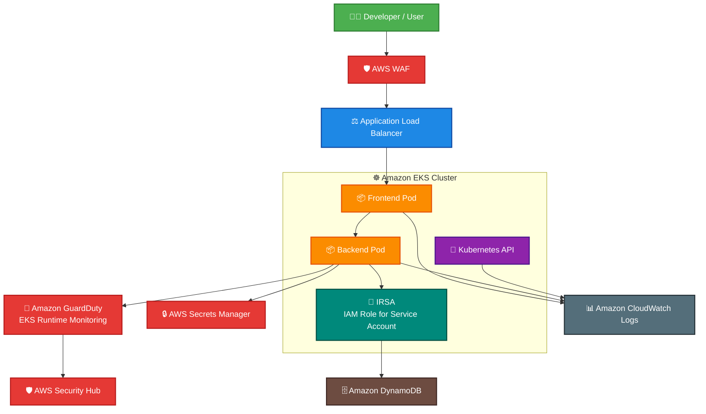

# Amazon EKS

## What Is Amazon EKS?

Amazon Elastic Kubernetes Service (Amazon EKS) is a managed Kubernetes service that allows organizations to run Kubernetes clusters on AWS.

EKS helps teams deploy and manage:
- containerized applications
- microservices
- scalable workloads
- cloud-native applications

AWS manages the Kubernetes control plane while customers manage:
- worker nodes
- workloads
- Kubernetes configurations
- security policies

EKS integrates with many AWS security services to provide:
- monitoring
- logging
- identity management
- runtime protection
- compliance visibility

---

## Why Amazon EKS Matters for Security

Modern organizations increasingly run production workloads on Kubernetes.

Security teams must understand how to secure:
- Kubernetes APIs
- containers
- worker nodes
- cluster networking
- identities
- runtime environments

EKS security commonly involves:
- IAM integration
- Kubernetes RBAC
- audit logging
- runtime threat detection
- container image scanning
- pod isolation
- secrets management

---

## Core Concepts

- EKS runs Kubernetes clusters on AWS
- applications run inside containers
- containers run inside pods
- pods run on worker nodes
- Kubernetes RBAC controls cluster permissions
- IAM integrates with EKS authentication
- worker nodes run inside a VPC
- EKS supports private and public cluster endpoints

Think of EKS as:

> A managed Kubernetes platform that still requires strong identity, network, runtime, and monitoring security controls.

---

# Kubernetes Fundamentals for Security

## Pods

Pods are the smallest deployable Kubernetes unit.

A pod may contain:
- one container
- multiple containers

Security concerns:
- container escapes
- privilege escalation
- exposed secrets

---

## Nodes

Nodes are EC2 instances or compute resources that run pods.

Security concerns:
- node compromise
- outdated software
- insecure IAM permissions

---

## Clusters

A cluster contains:
- control plane
- worker nodes
- Kubernetes workloads

Clusters can host:
- multiple applications
- multiple teams
- production workloads

---

## Namespaces

Namespaces logically separate workloads inside a cluster.

Useful for:
- isolation
- multi-team environments
- access segmentation

---

## Services

Services expose applications running inside pods.

Security concerns:
- public exposure
- unauthorized access
- insecure networking

---

## Control Plane

The EKS control plane manages:
- Kubernetes API
- scheduling
- cluster state

AWS manages the EKS control plane infrastructure.

---

## RBAC

Role-Based Access Control (RBAC) controls Kubernetes permissions.

RBAC determines:
- who can access resources
- what actions are allowed
- administrative permissions

---

## Common Security Use Cases

### Secure Container Orchestration

EKS securely runs:
- containerized workloads
- scalable applications
- microservices architectures

---

### Multi-Tenant Workloads

Organizations often run:
- multiple teams
- multiple environments
- multiple applications

inside a single cluster.

Requires strong:
- RBAC
- namespace isolation
- network segmentation

---

### Container Isolation

Used to isolate:
- applications
- workloads
- namespaces
- teams

---

### Runtime Threat Detection

Runtime monitoring helps detect:
- suspicious container activity
- crypto mining
- malware behavior
- command execution
- unusual network activity

---

### Secure API Exposure

EKS applications commonly integrate with:
- API Gateway
- Application Load Balancers
- AWS WAF

---

### Private Kubernetes Clusters

Clusters can restrict access using:
- private endpoints
- VPC networking
- restricted API access

---

### Compliance and Governance

Security teams use:
- logging
- monitoring
- image scanning
- runtime controls

to support compliance requirements.

---

## How Amazon EKS Works

### Basic Workflow

1. Create an EKS cluster
2. Configure worker nodes
3. Deploy containerized applications
4. Configure networking and access controls
5. Monitor workloads and runtime activity
6. Secure workloads with AWS integrations

---

### Simple Architecture

```text
Users / Applications
          ↓
Application Load Balancer
          ↓
Amazon EKS Cluster
     ↓            ↓
Worker Nodes   Kubernetes API
     ↓
Pods / Containers
     ↓
AWS Services
```
---
### Example Use case: Secure containerized application running on Amazon EKS.
This architecture demonstrates:

- WAF protection for public traffic
- secure Kubernetes workloads
- IAM Roles for Service Accounts (IRSA)
- secure secret retrieval
- runtime threat detection with GuardDuty
- centralized monitoring and security visibility.

---

## Important Components

### EKS Control Plane

Managed by AWS.

Handles:
- Kubernetes API
- scheduling
- cluster management

---

### Worker Nodes

Run:
- pods
- containers
- Kubernetes workloads

Can use:
- EC2
- managed node groups
- Fargate

---

### Managed Node Groups

AWS manages:
- node lifecycle
- scaling
- updates

Simplifies operations.

---

### IAM Roles for Service Accounts (IRSA)

IRSA allows Kubernetes pods to securely access AWS services using IAM roles.

Very important security feature.

Benefits:
- least privilege access
- no hardcoded credentials
- pod-level permissions

---

### Kubernetes RBAC

Controls Kubernetes API permissions.

Used for:
- administrators
- developers
- workloads
- service accounts

---

### EKS Add-ons

Add-ons commonly include:
- CoreDNS
- kube-proxy
- VPC CNI
- monitoring agents

---

### Networking with CNI

The Amazon VPC CNI plugin provides pod networking inside the VPC.

Pods receive:
- VPC IP addresses
- direct VPC networking

---

## Important Integrations

### Amazon GuardDuty

GuardDuty supports:
- EKS Protection
- Runtime Monitoring

Can detect:
- suspicious Kubernetes activity
- malicious containers
- unusual API calls

---

### AWS Security Hub

Aggregates findings from:
- GuardDuty
- Inspector
- Config
- EKS-related security findings

---

### Amazon Inspector

Inspector scans:
- container images
- software vulnerabilities
- package exposure

Very important for container security.

---

### AWS IAM

IAM controls:
- EKS authentication
- administrative access
- IRSA permissions

---

### Amazon VPC

EKS runs inside a VPC.

Networking controls include:
- security groups
- subnets
- routing
- NACLs

---

### AWS CloudTrail

CloudTrail records:
- EKS API activity
- cluster changes
- IAM actions

Useful for:
- investigations
- auditing
- compliance

---

### Amazon CloudWatch

Used for:
- metrics
- logs
- dashboards
- monitoring

---

### AWS WAF

Used to protect:
- Kubernetes applications
- APIs
- public ingress traffic

---

### AWS KMS

Used to encrypt:
- Kubernetes secrets
- EBS volumes
- cluster data

---

### AWS Systems Manager

Useful for:
- worker node management
- patching
- automation
- operational access

---

### Amazon ECR

ECR stores container images used by EKS workloads.

Often integrated with:
- Inspector scanning
- image lifecycle policies

---

### AWS Secrets Manager

Used to securely store:
- database credentials
- API keys
- secrets
- tokens

---

## Security Features

### IAM Integration

IAM controls:
- EKS authentication
- administrative access
- cluster access

---

### Kubernetes RBAC

RBAC controls:
- Kubernetes API permissions
- namespace access
- workload permissions

---

### IRSA

Allows pods to securely assume IAM roles.

Very important best practice.

Preferred over:
- EC2 instance roles for all pods

---

### Secrets Encryption

Kubernetes secrets can be encrypted using:
- AWS KMS

---

### Private Cluster Endpoints

Restricts Kubernetes API access to:
- private networks
- internal users
- trusted systems

---

### Network Policies

Can restrict pod-to-pod communication.

Useful for:
- workload isolation
- zero trust networking

---

### Pod Security

Security teams should restrict:
- privileged containers
- root access
- excessive permissions

---

### Audit Logging

EKS supports audit logs for:
- API activity
- authentication events
- authorization actions

Very important for investigations.

---

### Runtime Monitoring

Runtime protection helps detect:
- suspicious processes
- container abuse
- malicious activity

---

## Monitoring and Logging

### EKS Audit Logs

Important for:
- investigations
- compliance
- access reviews

---

### CloudWatch Container Insights

Provides:
- metrics
- logs
- performance visibility

---

### GuardDuty EKS Protection

Detects:
- suspicious Kubernetes activity
- anomalous API calls
- malicious container behavior

---

### Runtime Monitoring

Runtime monitoring helps identify:
- malware
- crypto mining
- unusual activity

---

### CloudTrail Logging

CloudTrail logs:
- EKS management activity
- cluster changes
- IAM activity

---

### VPC Flow Logs

Useful for:
- network investigations
- suspicious traffic analysis
- exfiltration detection

---

## Incident Response Use Cases

### Compromised Pod Detection

Runtime monitoring can identify:
- suspicious containers
- malicious commands
- crypto miners

---

### Container Escape Investigation

Investigators may review:
- node activity
- container logs
- runtime findings
- network traffic

---

### Malicious Network Activity

Flow logs and runtime monitoring can identify:
- unusual outbound traffic
- command-and-control behavior
- data exfiltration

---

### Quarantining Nodes

Security teams may:
- isolate worker nodes
- restrict network access
- terminate compromised pods

---

### Snapshot and Forensics Workflows

EBS snapshots and logs may be preserved during investigations.

---

## Cost and Performance Considerations

### Managed Control Plane Costs

EKS charges for:
- managed Kubernetes control plane

---

### Logging Costs

Audit logging and runtime monitoring increase:
- CloudWatch costs
- storage usage

---

### Worker Node Sizing

Worker node size impacts:
- cluster performance
- workload scalability
- operational cost

---

### Runtime Monitoring Costs

Security monitoring improves visibility but increases:
- operational cost
- data ingestion
- storage usage

---

### Multi-AZ Deployments

Production clusters commonly use:
- multiple Availability Zones

for resilience and high availability.

---

## Service Comparisons

### EKS vs ECS

| EKS | ECS |
|---|---|
| Kubernetes-based | AWS-native container orchestration |
| greater flexibility | simpler operational model |
| more Kubernetes control | easier AWS integration |
| higher complexity | lower operational overhead |

---

### EKS vs Self-Managed Kubernetes

| EKS | Self-Managed Kubernetes |
|---|---|
| AWS-managed control plane | customer-managed control plane |
| easier operations | higher operational complexity |
| integrated AWS services | more manual management |

---

### IRSA vs Instance Roles

| IRSA | Instance Roles |
|---|---|
| pod-level permissions | node-level permissions |
| least privilege | broader permissions |
| preferred security model | less granular access |

---

### Kubernetes RBAC vs IAM

| Kubernetes RBAC | IAM |
|---|---|
| Kubernetes API permissions | AWS resource permissions |
| cluster-level access control | AWS account access control |
| namespace/resource actions | AWS service actions |

---

## Common Exam Scenarios

### Scenario 1

A company needs pod-level IAM permissions without exposing broader node permissions.

Answer:
Use IRSA.

---

### Scenario 2

A security team needs to monitor suspicious Kubernetes runtime activity.

Answer:
Enable GuardDuty Runtime Monitoring for EKS.

---

### Scenario 3

A company needs to investigate Kubernetes API activity.

Answer:
Enable EKS audit logging.

---

### Scenario 4

A company wants to scan container images for vulnerabilities before deployment.

Answer:
Use Amazon Inspector with ECR scanning.

---

### Scenario 5

A company wants to restrict Kubernetes API access to private networks only.

Answer:
Use private EKS cluster endpoints.

---

### Scenario 6

A company wants centralized visibility into EKS security findings.

Answer:
Use AWS Security Hub.

---

## Common Exam Traps

### Trap 1 — Confusing IAM and Kubernetes RBAC

IAM controls AWS authentication.

RBAC controls Kubernetes permissions.

---

### Trap 2 — Forgetting EKS Audit Logs

Audit logs are critical for:
- investigations
- monitoring
- compliance

---

### Trap 3 — Using Instance Roles Instead of IRSA

IRSA provides:
- pod-level least privilege access

Preferred over broad node permissions.

---

### Trap 4 — Exposing Public Kubernetes Endpoints

Sensitive clusters often require:
- private endpoints
- restricted API access

---

### Trap 5 — Forgetting Runtime Monitoring

Container image scanning alone is not enough.

Runtime monitoring detects:
- active threats
- malicious activity
- suspicious behavior

---

### Trap 6 — Assuming Containers Are Automatically Isolated

Containers still require:
- RBAC
- network controls
- runtime protection
- least privilege permissions

---

## Quick Revision Notes

- EKS = managed Kubernetes service
- pods run containers
- worker nodes run pods
- use IRSA for pod-level IAM access
- use RBAC for Kubernetes permissions
- enable EKS audit logging
- GuardDuty supports EKS Protection and Runtime Monitoring
- Inspector scans container images
- private endpoints reduce API exposure
- use KMS for secret encryption
- use Security Hub for centralized findings
- runtime monitoring detects active threats
