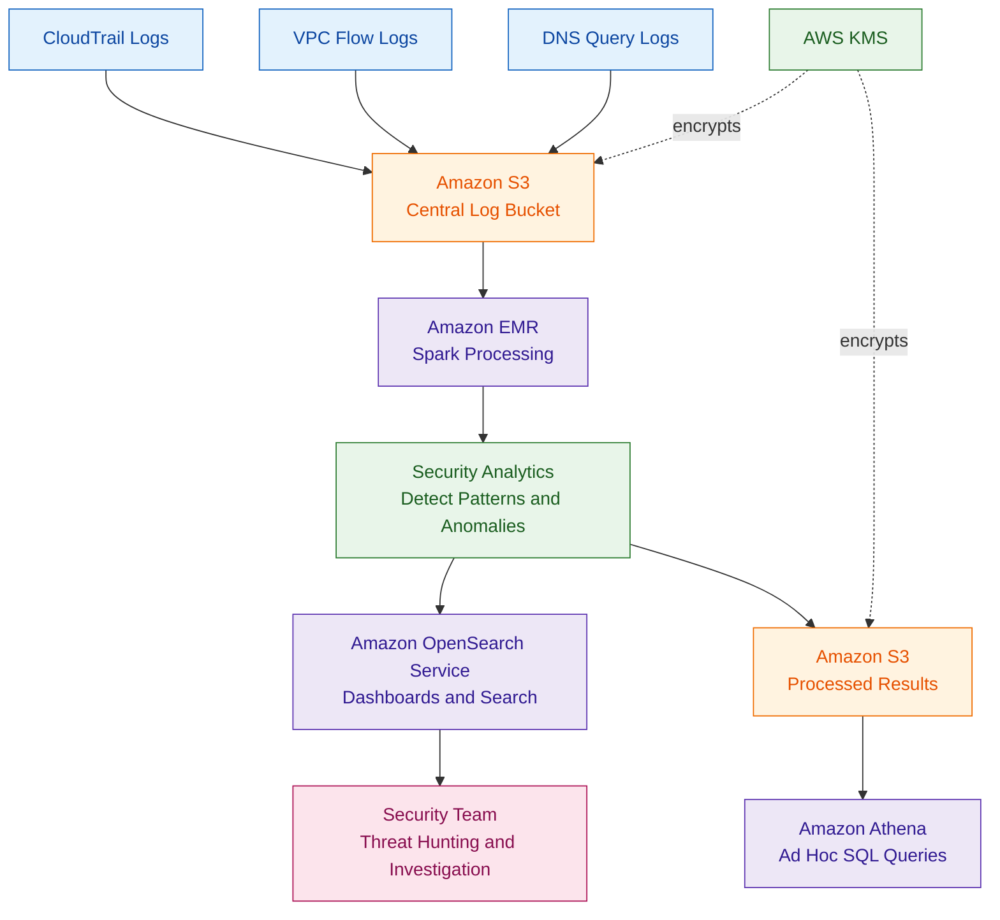

# Amazon EMR

## What Is Amazon EMR?

Amazon EMR (Elastic MapReduce) is a managed big data platform used to process and analyze large volumes of data.

EMR supports frameworks such as:
- Apache Hadoop
- Apache Spark
- Hive
- Presto
- HBase
- Flink

Organizations use EMR for:
- big data analytics
- log processing
- machine learning
- security analytics
- large-scale data transformation

EMR can run on:
- Amazon EC2
- EKS
- serverless infrastructure
- AWS Outposts for hybrid deployments

---

## Why Amazon EMR Matters for Security

Security teams use EMR to analyze large-scale datasets such as:
- CloudTrail logs
- VPC Flow Logs
- DNS query logs
- application logs
- SIEM data
- threat intelligence feeds

EMR is useful when organizations need:
- distributed processing
- scalable analytics
- threat hunting
- centralized security analytics
- long-term security data analysis

EMR commonly integrates with:
- Amazon S3
- Athena
- OpenSearch
- Security Lake
- CloudWatch
- KMS

---

## Core Concepts

- EMR processes large datasets
- clusters contain multiple nodes
- Spark is commonly used for analytics
- EMR commonly stores data in Amazon S3
- clusters can scale dynamically
- workloads can be distributed across many nodes
- EMR supports batch and streaming analytics
- EMR can support hybrid deployments using AWS Outposts

Think of EMR as:

> A scalable analytics platform for processing massive datasets and security logs.

---

## Common Security Use Cases

### Big Data Analytics

Used to analyze:
- terabytes of logs
- historical activity
- large operational datasets

---

### Log Analysis and Security Analytics

EMR commonly processes:
- CloudTrail logs
- VPC Flow Logs
- DNS logs
- firewall logs
- application logs

---

### Threat Detection Pipelines

Security teams can use EMR to:
- identify suspicious activity
- detect anomalies
- correlate security events
- analyze attack patterns

---

### Large-Scale Data Processing

EMR is useful when:
- Athena becomes inefficient for complex processing
- datasets become extremely large
- custom Spark logic is required

---

### Compliance Data Retention

Organizations often store long-term logs in:
- Amazon S3

EMR can analyze archived security data when needed.

---

### Security Data Lakes

EMR commonly supports:
- centralized security data lakes
- SIEM architectures
- security analytics pipelines

---

### Security Lake Analytics

Amazon EMR can process normalized security data stored in Amazon Security Lake.

Security Lake uses the Open Cybersecurity Schema Framework (OCSF), which standardizes security event formats across AWS and third-party sources.

EMR and Spark can analyze:
- GuardDuty findings
- CloudTrail logs
- VPC Flow Logs
- DNS activity
- Security Hub findings

---

## How Amazon EMR Works

### Basic Workflow

1. Security logs are collected
2. Logs are stored in Amazon S3
3. EMR processes the data
4. Spark or Hadoop performs analytics
5. Results are stored or visualized
6. Security teams investigate findings

---

### Simple Architecture

```text
Security Logs
      ↓
Amazon S3
      ↓
Amazon EMR Cluster
      ↓
Spark / Hadoop Analytics
      ↓
OpenSearch / Dashboards / Reports
```
---
### Example Use case: Large-scale security log analytics with Amazon EMR.
This shows EMR processing CloudTrail, VPC Flow Logs, and DNS logs from S3, then sending results to OpenSearch for dashboards and Athena for ad hoc investigations.

---

## Important Components

### EMR Clusters

Clusters contain:
- primary nodes
- core nodes
- task nodes

Clusters process distributed workloads.

---

### Primary Nodes

The primary node manages:
- cluster coordination
- scheduling
- workload management

---

### Core Nodes

Core nodes:
- process data
- store HDFS data
- support distributed computing

---

### Task Nodes

Task nodes:
- process workloads
- improve scalability
- do not store persistent HDFS data

---

### Hadoop Ecosystem

EMR supports:
- Hadoop
- Hive
- HBase
- Presto
- Spark

---

### Spark

Apache Spark is commonly used for:
- security analytics
- log analysis
- distributed processing
- large-scale transformations

Spark is heavily used in modern analytics workflows.

---

### EMR Studio

Provides a managed environment for:
- notebooks
- analytics
- interactive querying

---

### EMR on EC2

Traditional EMR deployment using EC2 instances.

Provides:
- more infrastructure control
- customizable clusters

---

### EMR Serverless

Serverless EMR option that removes cluster management responsibilities.

Useful for:
- simplified analytics workflows
- variable workloads
- operational simplicity

---

## Important Integrations

### Amazon S3

Most important EMR integration.

S3 commonly stores:
- logs
- datasets
- analytics outputs
- archived security data

---

### AWS IAM

IAM controls:
- cluster access
- S3 permissions
- analytics permissions
- user access

---

### AWS Lake Formation

Can provide:
- centralized data governance
- fine-grained access control
- data lake permissions

---

### AWS Glue

Used for:
- data cataloging
- metadata management
- ETL integration

---

### AWS KMS

Used to encrypt:
- S3 data
- EBS volumes
- EMR data at rest

Very important for compliance workloads.

---

### Amazon CloudWatch

Used for:
- metrics
- alarms
- cluster monitoring
- log monitoring

---

### AWS CloudTrail

CloudTrail logs:
- EMR API activity
- cluster changes
- IAM actions

Useful for:
- auditing
- investigations
- compliance

---

### Amazon VPC

EMR clusters commonly run inside:
- private subnets
- controlled VPC environments

---

### AWS Security Hub

Can centralize findings related to:
- EMR configurations
- encryption compliance
- security posture

---

### Amazon Athena

Athena can query:
- processed data
- S3 datasets
- analytics results

---

### Amazon OpenSearch Service

OpenSearch can visualize:
- analytics results
- threat indicators
- dashboards
- log analysis

---

## Security Features

### Encryption at Rest

Supports encryption using:
- AWS KMS
- S3 encryption
- EBS encryption

---

### Encryption in Transit

Supports encrypted communication between:
- cluster nodes
- clients
- applications

---

### Kerberos Authentication

Kerberos can secure:
- Hadoop authentication
- cluster access
- internal communications

---

### IAM Roles for EMR

IAM roles control:
- cluster permissions
- S3 access
- service interactions

---

### Private Subnets

Best practice:
- deploy EMR clusters in private subnets

This reduces internet exposure.

---

### Security Configurations

EMR security configurations allow:
- encryption settings
- authentication settings
- access controls

---

### S3 Access Control

S3 bucket policies and IAM policies should restrict:
- unauthorized access
- cross-account exposure
- excessive permissions

---

### Fine-Grained Access Control

Lake Formation and IAM can help enforce:
- least privilege access
- dataset restrictions
- role-based analytics access

---

### Instance Metadata Protection

For EMR on EC2 deployments, organizations should enforce IMDSv2 on cluster instances to help protect temporary credentials and instance metadata.

This reduces risks related to:
- SSRF attacks
- metadata credential theft
- unauthorized role access

---

## Monitoring and Logging

### CloudWatch Monitoring

Used to monitor:
- cluster health
- CPU usage
- memory usage
- failures

---

### EMR Logs

EMR generates logs for:
- applications
- cluster operations
- processing tasks

---

### S3 Log Storage

Logs are commonly stored in:
- Amazon S3

Useful for:
- long-term retention
- investigations
- compliance

---

### CloudTrail Logging

CloudTrail records:
- cluster creation
- cluster modification
- IAM actions

---

### Audit Logging

Audit logs help track:
- administrative activity
- analytics access
- operational changes

---

## Security Analytics Use Cases

### CloudTrail Log Analysis

EMR can process massive CloudTrail datasets to identify:
- suspicious API activity
- privilege escalation
- unusual behavior

---

### VPC Flow Log Analytics

Used to analyze:
- network traffic
- suspicious communications
- exfiltration patterns

---

### Threat Hunting

Security teams can run:
- custom analytics
- historical investigations
- correlation analysis

---

### SIEM Data Processing

EMR can support:
- SIEM ingestion pipelines
- centralized analytics
- security dashboards

---

### Security Lake Integrations

EMR can analyze normalized security data stored in:
- Amazon Security Lake

---

## Cost and Performance Considerations

### Cluster Sizing

Cluster size impacts:
- performance
- processing speed
- operational cost

---

### Auto Scaling

Auto Scaling can reduce costs during:
- low activity
- variable workloads

---

### Spot Instances

Spot Instances can reduce analytics costs.

Useful for:
- batch processing
- non-critical workloads

---

### EMR Serverless

Serverless EMR reduces:
- cluster management overhead
- operational complexity

---

### S3 Storage Optimization

Use lifecycle policies and storage tiers to manage:
- long-term analytics data
- archived logs
- cost optimization

---

### EMR Runtime for Apache Spark

Amazon EMR includes an optimized runtime for Apache Spark that improves:
- query performance
- job execution speed
- cost efficiency

This helps reduce:
- processing time
- infrastructure usage
- analytics costs

---

## Service Comparisons

### EMR vs Athena

| EMR | Athena |
|---|---|
| complex distributed analytics | serverless SQL queries |
| Spark and Hadoop support | SQL-focused |
| customizable processing | simpler operational model |
| large-scale transformations | ad hoc querying |

---

### EMR vs OpenSearch

| EMR | OpenSearch |
|---|---|
| data processing platform | search and visualization platform |
| analytics workloads | dashboards and search |
| batch and distributed processing | near real-time analysis |

---

### EMR vs Glue

| EMR | Glue |
|---|---|
| big data analytics platform | managed ETL service |
| Spark clusters | serverless ETL |
| advanced processing flexibility | simpler data pipelines |

---

### EMR on EC2 vs EMR Serverless

| EMR on EC2 | EMR Serverless |
|---|---|
| infrastructure control | serverless operations |
| cluster management required | simplified management |
| customizable environment | operational simplicity |

---

## Common Exam Scenarios

### Scenario 1

A company needs to process petabytes of CloudTrail logs for security analytics.

Answer:
Use Amazon EMR with Spark.

---

### Scenario 2

A security team needs distributed analytics for VPC Flow Logs and DNS logs.

Answer:
Use Amazon EMR.

---

### Scenario 3

A company needs to visualize processed security analytics data.

Answer:
Use EMR with OpenSearch dashboards.

---

### Scenario 4

A company needs scalable log analytics with data stored in Amazon S3.

Answer:
Use EMR with S3 integration.

---

### Scenario 5

A company needs serverless big data analytics without managing clusters.

Answer:
Use EMR Serverless.

---

## Common Exam Traps

### Trap 1 — Choosing EMR for Simple Queries

Athena is often better for:
- simple SQL queries
- lightweight analysis
- ad hoc exploration

---

### Trap 2 — Forgetting S3 Encryption

Security logs commonly require:
- encrypted S3 buckets
- KMS protection
- access controls

---

### Trap 3 — Exposing EMR Publicly

Best practice:
- run EMR in private subnets
- restrict internet exposure

---

### Trap 4 — Confusing EMR with Athena

EMR:
- large-scale analytics platform

Athena:
- serverless query service

---

### Trap 5 — Ignoring IAM and S3 Permissions

Improper permissions can expose:
- sensitive logs
- analytics datasets
- security findings

---

## Quick Revision Notes

- EMR = big data analytics platform
- commonly uses Spark and Hadoop
- processes large-scale security logs
- integrates heavily with Amazon S3
- useful for threat hunting and SIEM pipelines
- supports encryption with KMS
- commonly runs in private subnets
- EMR Serverless reduces operational overhead
- OpenSearch visualizes analytics results
- Athena is better for simple serverless queries
- CloudTrail and VPC Flow Logs are common EMR datasets
- Security Lake uses OCSF-formatted security data
- IMDSv2 should be enforced for EMR on EC2
- EMR Runtime for Apache Spark improves performance and efficiency
