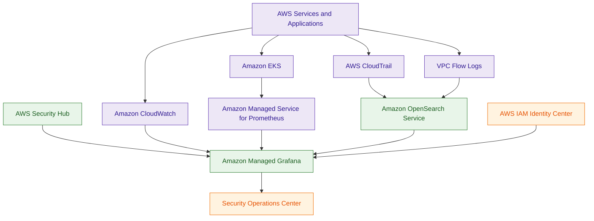

# Amazon Managed Grafana

## What Is Amazon Managed Grafana?

Amazon Managed Grafana is a fully managed observability and visualization service based on Grafana.

It allows organizations to create centralized dashboards using data from multiple AWS and third-party monitoring systems.

Amazon Managed Grafana helps teams visualize:

- infrastructure metrics
- application telemetry
- logs
- traces
- security findings
- operational events

Think of Amazon Managed Grafana as:

> A unified observability and security visualization layer for AWS and hybrid environments.

---

## Why It Matters for Security

Amazon Managed Grafana is heavily used for:

- centralized security monitoring
- operational observability
- incident investigation
- hybrid visibility
- Kubernetes monitoring
- enterprise dashboarding

Security teams commonly use Grafana to:

- visualize GuardDuty findings
- monitor CloudTrail activity
- track VPC Flow Logs
- monitor EKS security telemetry
- correlate operational and security events
- build SOC dashboards

Grafana becomes especially powerful when organizations need:

- a single pane of glass
- cross-account observability
- multi-source telemetry correlation
- centralized operational visibility

It is commonly used alongside:

- CloudWatch
- OpenSearch
- Prometheus
- Security Hub
- Athena
- X-Ray

---

## Core Concepts

- managed Grafana workspaces
- centralized visualization dashboards
- supports multiple data sources
- integrates with IAM Identity Center
- supports cross-account observability
- visualizes metrics, logs, and traces
- supports alerting and notifications
- commonly used for enterprise observability
- Grafana visualizes telemetry rather than storing it

---

## Important Integrations

### Amazon CloudWatch

Provides:

- metrics
- logs
- alarms
- operational telemetry

CloudWatch is one of the most common Grafana data sources.

---

### Amazon OpenSearch Service

Used for:

- log analytics
- security dashboards
- threat hunting
- forensic visualization

Grafana commonly visualizes OpenSearch telemetry.

---

### Amazon Managed Service for Prometheus

Provides:

- Prometheus metrics storage
- Kubernetes telemetry
- container observability

Very common with Amazon EKS environments.

---

### Amazon EKS

Grafana is heavily used for:

- Kubernetes monitoring
- cluster visibility
- workload observability
- container security monitoring

Typically integrated with Prometheus.

---

### AWS Security Hub

Provides:

- centralized findings
- compliance visibility
- security alerts

Grafana dashboards can visualize Security Hub findings.

---

### AWS CloudTrail

Provides:

- AWS API activity logs
- account activity visibility
- audit telemetry

CloudTrail activity can feed security dashboards.

---

### AWS X-Ray

Provides:

- distributed tracing
- request flow visibility
- application observability

Useful for troubleshooting and performance analysis.

---

### AWS IAM Identity Center

Provides:

- centralized authentication
- federated access
- enterprise identity management

Amazon Managed Grafana commonly relies on Identity Center for authentication.

---

### AWS Organizations

Supports:

- cross-account monitoring
- centralized observability
- enterprise visibility architectures

---

### Amazon Athena

Can query:

- CloudTrail logs
- VPC Flow Logs
- audit datasets

Useful for investigative workflows supporting dashboards.

---

## Security Features

### Centralized Security Visualization

Grafana consolidates telemetry from multiple systems into unified dashboards.

This improves:

- operational awareness
- security visibility
- incident response workflows

---

### Multi-Source Correlation

Grafana can correlate data from:

- CloudWatch
- OpenSearch
- Prometheus
- Security Hub
- X-Ray

This helps teams investigate operational and security issues more efficiently.

---

### Cross-Account Observability

Grafana supports monitoring across:

- AWS accounts
- Regions
- hybrid environments

Very important for enterprise SOC environments.

---

### IAM Identity Integration

Amazon Managed Grafana integrates with:

- IAM Identity Center
- SAML identity providers

This supports centralized authentication and role-based access.

---

### Fine-Grained Access Control

Administrators can restrict:

- dashboard visibility
- workspace access
- data source permissions

using IAM and Grafana role mappings.

---

### Security Dashboarding

Common security dashboards include:

- GuardDuty findings
- CloudTrail activity
- VPC Flow Logs
- IAM anomalies
- EKS runtime telemetry
- compliance findings

---

### Kubernetes Observability

Grafana is widely used for Kubernetes monitoring using:

- Amazon EKS
- Prometheus
- CloudWatch Container Insights

This architecture is very common in enterprise AWS environments.

---

### Operational and Security Alerting

Grafana supports alerts based on:

- metrics
- thresholds
- telemetry anomalies
- operational conditions

Alerts commonly integrate with:

- SNS
- PagerDuty
- Slack
- incident response systems

---

### Enterprise Observability

Grafana supports centralized observability across:

- infrastructure
- applications
- containers
- security tooling
- operational telemetry

Very important in large AWS environments.

---

## Architecture Example

### Unified Security and Observability Dashboard

**Use case:** centralized observability and security visualization across AWS infrastructure, Kubernetes environments, logs, metrics, and security findings.

---

## Amazon Managed Grafana vs CloudWatch Dashboards

| Amazon Managed Grafana | CloudWatch Dashboards |
|---|---|
| advanced observability platform | AWS-native dashboard service |
| supports multiple data sources | primarily CloudWatch-focused |
| cross-platform visualization | AWS metrics visualization |
| enterprise observability focused | simpler monitoring dashboards |
| common in hybrid environments | focused on AWS-native monitoring |

Use Amazon Managed Grafana when:

- correlating multiple telemetry sources
- building advanced dashboards
- monitoring hybrid environments
- centralizing observability

Use CloudWatch Dashboards when:

- monitoring AWS-native metrics
- building lightweight dashboards
- focusing mainly on CloudWatch telemetry

---

## Amazon Managed Grafana vs OpenSearch Dashboards

| Amazon Managed Grafana | OpenSearch Dashboards |
|---|---|
| observability visualization platform | log analytics platform |
| supports many data sources | focused on OpenSearch data |
| visualizes metrics, logs, and traces | optimized for search and investigations |
| centralized monitoring dashboards | deep log analytics and threat hunting |

Use Grafana when:

- correlating telemetry sources
- building centralized observability dashboards
- visualizing infrastructure metrics

Use OpenSearch Dashboards when:

- performing log investigations
- running threat hunting queries
- analyzing security logs deeply

---

## Common Exam Traps

### Trap 1 — Confusing Grafana and CloudWatch

CloudWatch:
- stores metrics and logs

Grafana:
- visualizes telemetry and observability data

---

### Trap 2 — Assuming Grafana Stores Monitoring Data

Grafana primarily visualizes data.

Underlying telemetry is commonly stored in:
- CloudWatch
- OpenSearch
- Prometheus

---

### Trap 3 — Forgetting IAM Identity Center Dependency

Amazon Managed Grafana commonly relies on:

- IAM Identity Center
- SAML federation

for authentication.

---

### Trap 4 — Confusing Grafana and OpenSearch

Grafana:
- centralized visualization layer

OpenSearch:
- analytics and search engine

---

### Trap 5 — Ignoring Cross-Account Monitoring

Grafana is heavily used for:

- enterprise observability
- centralized monitoring
- multi-account visibility

---

### Trap 6 — Missing Data Source IAM Permissions

Grafana accesses telemetry sources using IAM permissions.

If dashboards cannot load data:
- verify IAM permissions
- verify OpenSearch access policies
- verify CloudWatch permissions
- verify cross-account access configuration

Common issue:
- users authenticate successfully
- but Grafana cannot query telemetry sources

---

## 5-Second Recall

### Identity

Amazon Managed Grafana = centralized observability and security visualization platform

---

### Keywords

If the scenario mentions:

- unified dashboards
- observability visualization
- telemetry correlation
- infrastructure dashboards
- centralized monitoring
- Grafana workspaces
- single pane of glass

Answer:

→ Amazon Managed Grafana

---

### Kubernetes Monitoring Trigger

If the scenario involves:

- EKS observability
- Prometheus metrics
- container monitoring
- Kubernetes telemetry

Answer:

→ Prometheus + Grafana

---

### Security Dashboard Trigger

If the requirement involves:

- GuardDuty dashboards
- CloudTrail visualization
- centralized security findings
- SOC visibility

Answer:

→ Amazon Managed Grafana

---

### Multi-Source Correlation Trigger

If the scenario requires:

- metrics + logs + traces
- telemetry correlation
- centralized observability

Answer:

→ Amazon Managed Grafana

---

### Need deep log analytics and threat hunting?

→ OpenSearch

---

### Need SQL forensic queries?

→ Athena or CloudTrail Lake

---

### Need AWS-native monitoring?

→ CloudWatch

---

### Need centralized observability dashboards?

→ Amazon Managed Grafana

---

### Need Kubernetes observability?

→ Prometheus + Grafana

---

### Need enterprise-wide observability?

→ Grafana + Organizations + IAM Identity Center

---

## Quick Revision Notes

- managed Grafana service on AWS
- centralized observability and visualization platform
- visualizes metrics, logs, traces, and findings
- integrates with CloudWatch and OpenSearch
- heavily used with EKS and Prometheus
- supports enterprise SOC dashboards
- supports cross-account observability
- integrates with IAM Identity Center
- common for unified security visualization
- Grafana visualizes telemetry rather than storing it
- OpenSearch commonly powers log analytics
- Prometheus commonly powers Kubernetes metrics
- Security Hub findings can feed Grafana dashboards
- strong multi-source telemetry correlation capabilities
- foundational enterprise observability architecture pattern
