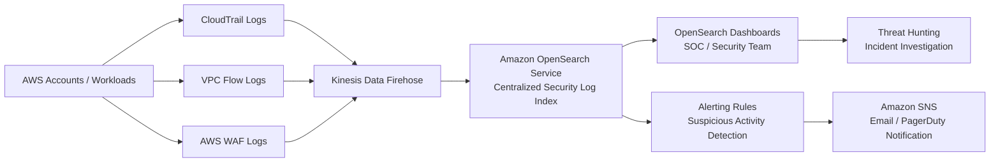

# Amazon OpenSearch Service

## What Is Amazon OpenSearch Service?

Amazon OpenSearch Service is a managed search and analytics service used to search, analyze, visualize, and monitor large amounts of data in near real time.

It is commonly used for:
- log analytics
- security monitoring
- application monitoring
- SIEM solutions
- threat detection
- dashboards and visualizations

OpenSearch allows security teams to:
- centralize logs
- search security events quickly
- create dashboards
- detect anomalies
- investigate incidents

---

## Why OpenSearch Matters for SCS-C03

OpenSearch appears frequently in AWS security scenarios involving:

- centralized logging
- near real-time threat detection
- SIEM architectures
- security dashboards
- large-scale log analysis
- incident investigations
- operational monitoring

OpenSearch is commonly used when organizations need:

> Fast searching and visualization of large volumes of security logs.

---

## Core Concepts

- OpenSearch indexes data for fast searches
- data is stored inside indexes
- supports near real-time analytics
- commonly used with dashboards
- supports structured and unstructured data
- often used for centralized logging
- integrates heavily with AWS security services

Think of OpenSearch as:

> A search engine for logs, security events, and analytics.

---

## Common Security Use Cases

### Centralized Log Analytics

Used to aggregate:
- CloudTrail logs
- VPC Flow Logs
- application logs
- WAF logs
- DNS logs

Security teams can search logs from one central location.

---

### Real-Time Threat Detection

Used to:
- detect suspicious activity
- identify attack patterns
- analyze unusual behavior
- monitor authentication events

Example:
- detect repeated failed login attempts

---

### Security Dashboards

Used to create dashboards for:
- security operations centers (SOCs)
- compliance visibility
- incident tracking
- threat monitoring

---

### SIEM and SOC Operations

OpenSearch is commonly used as:
- a lightweight SIEM platform
- a centralized investigation platform

Used for:
- log correlation
- security investigations
- threat hunting

---

### Application Security Monitoring

Used to monitor:
- API activity
- web application traffic
- authentication requests
- suspicious application behavior

---

### Threat Hunting

Used to:
- search historical security logs
- identify indicators of compromise
- analyze attacker behavior
- investigate anomalies

---

### Compliance Monitoring

Used to:
- maintain centralized audit visibility
- search historical logs
- generate security reports
- support audit investigations

---

## How OpenSearch Works

### Basic Flow

1. Logs and events are generated
2. Data is ingested into OpenSearch
3. OpenSearch indexes the data
4. Users search and visualize the data

---

### Simple Architecture

```text
AWS Services / Applications
            ↓
Kinesis Data Firehose / Lambda
            ↓
Amazon OpenSearch Service
            ↓
Dashboards / Search / Analytics
```

### Example Use Case Architecture


---
## Example Dashboard


Pic Credit: AWS

---

## Important Integrations

### Amazon S3

Used for:
- snapshots
- backups
- long-term storage
- archived logs

---

### Amazon Kinesis Data Firehose

Commonly used to stream logs into OpenSearch.

Frequently appears in exam questions.

---

### AWS Lambda

Used to:
- transform logs
- enrich events
- automate processing
- trigger responses

---

### Amazon CloudWatch

Used for:
- monitoring cluster health
- metrics
- alarms
- operational visibility

---

### AWS CloudTrail

CloudTrail logs are commonly indexed into OpenSearch for:
- API investigations
- IAM activity analysis
- account monitoring

---

### Amazon Security Lake

Security Lake can centralize data that is later analyzed using OpenSearch.

---

### Amazon GuardDuty

GuardDuty findings can be streamed into OpenSearch dashboards for centralized investigations.

---

### AWS WAF

OpenSearch commonly analyzes:
- blocked requests
- bot traffic
- attack patterns
- web application attacks

---

### Amazon VPC

OpenSearch domains can be deployed inside a VPC for improved security.

Very important exam topic.

---

## Security Features

### IAM Access Control

Access can be controlled using:
- IAM policies
- domain access policies
- fine-grained access control

---

### Encryption

Supports:
- encryption at rest
- node-to-node encryption
- TLS encryption in transit

KMS is commonly used.

---

### Fine-Grained Access Control

Can restrict access to:
- indexes
- dashboards
- APIs
- documents

Supports:
- role-based access control

---

### VPC Deployment

OpenSearch domains can be deployed:
- publicly
- inside a VPC

Best practice:
> Deploy inside a VPC.

Very common exam topic.

---

### Audit Logging

Can log:
- authentication activity
- index changes
- search requests
- API calls

Useful for compliance and investigations.

---

## Cost and Performance Considerations

### Storage Optimization

OpenSearch stores indexed data.

Large log volumes increase:
- storage costs
- compute costs

---

### Index Management

Too many indexes can:
- increase cost
- reduce performance

Proper index lifecycle management is important.

---

### Data Retention

Older data is commonly moved to:
- UltraWarm storage
- cold storage
- Amazon S3

---

### Cluster Sizing

Performance depends on:
- node count
- instance types
- storage
- query volume

---

### UltraWarm and Cold Storage

Used to reduce costs for:
- historical logs
- archived investigations
- compliance data

---

## Service Comparisons

### OpenSearch vs Athena

| OpenSearch | Athena |
|---|---|
| near real-time search | SQL on S3 |
| indexed data | queries raw data |
| fast dashboards | lower-cost investigations |
| SIEM-style analytics | serverless SQL analysis |
| higher operational overhead | lower operational overhead |

---

### OpenSearch vs CloudWatch Logs Insights

| OpenSearch | CloudWatch Logs Insights |
|---|---|
| centralized analytics platform | operational log analysis |
| long-term analytics | troubleshooting |
| dashboards and visualization | temporary investigations |
| scalable search platform | CloudWatch-native |

---

### OpenSearch vs Security Lake

| OpenSearch | Security Lake |
|---|---|
| analytics and search platform | centralized security data lake |
| stores indexed searchable data | stores normalized logs in S3 |
| dashboards and investigations | centralized storage layer |

---

## Common Exam Scenarios

### Scenario 1

A company needs near real-time dashboards for security logs collected from multiple AWS accounts.

Answer:
Amazon OpenSearch Service

---

### Scenario 2

A security operations team needs a centralized platform to search CloudTrail and VPC Flow Logs quickly.

Answer:
Amazon OpenSearch Service

---

### Scenario 3

A company needs fast full-text search across large security log datasets.

Answer:
Amazon OpenSearch Service

---

### Scenario 4

A company needs a SIEM-like analytics platform with dashboards and search capabilities.

Answer:
Amazon OpenSearch Service

---

## Common Exam Traps

### Trap 1 — Choosing Athena Instead of OpenSearch

Use OpenSearch when:
- near real-time analytics are required
- dashboards are required
- fast indexed searching is needed
- SIEM-style capabilities are needed

Use Athena when:
- logs already exist in S3
- SQL analysis is sufficient
- lower cost matters more

---

### Trap 2 — Forgetting VPC Deployment

Public OpenSearch domains are less secure.

Best practice:
> Deploy OpenSearch inside a VPC.

---

### Trap 3 — Ignoring Index Costs

OpenSearch can become expensive because:
- indexed data consumes storage
- clusters require compute resources

---

### Trap 4 — Assuming OpenSearch Is Fully Serverless

Traditional OpenSearch deployments require:
- clusters
- node sizing
- storage planning

Operational management still exists.

---

## Quick Revision Notes

- OpenSearch = managed search and analytics platform
- heavily used for centralized logging
- common in SIEM architectures
- supports near real-time analytics
- commonly integrated with Kinesis Firehose
- frequently used with CloudTrail and WAF logs
- supports dashboards and visualizations
- VPC deployment is a security best practice
- often compared with Athena
- indexed searches are fast but increase cost
