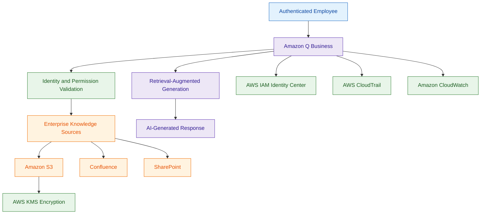

# Amazon Q Business

## What Is Amazon Q Business?

Amazon Q Business is a generative AI-powered assistant designed for enterprise environments.

It helps users securely interact with:

- internal documents
- enterprise applications
- organizational knowledge
- business systems
- operational data

Amazon Q Business can answer questions, summarize information, generate content, and help employees access enterprise knowledge securely.

Think of Amazon Q Business as:

> A secure enterprise AI assistant connected to organizational data sources.

---

## Why Amazon Q Business Matters for Security

Enterprise AI assistants introduce major security concerns around:

- sensitive data exposure
- unauthorized document access
- identity-aware responses
- permission enforcement
- AI-generated content security
- auditability

Security teams must ensure:

- users only access authorized data
- enterprise permissions are enforced
- AI responses do not expose sensitive information
- AI usage is monitored and logged

Amazon Q Business is designed to integrate with enterprise identity and access controls.

---

## Core Concepts

- provides enterprise generative AI assistance
- integrates with enterprise data sources
- respects user identity and permissions
- uses retrieval-augmented generation (RAG)
- supports secure enterprise search
- integrates with IAM and identity providers
- users only see data they are authorized to access

---

## Common Security Use Cases

### Secure Enterprise Search

Employees can securely search:

- internal documentation
- operational procedures
- security runbooks
- knowledge bases

without exposing unauthorized data.

---

### Security Operations Assistance

Security teams can use Amazon Q Business to:

- summarize incidents
- search operational knowledge
- review security procedures
- assist investigations

---

### Identity-Aware AI Responses

Amazon Q Business respects:

- user permissions
- document access controls
- enterprise identity policies

This helps prevent unauthorized data exposure.

---

### AI-Powered Knowledge Assistance

Can help employees:

- locate internal information
- summarize policies
- understand procedures
- query operational documentation

---

### Operational Automation Support

Can integrate with:

- Lambda
- EventBridge
- enterprise workflows

for AI-assisted operations.

---

## How Amazon Q Business Works

### Basic Workflow

1. User authenticates
2. Amazon Q Business validates permissions
3. User submits a query
4. Relevant enterprise data is retrieved
5. AI generates a contextual response
6. Results are filtered based on user access rights

---

### Simple Architecture

```text
Authenticated User
        ↓
Amazon Q Business
        ↓
Enterprise Knowledge Sources
        ↓
Permission-Aware Retrieval
        ↓
AI-Generated Response
```
---
### Example Architecture

---

## Important Components

### Enterprise Connectors

Amazon Q Business can connect to:

- SharePoint
- Confluence
- S3
- Salesforce
- Google Drive
- Jira
- internal repositories

---

### Identity Awareness

Responses are filtered based on:

- user identity
- permissions
- access controls

---

### Retrieval-Augmented Generation (RAG)

Uses enterprise data retrieval to improve AI responses using organizational knowledge.

---

### Access Control Enforcement

Amazon Q Business respects existing enterprise permissions instead of bypassing them.

---

### AI Responses

Generates contextual enterprise responses using:

- retrieved documents
- internal knowledge
- enterprise content

---

## Important Integrations

### AWS IAM Identity Center

Used for:

- enterprise authentication
- user identity management
- access control integration

---

### Amazon S3

Commonly used for:

- enterprise documents
- knowledge repositories
- operational records

---

### AWS Lambda

Useful for:

- automation
- workflow integration
- operational actions

---

### Amazon EventBridge

Can trigger:

- automation workflows
- notifications
- operational integrations

---

### AWS CloudTrail

CloudTrail logs:

- API activity
- configuration changes
- administrative actions

---

### Amazon CloudWatch

Provides:

- monitoring
- metrics
- operational visibility

---

### AWS KMS

KMS helps encrypt:

- enterprise documents
- knowledge sources
- stored data

---

## Security Features

### Identity-Aware Access Control

Very important concept.

Amazon Q Business only returns information users are authorized to access.

This helps prevent unauthorized exposure of enterprise data.

---

### Enterprise Permission Enforcement

Amazon Q Business respects existing permissions from connected enterprise systems.

Example:

A user without HR access should not receive HR-related documents in AI responses.

---

### Encryption

Enterprise data can be encrypted using:

- AWS KMS

for secure storage and integrations.

---

### Logging and Monitoring

CloudTrail and CloudWatch help monitor:

- API activity
- operational events
- administrative actions

---

### Least Privilege Access

IAM and identity permissions should restrict:

- application access
- connector access
- administrative permissions
- data source visibility

---

## Why Amazon Q Business Matters for SCS-C03

### Identity Federation

Amazon Q Business commonly integrates with:

- AWS IAM Identity Center
- enterprise identity providers

to support secure human authentication and enterprise access control.

---

### Permission-Aware AI Responses

Very important concept.

Amazon Q Business respects existing permissions from connected enterprise systems such as:

- SharePoint
- Confluence
- Amazon S3

Users only receive AI-generated responses for content they are authorized to access.

---

### Enterprise AI Security

Security teams must ensure:

- sensitive data is protected
- AI assistants do not expose unauthorized documents
- enterprise permissions remain enforced
- AI interactions are monitored and audited

---

### Logging and Monitoring

Amazon Q Business activity should be monitored using:

- AWS CloudTrail
- Amazon CloudWatch

to support:

- auditing
- investigations
- operational visibility

---

## Amazon Q Business vs Amazon Bedrock

| Amazon Q Business | Amazon Bedrock |
|---|---|
| enterprise AI assistant | generative AI development platform |
| focused on enterprise users | focused on AI application builders |
| permission-aware enterprise search | foundation model access |
| built-in enterprise connectors | custom AI application development |
| secure organizational knowledge access | flexible AI infrastructure |

Use Amazon Q Business when:

- building enterprise AI assistants
- securely searching internal documents
- providing AI-powered enterprise knowledge access

Use Amazon Bedrock when:

- building custom AI applications
- working directly with foundation models
- developing advanced AI architectures

---

## Amazon Q Business vs Amazon Q Developer

| Amazon Q Business | Amazon Q Developer |
|---|---|
| enterprise AI assistant | developer-focused AI assistant |
| searches enterprise business data | assists with code and AWS operations |
| used by employees and business users | used by developers and engineers |
| integrates with enterprise knowledge sources | integrates with IDEs and AWS environments |
| permission-aware document retrieval | coding assistance and troubleshooting |

Use Amazon Q Business when:

- building enterprise AI assistants
- securely searching internal business data
- providing permission-aware AI responses

Use Amazon Q Developer when:

- assisting developers with code
- troubleshooting AWS resources
- generating remediation guidance
- improving developer productivity

---

## Common Exam Scenarios

### Scenario 1

A company wants an enterprise AI assistant that respects existing document permissions.

Answer:

Amazon Q Business

---

### Scenario 2

A company needs secure AI-powered search across internal documentation.

Answer:

Amazon Q Business

---

### Scenario 3

A company wants identity-aware AI responses based on user permissions.

Answer:

Amazon Q Business

---

### Scenario 4

A security team needs AI assistance for searching operational runbooks securely.

Answer:

Amazon Q Business

---

### Scenario 5

A company needs centralized logging for enterprise AI operations.

Answer:

Use CloudTrail and CloudWatch with Amazon Q Business.

---

## Common Exam Traps

### Trap 1 — Confusing Amazon Q Business and Amazon Bedrock

Amazon Q Business:
- enterprise AI assistant

Amazon Bedrock:
- AI development platform

---

### Trap 2 — Assuming AI Bypasses Permissions

Amazon Q Business respects:

- user permissions
- document access controls
- enterprise identity restrictions

---

### Trap 3 — Forgetting Data Protection Responsibilities

Organizations must still secure:

- S3 buckets
- enterprise repositories
- IAM permissions
- encryption keys

---

### Trap 4 — Overly Broad IAM Permissions

Access should follow:

- least privilege
- role-based access
- identity-aware permissions

---

### Trap 5 — Ignoring Logging and Auditing

Enterprise AI systems should be monitored and audited carefully.

---

## 5-Second Recall for Enterprise AI

### Identity

Amazon Q Business = Generative AI + Enterprise Search + Permission-Aware Responses

---

### Keywords

If the scenario mentions:

- AI assistant for employees
- searching SharePoint or Confluence
- enterprise AI search
- permission-aware AI responses
- secure organizational knowledge retrieval

Answer:

→ Amazon Q Business

---

### In-Scope Service Reminder

Amazon Q Business and Amazon Q Developer are both included in the SCS-C03 service list.

---

### Need secure enterprise AI search?

→ Amazon Q Business

---

### Need identity-aware AI responses?

→ Amazon Q Business

---

### Need foundation model development platform?

→ Amazon Bedrock

---

### Need enterprise permission-aware document retrieval?

→ Amazon Q Business

---

### Need AI application building flexibility?

→ Amazon Bedrock

---

## Quick Revision Notes

- Amazon Q Business = enterprise generative AI assistant
- supports secure enterprise search and RAG
- respects user permissions and access controls
- integrates with enterprise data sources
- IAM Identity Center commonly manages authentication
- CloudTrail logs API activity
- KMS encrypts enterprise data
- permission-aware AI responses are critical
- Q Business focuses on enterprise AI assistants
- Bedrock focuses on custom AI application development
- Q Developer focuses on developer productivity and AWS troubleshooting
