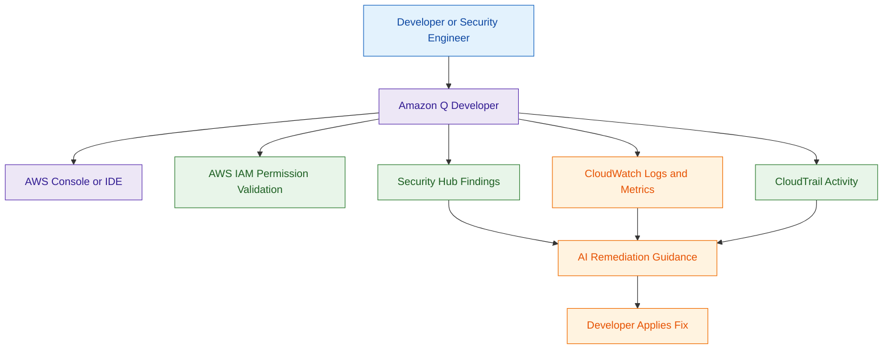

# Amazon Q Developer

## What Is Amazon Q Developer?

Amazon Q Developer is a generative AI-powered assistant designed for developers and cloud engineers.

It helps with:

- code generation
- AWS troubleshooting
- security remediation guidance
- infrastructure explanations
- CLI assistance
- operational debugging

Amazon Q Developer integrates into:

- IDEs
- AWS Console
- development workflows

Think of Amazon Q Developer as:

> An AI assistant for AWS development, troubleshooting, and operational guidance.

---

## Why It Matters for Security

Amazon Q Developer helps security and engineering teams:

- identify security issues
- remediate vulnerabilities
- understand AWS misconfigurations
- improve secure coding practices
- accelerate operational investigations

It is commonly used for:

- remediation guidance
- IAM troubleshooting
- infrastructure debugging
- secure coding assistance
- DevSecOps workflows

---

### Security Operations and Remediation

Amazon Q Developer is especially useful for:

- Security Hub remediation guidance
- CloudWatch troubleshooting
- CloudTrail investigation assistance
- AWS operational debugging
- remediation workflows

It helps security engineers and cloud teams investigate and resolve operational security issues faster.

---

## Core Concepts

- AI-powered developer assistant
- integrates into IDEs and AWS Console
- helps troubleshoot AWS resources
- provides code recommendations
- assists with remediation workflows
- supports operational guidance
- uses identity-aware AWS access controls

---

## Important Integrations

### AWS IAM

Controls:

- user permissions
- AI access permissions
- AWS resource visibility

---

### AWS CloudTrail

Logs:

- API activity
- operational actions
- administrative changes

---

### Amazon CloudWatch

Provides:

- operational metrics
- logs
- monitoring visibility

---

### AWS Lambda

Can assist developers with:

- Lambda troubleshooting
- remediation guidance
- operational debugging

---

### AWS Security Hub

Useful for:

- investigating findings
- remediation recommendations
- operational analysis

---

### IDE Integrations

Amazon Q Developer integrates with IDEs for:

- coding assistance
- troubleshooting
- remediation support

---

## Security Features

### Identity-Aware Assistance

Amazon Q Developer only accesses AWS resources the user is authorized to access.

---

### IAM-Aware Assistance

Very important concept.

Amazon Q Developer is not a bypass for AWS permissions.

The AI assistant only accesses:

- logs
- findings
- metrics
- AWS resources

that the authenticated user is already authorized to access.

---

### Secure Development Assistance

Helps developers identify:

- insecure code
- AWS misconfigurations
- operational issues
- remediation steps

---

### Logging and Auditing

CloudTrail and CloudWatch support:

- auditing
- operational monitoring
- API visibility

---

### Least Privilege Access

IAM permissions should restrict:

- AWS resource visibility
- operational permissions
- troubleshooting access

---

## Architecture Example

### AI-Assisted AWS Troubleshooting Workflow

**Use case:** AI-assisted AWS troubleshooting and security remediation using Amazon Q Developer.

---

## Amazon Q Developer vs Amazon Q Business

| Amazon Q Developer | Amazon Q Business |
|---|---|
| developer-focused AI assistant | enterprise business AI assistant |
| helps with AWS troubleshooting | helps search enterprise business data |
| integrates with IDEs and AWS Console | integrates with enterprise knowledge sources |
| used by developers and engineers | used by employees and business users |
| supports remediation guidance | supports enterprise knowledge retrieval |

Use Amazon Q Developer when:

- troubleshooting AWS resources
- assisting developers
- generating remediation guidance
- improving operational productivity

Use Amazon Q Business when:

- building enterprise AI assistants
- securely searching internal documents
- providing permission-aware enterprise AI search

---

## Common Exam Traps

### Trap 1 — Confusing Q Developer and Q Business

Q Developer:
- developer and AWS operations focused

Q Business:
- enterprise business knowledge focused

---

### Trap 2 — Assuming AI Bypasses IAM Permissions

Amazon Q Developer still respects:

- IAM permissions
- AWS access controls
- resource authorization

---

### Trap 3 — Forgetting Logging Requirements

AI-assisted operational workflows should still use:

- CloudTrail
- CloudWatch
- auditing controls

---

## 5-Second Recall

### The Persona

If the user is:

- a developer
- cloud engineer
- security engineer
- operations engineer

Answer:

→ Amazon Q Developer

---

### The Location

If the interaction happens in:

- AWS Console
- VS Code
- JetBrains IDEs
- CLI workflows

Answer:

→ Amazon Q Developer

---

### The Task

If the scenario involves:

- AWS troubleshooting
- remediation guidance
- Security Hub investigation
- CloudWatch analysis
- CloudTrail investigation
- debugging AWS resources

Answer:

→ Amazon Q Developer

---

### Need enterprise document search?

→ Amazon Q Business

---

### Need custom generative AI applications?

→ Amazon Bedrock

---

## AI and Security Service Comparison

| Service | Primary Security Use Case | Quick Identity Trigger |
|---|---|---|
| Amazon Bedrock | Build custom AI security applications | Foundation models and Guardrails |
| Amazon Q Business | Enterprise AI knowledge assistant | SharePoint and business data search |
| Amazon Q Developer | AWS troubleshooting and remediation | Security Hub and operational debugging |
| Amazon CodeGuru Security | Source code security scanning | SAST and secret detection |

---

## Quick Revision Notes

- Amazon Q Developer = AI assistant for developers and AWS operations
- integrates with IDEs and AWS Console
- helps troubleshoot AWS resources
- supports remediation guidance
- respects IAM permissions
- CloudTrail logs operational activity
- CloudWatch supports monitoring
- Security Hub findings can support investigations
- Q Business focuses on enterprise search
- Bedrock focuses on custom AI applications
- Q Developer focuses on developer productivity and AWS troubleshooting
