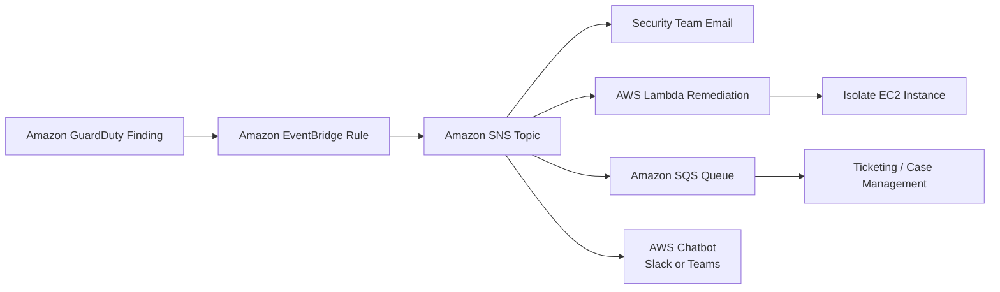

# Amazon SNS

## What Is Amazon SNS?

Amazon Simple Notification Service (Amazon SNS) is a fully managed messaging service used to send notifications and events to multiple subscribers.

SNS follows a:

> publish-subscribe (pub/sub)

messaging model.

SNS is commonly used for:
- alerting
- event notifications
- automation
- incident response
- security findings distribution

SNS can send messages to:
- email
- SMS
- AWS Lambda
- Amazon SQS
- HTTP endpoints
- mobile notifications

---

## Why SNS Matters for SCS-C03

SNS appears frequently in AWS security architectures because it is heavily used for:

- GuardDuty alerts
- Security Hub findings
- automated remediation
- incident response workflows
- compliance notifications
- CloudWatch alarms
- cross-service event notifications

SNS is commonly used when organizations need:

> immediate security notifications and automated event handling.

---

## Core Concepts

- SNS uses a publish-subscribe model
- publishers send messages to SNS topics
- subscribers receive messages from SNS topics
- one message can be delivered to multiple subscribers
- SNS supports push-based messaging
- SNS is commonly used in event-driven architectures

Think of SNS as:

> A central notification hub for AWS services and applications.

---

## Common Security Use Cases

### Security Alerting

Used to send alerts for:
- GuardDuty findings
- Security Hub findings
- CloudWatch alarms
- suspicious activity
- failed authentication attempts

Example:
- email the SOC team when GuardDuty detects crypto mining activity

---

### Incident Notifications

Used during:
- security incidents
- operational failures
- compliance violations
- infrastructure attacks

Example:
- notify the incident response team when a critical finding occurs

---

### Automated Security Responses

SNS commonly triggers:
- AWS Lambda functions
- remediation workflows
- ticket creation systems
- security automation

Example:
- isolate an EC2 instance automatically after a GuardDuty finding

---

### Multi-Account Security Notifications

Used in organizations to:
- centralize alerts
- notify security teams
- aggregate findings across accounts

---

### Compliance Alerts

Used to notify teams when:
- resources become non-compliant
- configurations drift
- policies are violated

Common with:
- AWS Config
- Security Hub

---

### GuardDuty and Security Hub Notifications

Very common exam pattern.

Example flow:

```text
GuardDuty Finding
        ↓
EventBridge Rule
        ↓
SNS Topic
        ↓
Security Team Email
```

---

## How SNS Works

### Basic Flow

1. A service publishes a message
2. The message is sent to an SNS topic
3. Subscribers receive the notification

---

### Simple Architecture

```text
AWS Security Service
          ↓
      SNS Topic
          ↓
 ┌────────┼────────┐
 ↓        ↓        ↓
Email   Lambda    SQS
```
---
### Example Architecture

---

## Important Integrations

### Amazon EventBridge

EventBridge commonly routes security findings into SNS topics.

Very common in SCS-C03 architectures.

---

### AWS Lambda

SNS can trigger Lambda functions for:
- automated remediation
- investigations
- ticket creation
- quarantine workflows

---

### Amazon GuardDuty

GuardDuty findings are commonly:
- routed through EventBridge
- delivered to SNS topics

Used for:
- email alerts
- SOC notifications
- automation

---

### AWS Security Hub

Security Hub findings can trigger SNS notifications for:
- centralized alerting
- compliance issues
- high-severity findings

---

### Amazon CloudWatch

CloudWatch alarms commonly publish alerts to SNS.

Example:
- CPU spikes
- unauthorized API activity
- failed login attempts

---

### AWS Config

Config rules can send SNS notifications for:
- non-compliant resources
- policy violations
- configuration drift

---

### AWS Systems Manager

SNS can notify teams about:
- patch failures
- automation results
- operational issues

---

### Amazon SQS

SNS can fan out messages to multiple SQS queues.

Used for:
- scalable event processing
- decoupled architectures

---

### AWS Chatbot

SNS notifications can be delivered directly to:
- Slack
- Microsoft Teams

Used for:
- operational visibility
- security alerting

---

## Security Features

### IAM Access Control

Access to SNS topics is controlled using:
- IAM policies
- SNS topic policies

---

### Topic Policies

Topic policies control:
- who can publish
- who can subscribe
- cross-account access

Very important exam topic.

---

### Encryption

SNS supports:
- server-side encryption
- AWS KMS integration

Used to protect:
- sensitive notifications
- compliance-related alerts

---

### Private Messaging with VPC Endpoints

SNS supports:
- interface VPC endpoints

Allows private communication without traversing the public internet.

---

## Cost and Performance Considerations

### Fanout Architecture

One SNS message can trigger:
- multiple Lambda functions
- multiple SQS queues
- multiple notifications

Very scalable.

---

### Retry Behavior

SNS automatically retries message delivery for supported endpoints.

---

### Delivery Methods

SNS supports:
- email
- SMS
- Lambda
- HTTP
- SQS
- mobile push notifications

---

### High Availability

SNS is:
- highly available
- fully managed
- regionally resilient

---

## Service Comparisons

### SNS vs SQS

| SNS | SQS |
|---|---|
| push-based | pull-based |
| pub/sub model | message queue |
| multiple subscribers | one consumer at a time |
| immediate notifications | durable message processing |

---

### SNS vs EventBridge

| SNS | EventBridge |
|---|---|
| notification service | event routing service |
| simple pub/sub | advanced filtering and routing |
| immediate fanout | event-driven workflows |
| commonly used for alerts | commonly used for integrations |

---

### SNS vs SES

| SNS | SES |
|---|---|
| notifications | email sending service |
| alerts and automation | marketing and transactional emails |
| pub/sub messaging | full email platform |

---

## Common Exam Scenarios

### Scenario 1

A company needs to send immediate email alerts when GuardDuty detects suspicious activity.

Answer:
Amazon SNS

---

### Scenario 2

A company needs to notify multiple systems simultaneously when a security finding occurs.

Answer:
Amazon SNS

---

### Scenario 3

A CloudWatch alarm must trigger automated remediation through a Lambda function.

Answer:
CloudWatch → SNS → Lambda

---

### Scenario 4

A company needs a scalable fanout architecture for security notifications.

Answer:
Amazon SNS

---

## Common Exam Traps

### Trap 1 — Confusing SNS with SQS

Use SNS when:
- immediate notifications are needed
- multiple subscribers are involved
- push-based messaging is required

Use SQS when:
- durable queues are needed
- consumers process messages asynchronously

---

### Trap 2 — Choosing EventBridge Instead of SNS

Use SNS for:
- notifications
- fanout messaging
- alert delivery

Use EventBridge for:
- event routing
- filtering
- workflow orchestration

---

### Trap 3 — Forgetting Topic Policies

Cross-account SNS usage commonly requires:
- SNS topic policies

Very common exam topic.

---

### Trap 4 — Assuming SNS Stores Messages Long-Term

SNS is not long-term storage.

Messages are delivered immediately to subscribers.

---

## Quick Revision Notes

- SNS = publish-subscribe messaging service
- heavily used for security alerting
- common with GuardDuty and Security Hub
- supports fanout messaging
- integrates with Lambda and EventBridge
- supports email, SMS, SQS, and Lambda
- topic policies control access
- supports KMS encryption
- commonly appears in automated remediation workflows
