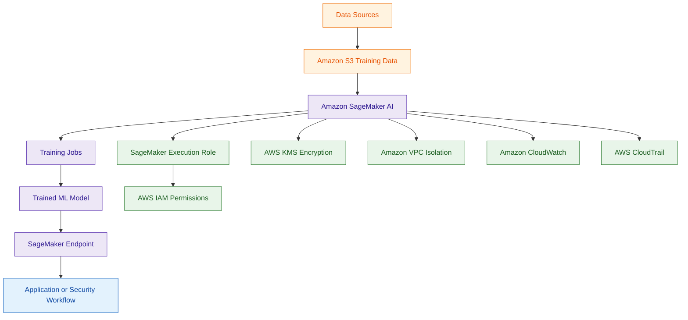

# Amazon SageMaker AI

## What Is Amazon SageMaker AI?

Amazon SageMaker AI is a fully managed machine learning service used to build, train, deploy, and manage machine learning models at scale.

It supports:

- model training
- inference endpoints
- data preparation
- model deployment
- MLOps workflows
- AI experimentation

SageMaker helps organizations build custom AI and machine learning applications without manually managing infrastructure.

Think of Amazon SageMaker AI as:

> A managed machine learning platform for building and operating AI models.

---

## Why It Matters for Security

Machine learning environments introduce security concerns around:

- sensitive training data
- model access
- inference endpoint exposure
- data poisoning
- model theft
- unauthorized access

Security teams must secure:

- datasets
- notebooks
- models
- APIs
- training jobs
- inference endpoints

SageMaker is commonly used in:

- fraud detection
- anomaly detection
- threat analysis
- predictive security analytics

---

## Core Concepts

- build and train ML models
- deploy inference endpoints
- manage ML workflows
- notebooks support development
- IAM controls access
- endpoints expose model inference APIs
- MLOps automates model lifecycle operations

---

## Important Integrations

### Amazon S3

Used for:

- training datasets
- model artifacts
- inference outputs

---

### AWS IAM

Controls:

- notebook access
- training job permissions
- endpoint permissions

---

### AWS KMS

Encrypts:

- training data
- model artifacts
- notebooks
- storage volumes

---

### Amazon ECR

SageMaker training jobs and inference workloads can use container images stored in Amazon ECR.

The SageMaker Execution Role may require permissions to:

- pull container images
- access private repositories

---

### Amazon CloudWatch

Provides:

- logs
- metrics
- monitoring
- endpoint visibility

---

### AWS CloudTrail

Logs:

- API activity
- model deployment actions
- notebook operations

---

### Amazon VPC

SageMaker resources can run inside VPCs for network isolation.

---

### AWS Lambda

Can automate:

- inference workflows
- model operations
- event-driven ML tasks

---

## Security Features

### IAM-Based Access Control

IAM policies should restrict:

- notebook access
- model deployment
- endpoint invocation
- training job permissions

---

### SageMaker Execution Role

Very important exam concept.

SageMaker commonly uses a service role called the SageMaker Execution Role.

This role may require permissions for:

- Amazon S3 access
- AWS KMS encryption and decryption
- Amazon ECR image access
- CloudWatch logging

Best practice:
- follow least privilege access
- avoid overly broad permissions

---

### Network Isolation

Best practice is to run SageMaker resources inside a VPC.

This helps isolate:

- notebooks
- training jobs
- inference endpoints

Organizations commonly use:

- private subnets
- security groups
- Interface VPC Endpoints

to reduce internet exposure.

---

### Encryption

SageMaker supports KMS encryption for:

- EBS volumes
- S3 data
- model artifacts
- endpoint storage

---

### Protecting Model Artifacts

Model artifacts stored in Amazon S3 should use:

- AWS KMS encryption
- restricted IAM access
- bucket policies

Sensitive ML models and datasets should never be publicly accessible.

---

### Endpoint Security

Inference endpoints should use:

- authentication
- least privilege access
- network controls
- monitoring

---

### SageMaker Model Monitor

Amazon SageMaker Model Monitor helps detect:

- data drift
- model quality degradation
- unexpected inference behavior

This is important because changes in production data may indicate:

- operational problems
- environmental changes
- security anomalies
- suspicious activity

---

### Logging and Monitoring

CloudTrail and CloudWatch help monitor:

- model activity
- endpoint usage
- operational events
- suspicious API activity

---

## Architecture Example

### Secure Machine Learning Workflow

**Use case:** secure machine learning model training and deployment using Amazon SageMaker AI.

---

## SageMaker AI vs Amazon Bedrock

| SageMaker AI | Amazon Bedrock |
|---|---|
| build and train custom ML models | use managed foundation models |
| full ML lifecycle management | generative AI application platform |
| supports custom model training | focuses on AI inference and GenAI |
| requires ML development workflows | faster GenAI application development |
| used for traditional ML and AI | used for foundation model access |

Use SageMaker AI when:

- training custom machine learning models
- building ML pipelines
- deploying custom inference endpoints
- managing full MLOps workflows

Use Amazon Bedrock when:

- building generative AI applications
- using foundation models
- implementing RAG architectures
- creating AI assistants quickly

---

## Common Exam Traps

### Trap 1 — Confusing SageMaker and Bedrock

SageMaker:
- custom ML model development

Bedrock:
- managed foundation model access

---

### Trap 2 — Forgetting Endpoint Security

Inference endpoints should still use:

- IAM controls
- network restrictions
- monitoring
- least privilege access

---

### Trap 3 — Ignoring Data Protection

Training datasets and model artifacts may contain sensitive information.

Use:

- KMS encryption
- VPC isolation
- restricted IAM access

---

### Trap 4 — Exposing Training Resources Publicly

Best practice:

- use VPC isolation
- avoid unnecessary internet exposure
- restrict notebook access

---

## 5-Second Recall

### The Persona

If the user is a:

- data scientist
- ML engineer
- AI engineer

Answer:

→ Amazon SageMaker AI

---

### The Action

If the scenario mentions:

- training jobs
- hyperparameter tuning
- model artifacts
- inference endpoints
- custom ML models

Answer:

→ Amazon SageMaker AI

---

### Security Trigger

If the requirement involves:

- protecting ML models
- encrypting training datasets
- securing inference endpoints
- VPC-isolated ML workloads

Answer:

→ Amazon SageMaker AI

---

### Need managed foundation models?

→ Amazon Bedrock

---

### Need full MLOps workflows?

→ Amazon SageMaker AI

---

## Quick Revision Notes

- SageMaker AI = managed machine learning platform
- supports training and deployment of custom ML models
- IAM controls notebooks and endpoints
- SageMaker Execution Role is a key security concept
- KMS encrypts training data and model artifacts
- VPCs provide network isolation
- CloudTrail logs ML API activity
- CloudWatch monitors endpoints and jobs
- Model Monitor detects data drift and anomalies
- inference endpoints require security controls
- Bedrock focuses on foundation models and GenAI
- SageMaker focuses on custom ML development
