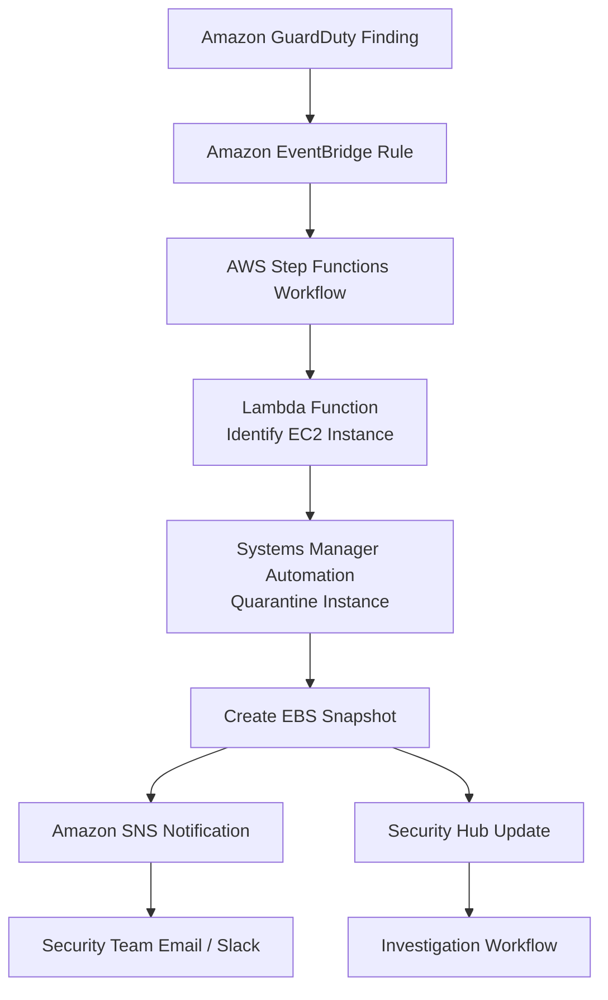

# AWS Step Functions

## What Is AWS Step Functions?

AWS Step Functions is a serverless workflow orchestration service used to coordinate multiple AWS services into automated workflows.

Step Functions allows you to:
- automate processes
- coordinate multiple tasks
- build decision-based workflows
- handle retries and failures
- manage long-running operations

Step Functions is commonly used in security for:
- incident response automation
- remediation workflows
- compliance operations
- investigation pipelines
- orchestration of Lambda functions

---

## Why Step Functions Matter for SCS-C03

Step Functions appears frequently in AWS security scenarios involving:

- automated incident response
- orchestration of remediation actions
- multi-step security workflows
- automated investigations
- security operations automation
- event-driven security pipelines

Step Functions is commonly used when organizations need:

> coordinated and automated security response workflows.

---

## Core Concepts

- Step Functions orchestrates workflows
- workflows are made of states
- each state performs an action
- workflows can branch conditionally
- supports retries and error handling
- integrates with many AWS services
- workflows are visual and traceable

Think of Step Functions as:

> A workflow engine for AWS automation.

---

## Common Security Use Cases

### Automated Incident Response

Used to automate:
- compromised EC2 isolation
- suspicious IAM investigations
- malware response
- threat containment

Example:
- automatically quarantine an EC2 instance after a GuardDuty finding

---

### Security Investigation Workflows

Used to:
- gather evidence
- collect logs
- trigger snapshots
- notify analysts
- document findings

---

### Automated Remediation

Used for:
- removing risky security group rules
- disabling exposed IAM keys
- correcting non-compliant resources
- enforcing security baselines

---

### Compliance Automation

Used to:
- remediate AWS Config findings
- enforce tagging policies
- automate compliance reporting
- trigger security assessments

---

### Multi-Step Security Operations

Used when multiple coordinated actions are required.

Example:
1. detect threat
2. isolate resource
3. create snapshot
4. notify SOC team
5. open ticket

---

### Orchestrating Lambda-Based Security Actions

Step Functions commonly coordinates:
- multiple Lambda functions
- decision-based branching
- retry workflows
- automated investigations

---

## How Step Functions Work

### Basic Flow

1. An event triggers the workflow
2. Step Functions executes defined states
3. Each state performs an action
4. Results determine the next step
5. Workflow completes automatically

---

### Simple Architecture

```text
GuardDuty Finding
        ↓
Amazon EventBridge
        ↓
AWS Step Functions
        ↓
 ┌────────┼────────┬────────┐
 ↓        ↓        ↓        ↓
Lambda   SNS      SSM    Security Hub
```
---
### Example Architecture

Use case: automated incident response and EC2 quarantine workflow.

This is a very common use case where GuardDuty detects malicious activity and Step Functions orchestrates:

- investigation
- isolation
- evidence preservation
- notifications
- centralized security tracking.

---

## Important Integrations

### AWS Lambda

Most common integration.

Lambda functions perform:
- remediation
- investigation
- automation logic
- notifications

---

### Amazon EventBridge

Commonly used to:
- trigger Step Functions workflows
- route security findings
- automate incident response

Very common exam pattern.

---

### Amazon SNS

Used to:
- notify security teams
- send alerts
- trigger external systems

---

### AWS Systems Manager

Used for:
- remediation actions
- automation documents
- patching
- quarantine operations

---

### AWS Config

Config findings can trigger Step Functions remediation workflows.

Example:
- automatically remediate non-compliant resources

---

### AWS Security Hub

Security Hub findings can initiate:
- investigations
- remediation pipelines
- incident response workflows

---

### Amazon GuardDuty

Very common integration.

GuardDuty findings commonly trigger:
- EventBridge rules
- Step Functions workflows
- automated containment

---

### AWS IAM

IAM controls:
- workflow permissions
- service integrations
- execution roles

---

### AWS CloudTrail

CloudTrail records:
- workflow activity
- API actions
- remediation operations

Useful for:
- auditing
- investigations
- compliance

---

## Security Features

### IAM Permissions

Step Functions uses IAM roles to:
- execute workflows
- access services
- invoke actions

Least privilege is very important.

---

### Workflow Visibility

Provides:
- visual execution tracking
- workflow history
- state-level visibility

Useful during:
- investigations
- troubleshooting
- audits

---

### Error Handling

Supports:
- retries
- fallback actions
- exception handling

Very important for automation reliability.

---

### Retry Logic

Can automatically retry:
- failed Lambda executions
- API failures
- temporary service errors

---

### Auditability

Workflow execution history helps:
- track security actions
- review incident response
- support compliance audits

---

## Cost and Performance Considerations

### State Transition Pricing

Pricing is based on:
- workflow state transitions

Large workflows increase cost.

---

### Workflow Design

Efficient workflows should:
- minimize unnecessary states
- reduce complexity
- avoid excessive retries

---

### Long-Running Workflows

Step Functions supports:
- long-running operations
- delayed execution
- human approval flows

---

### Standard vs Express Workflows

#### Standard Workflows
Best for:
- long-running workflows
- durable execution
- incident response

#### Express Workflows
Best for:
- high-volume events
- short-lived workflows
- lower latency

---

## Service Comparisons

### Step Functions vs Lambda

| Step Functions | Lambda |
|---|---|
| orchestrates workflows | executes code |
| visual workflows | individual functions |
| retry and branching logic | compute execution |
| coordinates multiple services | performs single tasks |

---

### Step Functions vs EventBridge

| Step Functions | EventBridge |
|---|---|
| workflow orchestration | event routing |
| multi-step automation | event distribution |
| state management | event filtering |
| retries and branching | decoupled integrations |

---

### Step Functions vs Systems Manager Automation

| Step Functions | Systems Manager Automation |
|---|---|
| general workflow orchestration | operational automation |
| broad AWS integrations | infrastructure-focused actions |
| application and security workflows | remediation and administration |

---

## Common Exam Scenarios

### Scenario 1

A company needs to automate a multi-step incident response workflow after a GuardDuty finding.

Answer:
AWS Step Functions

---

### Scenario 2

A security team needs a workflow that:
- isolates an EC2 instance
- creates a snapshot
- sends notifications
- opens an investigation ticket

Answer:
AWS Step Functions

---

### Scenario 3

A company needs retry logic and branching decisions in an automated remediation pipeline.

Answer:
AWS Step Functions

---

### Scenario 4

A company needs to coordinate multiple Lambda functions during an investigation workflow.

Answer:
AWS Step Functions

---

## Common Exam Traps

### Trap 1 — Using Lambda Alone for Complex Workflows

Lambda executes code.

Step Functions orchestrates workflows.

Use Step Functions when:
- multiple steps are involved
- retries are needed
- workflows become complex

---

### Trap 2 — Confusing Event Routing with Workflow Orchestration

Use:
- EventBridge for routing events
- Step Functions for orchestrating actions

Very common exam confusion.

---

### Trap 3 — Forgetting Retry and Error Handling

Step Functions is commonly selected because:
- retry handling is built-in
- workflows are resilient

---

### Trap 4 — Overengineering Simple Automations

Not every automation requires Step Functions.

Simple single-action events may only need:
- Lambda
- EventBridge

---

## Quick Revision Notes

- Step Functions = workflow orchestration service
- heavily used for incident response automation
- commonly triggered by EventBridge
- integrates heavily with Lambda
- supports retries and branching logic
- common in GuardDuty remediation workflows
- useful for multi-step security automation
- provides workflow visibility and auditability
- often paired with Systems Manager and SNS
