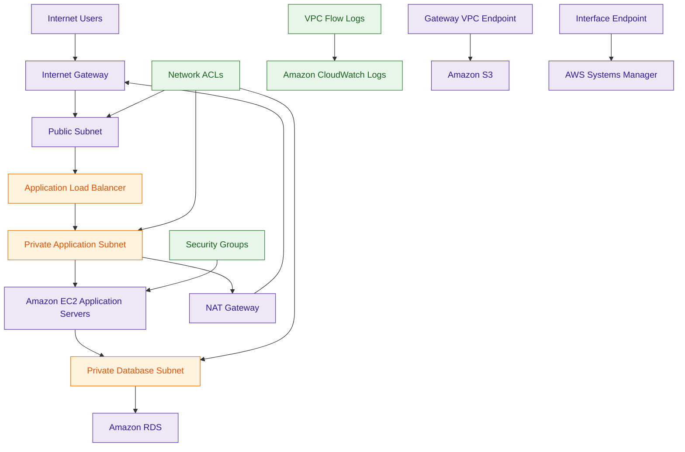
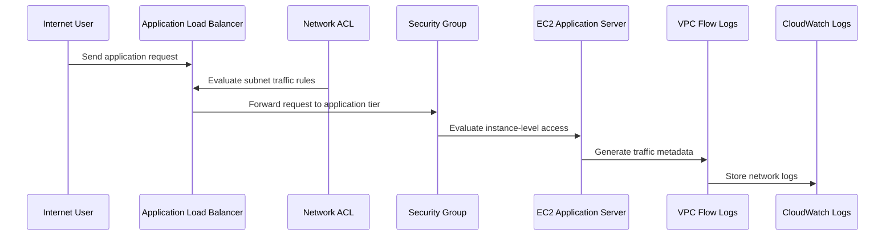

# Amazon Virtual Private Cloud (Amazon VPC)

## What Is Amazon VPC?

Amazon Virtual Private Cloud (Amazon VPC) is a logically isolated networking service that allows organizations to build private cloud networks inside AWS.

A VPC provides control over:

- IP addressing
- routing
- subnets
- internet connectivity
- traffic segmentation
- network boundaries

Amazon VPC is the foundational networking layer for most AWS workloads.

Think of Amazon VPC as:

> A private virtual network environment for AWS infrastructure and cloud workloads.

---

## Why It Matters for Security

Amazon VPC is one of the most important AWS security services because it controls:

- workload isolation
- network segmentation
- traffic exposure
- ingress and egress paths
- east-west traffic boundaries
- private connectivity

Security teams use VPCs to:

- isolate sensitive systems
- implement least privilege networking
- reduce attack surface
- segment workloads
- secure hybrid connectivity
- enforce zero-trust architectures

VPC architecture is foundational for:

- cloud security
- enterprise networking
- secure workload design
- hybrid infrastructure
- multi-account governance

Almost every AWS security architecture depends on proper VPC design.

---

## Core Concepts

- logically isolated AWS virtual network
- supports public and private subnets
- controlled traffic routing
- customizable CIDR ranges
- highly scalable virtual networking
- supports hybrid connectivity
- enables workload segmentation
- integrates with AWS network security services

---

## Important Integrations

### Amazon EC2

Primary compute service deployed inside VPCs.

---

### Elastic Load Balancing (ELB)

Provides:

- traffic distribution
- high availability
- public and private load balancing

---

### AWS Transit Gateway

Supports:

- centralized VPC connectivity
- transitive routing
- hub-and-spoke networking

---

### AWS Direct Connect

Provides dedicated private connectivity between AWS and on-premises environments.

---

### AWS Site-to-Site VPN

Supports encrypted hybrid connectivity between AWS and enterprise networks.

---

### AWS Network Firewall

Provides managed:

- traffic inspection
- network filtering
- intrusion prevention

---

### Security Groups

Provide stateful instance-level firewall controls.

---

### Network ACLs (NACLs)

Provide stateless subnet-level traffic filtering.

---

### Amazon Route 53

Supports:

- DNS resolution
- private hosted zones
- internal service discovery

---

### VPC Endpoints

Provide private connectivity to AWS services without internet exposure.

---

### AWS PrivateLink

Provides secure private service connectivity across VPCs and AWS accounts.

---

### AWS RAM

Supports subnet and resource sharing across AWS accounts.

---

## Security Features

### Network Isolation

Each VPC is logically isolated from other AWS customer environments.

This provides:

- workload separation
- tenant isolation
- network segmentation

---

### Public and Private Subnets

VPCs commonly separate workloads into:

- public subnets
- private subnets

Public subnets:
- internet-facing resources

Private subnets:
- internal workloads without direct internet exposure

Very important AWS security architecture pattern.

---

### Security Groups

Security Groups are:

- stateful virtual firewalls
- attached to instances and ENIs

They control:

- inbound traffic
- outbound traffic

Very important foundational AWS security concept.

---

### Security Group Referencing

Security Groups can reference other Security Groups as traffic sources.

Example:

- allow database access only from instances using the "Application-SG"

instead of:
- allowing specific IP addresses

This enables:

- dynamic scaling
- simplified administration
- identity-based workload segmentation

Very important cloud-native security architecture pattern.

---

### Network ACLs (NACLs)

NACLs are:

- subnet-level stateless firewalls

They provide:

- explicit allow and deny rules
- subnet traffic filtering
- coarse-grained protection

---

### Route Tables

Route tables control:

- traffic flow
- internet access
- hybrid routing
- inter-subnet communication

Improper routing can unintentionally expose workloads.

---

### Internet Gateways

Internet Gateways allow internet connectivity for public resources.

Important security requirement:
- resources require:
  - public IP assignment
  - internet-routable path

before becoming publicly accessible.

---

### NAT Gateways

NAT Gateways allow private subnet resources to:

- access the internet outbound

without allowing inbound internet connectivity.

Very common secure networking pattern.

---

### VPC Endpoints

VPC Endpoints provide private connectivity to AWS services without traversing the public internet.

Common services:

- Amazon S3
- DynamoDB
- Systems Manager
- Secrets Manager

Very important AWS security architecture feature.

---

### Gateway Endpoints vs Interface Endpoints

| Gateway Endpoint | Interface Endpoint |
|---|---|
| supports S3 and DynamoDB only | supports most AWS services |
| free to use | hourly and data processing charges |
| uses route table entries | uses ENIs with private IPs |
| gateway-style routing | powered by AWS PrivateLink |

Use Gateway Endpoints when:

- accessing S3 privately
- accessing DynamoDB privately
- minimizing cost

Use Interface Endpoints when:

- accessing AWS services privately
- using PrivateLink architectures
- enabling private service connectivity

---

### AWS PrivateLink

PrivateLink enables private service connectivity between:

- VPCs
- AWS accounts
- AWS services

without exposing traffic publicly.

---

### VPC Flow Logs

VPC Flow Logs capture network traffic metadata such as:

- source IP
- destination IP
- ports
- accepted traffic
- rejected traffic

Very important for:

- investigations
- threat detection
- network monitoring

---

### Traffic Segmentation

Organizations commonly segment workloads by:

- environment
- sensitivity
- compliance boundary
- application tier

Examples:

- production VPCs
- development VPCs
- PCI workloads
- internal-only systems

---

### Hybrid Connectivity

VPC supports secure hybrid networking using:

- Direct Connect
- Site-to-Site VPN
- Transit Gateway

---

### Amazon Provided DNS

AWS reserves the plus-two IP address in every subnet for AmazonProvidedDNS.

Example:

- subnet: 10.0.0.0/24
- DNS server: 10.0.0.2

This DNS service supports:

- internal hostname resolution
- VPC DNS functionality
- private hosted zone integration

---

## Default Security Behavior

### Security Groups

Security Groups start with:

- default deny inbound
- default allow outbound

Traffic must be explicitly allowed inbound.

---

### Default NACLs

Default NACLs typically allow:

- all inbound traffic
- all outbound traffic

---

### Custom NACLs

Custom NACLs start with:

- deny all inbound
- deny all outbound

Rules must be explicitly added.

---

## Ephemeral Ports and NACL Behavior

Because NACLs are stateless, return traffic must be explicitly allowed.

Example:

- inbound HTTP on port 80 allowed
- outbound ephemeral ports (typically 1024-65535) must also be allowed

Otherwise:
- responses may fail unexpectedly

Security Groups automatically handle return traffic because they are stateful.

---

## Architecture Example

### Secure Multi-Tier Enterprise VPC Architecture

**Use case:** secure enterprise networking with segmented workloads, private AWS service access, and centralized traffic monitoring.

---

## Traffic Inspection Workflow

**Use case:** layered VPC traffic filtering and centralized network visibility.

---

## Security Groups vs Network ACLs

| Security Groups | Network ACLs |
|---|---|
| stateful firewall | stateless firewall |
| attached to instances and ENIs | attached to subnets |
| supports allow rules only | supports allow and deny rules |
| evaluates all rules collectively | evaluates rules sequentially |
| instance-level protection | subnet-level protection |

Use Security Groups when:

- protecting workloads
- implementing least privilege networking
- controlling instance access

Use NACLs when:

- filtering subnet traffic
- creating explicit deny rules
- implementing coarse-grained subnet protection

---

## VPC Endpoints vs NAT Gateway

| VPC Endpoints | NAT Gateway |
|---|---|
| private AWS service connectivity | outbound internet connectivity |
| traffic stays inside AWS network | traffic traverses internet |
| no public internet required | internet connectivity required |
| AWS service access focused | general outbound access focused |

Use VPC Endpoints when:

- accessing AWS services privately
- avoiding internet exposure
- improving security posture

Use NAT Gateway when:

- private workloads require outbound internet access

---

## AWS PrivateLink vs VPC Peering

| AWS PrivateLink | VPC Peering |
|---|---|
| service-level private connectivity | network-level connectivity |
| selective service exposure | broader trust relationship |
| provider-consumer architecture | bidirectional routing |
| more isolated connectivity model | full VPC communication |

Use PrivateLink when:

- exposing services securely
- limiting network exposure
- enabling cross-account service access

Use VPC Peering when:

- connecting trusted VPCs
- enabling broader routing connectivity

---

## Common Exam Traps

### Trap 1 — Confusing Security Groups and NACLs

Security Groups:
- stateful
- instance-level

NACLs:
- stateless
- subnet-level

Very common exam distinction.

---

### Trap 2 — Forgetting Ephemeral Ports

Because NACLs are stateless:
- return traffic requires ephemeral port rules

Very important troubleshooting concept.

---

### Trap 3 — Forgetting Private Subnet Internet Access Requirements

Private subnets commonly require:

- NAT Gateway

for outbound internet connectivity.

---

### Trap 4 — Assuming Public Subnet Means Public Access

A resource requires both:

- public IP
- internet-routable path

before becoming publicly accessible.

---

### Trap 5 — Forgetting VPC Endpoints

VPC Endpoints provide private AWS service access without internet exposure.

Very important AWS security pattern.

---

### Trap 6 — Confusing Gateway and Interface Endpoints

Gateway Endpoints:
- S3 and DynamoDB only

Interface Endpoints:
- most AWS services
- powered by PrivateLink

---

### Trap 7 — Confusing PrivateLink and VPC Peering

PrivateLink:
- service-level exposure

VPC Peering:
- full VPC network connectivity

---

### Trap 8 — Assuming Security Groups Evaluate Rule Order

Security Groups:
- evaluate all rules collectively

NACLs:
- evaluate rules sequentially

---

### Trap 9 — Assuming VPC Peering Is Transitive

VPC Peering is not transitive.

Example:

- VPC A peered with VPC B
- VPC B peered with VPC C

Result:
- VPC A cannot automatically communicate with VPC C

Use AWS Transit Gateway for centralized transitive routing architectures.

---

## 5-Second Recall

### Identity

Amazon VPC = isolated AWS virtual networking environment

---

### Keywords

If the scenario mentions:

- network isolation
- private networking
- subnets
- routing
- traffic segmentation
- hybrid connectivity

Answer:

→ Amazon VPC

---

### Stateful Firewall Trigger

If the requirement involves:

- instance-level filtering
- workload firewalling
- automatic return traffic handling

Answer:

→ Security Groups

---

### Stateless Firewall Trigger

If the scenario involves:

- subnet filtering
- explicit deny rules
- ephemeral ports

Answer:

→ Network ACLs

---

### Private AWS Service Access Trigger

If the requirement involves:

- private S3 access
- no internet exposure
- private AWS connectivity

Answer:

→ VPC Endpoints

---

### Service Exposure Trigger

If the requirement involves:

- private service publishing
- provider-consumer architecture
- selective service exposure

Answer:

→ AWS PrivateLink

---

### Hybrid Networking Trigger

If the requirement involves:

- on-premises connectivity
- enterprise networking
- hybrid architectures

Answer:

→ Direct Connect or VPN

---

### Need outbound internet from private subnets?

→ NAT Gateway

---

### Need centralized routing for many VPCs?

→ AWS Transit Gateway

---

### Need network traffic investigations?

→ VPC Flow Logs

---

## Quick Revision Notes

- foundational AWS networking service
- logically isolated virtual network
- supports public and private subnets
- Security Groups are stateful instance firewalls
- NACLs are stateless subnet firewalls
- Security Groups support SG referencing
- NAT Gateway enables outbound internet access
- VPC Endpoints provide private AWS service connectivity
- Gateway Endpoints support S3 and DynamoDB
- Interface Endpoints use PrivateLink
- Flow Logs capture network traffic metadata
- Transit Gateway supports centralized routing
- VPC Peering is not transitive
- public access requires public IP and routable path
- foundational AWS security and networking architecture service
