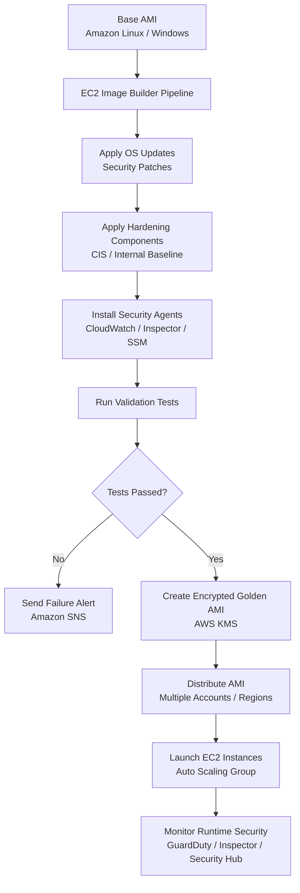

# EC2 Image Builder

## What Is EC2 Image Builder?

EC2 Image Builder is a fully managed AWS service used to automate the creation, testing, hardening, and distribution of machine images.

It helps organizations build:
- secure Amazon Machine Images (AMIs)
- standardized server images
- patched operating systems
- hardened infrastructure images
- container images

EC2 Image Builder reduces manual image management and helps security teams maintain consistent server configurations across environments.

---

## Why EC2 Image Builder Matters for Security

Security teams use Image Builder to:
- standardize infrastructure
- reduce configuration drift
- automate patching
- create hardened operating systems
- enforce security baselines
- reduce vulnerabilities

Modern cloud security architectures commonly prefer:

> immutable and pre-hardened machine images instead of manually configured servers.

Image Builder helps organizations maintain:
- secure EC2 fleets
- compliance consistency
- repeatable deployments
- predictable infrastructure

---

## Core Concepts

- Image Builder automates AMI creation
- image pipelines define build workflows
- recipes define software and configuration steps
- components contain installation and hardening logic
- pipelines can automatically patch and rebuild images
- images can be tested before deployment
- images can be distributed across Regions and accounts

Think of Image Builder as:

> A factory for creating secure and standardized machine images.

---

## Common Security Use Cases

### Secure Golden AMIs

Organizations commonly create:
- approved baseline images
- hardened operating systems
- security-approved AMIs

These are often called:
- golden AMIs
- hardened images
- baseline images

---

### Automated Patch Management

Image Builder can automatically:
- apply operating system patches
- update packages
- rebuild images regularly

This reduces exposure to known vulnerabilities.

---

### Compliance Baselines

Used to enforce:
- CIS benchmarks
- internal hardening standards
- compliance configurations
- security baselines

---

### Hardened Operating Systems

Security teams can:
- disable unnecessary services
- remove insecure packages
- configure logging
- enforce secure settings

before deployment.

---

### Immutable Infrastructure

Instead of patching running servers:
- new hardened AMIs are built
- old instances are replaced

This reduces:
- configuration drift
- manual errors
- inconsistent security states

---

### Vulnerability Reduction

Image Builder helps reduce vulnerabilities by:
- automating updates
- integrating with vulnerability scanning
- enforcing standard builds

---

## How EC2 Image Builder Works

### Basic Workflow

1. Select a base image
2. Define build instructions
3. Apply hardening and patches
4. Run validation tests
5. Create a new AMI
6. Distribute the AMI
7. Deploy EC2 instances using the image

---

### Simple Architecture

```text
Base AMI
    ↓
EC2 Image Builder Pipeline
    ↓
Install Packages and Patches
    ↓
Apply Security Hardening
    ↓
Validation Testing
    ↓
Create Hardened AMI
    ↓
Deploy EC2 Instances
```
---
### Example use case: Secure golden AMI pipeline.
This shows how EC2 Image Builder can create patched, hardened, encrypted AMIs and distribute them across accounts or Regions for consistent EC2 deployments.


---

## Important Components

### Image Pipelines

Pipelines automate:
- image builds
- testing
- patching
- distribution

Pipelines can run:
- on schedule
- automatically
- on demand

---

### Recipes

Recipes define:
- base image
- components
- software configuration
- image settings

Think of recipes as:
> Instructions for building an image.

---

### Components

Components contain:
- installation steps
- hardening logic
- patching actions
- validation scripts

Examples:
- install CloudWatch Agent
- disable unused services
- configure logging
- apply CIS hardening

---

### Infrastructure Configuration

Defines:
- build instance type
- networking
- IAM roles
- logging configuration

---

### Distribution Settings

Controls:
- Region distribution
- cross-account sharing
- AMI permissions

Useful for:
- multi-account organizations
- centralized security teams

---

### AMIs

Image Builder commonly produces:
- Amazon Machine Images (AMIs)

These AMIs are used to launch EC2 instances.

---

### Container Images

Image Builder also supports:
- container image creation

Useful for:
- EKS
- ECS
- container security workflows

---

## Important Integrations

### Amazon EC2

Image Builder creates hardened AMIs for EC2 deployments.

---

### AWS Systems Manager

Commonly used for:
- patching
- inventory
- automation
- operational tasks

---

### Amazon Inspector

Inspector can scan instances launched from AMIs for:
- vulnerabilities
- software exposure
- package risks

---

### AWS KMS

Used to encrypt:
- EBS volumes
- AMIs
- snapshots

Very important for:
- compliance workloads
- sensitive environments

---

### AWS Organizations

Useful for:
- centralized image distribution
- multi-account governance
- standardized infrastructure

---

### AWS CloudTrail

CloudTrail records:
- image creation
- pipeline changes
- distribution activity
- IAM actions

Useful for:
- auditing
- investigations
- compliance

---

### Amazon CloudWatch

Used for:
- pipeline monitoring
- metrics
- alarms
- logging

---

### Amazon EventBridge

Can trigger:
- automated rebuilds
- notifications
- remediation workflows

---

### AWS IAM

Controls access to:
- pipelines
- AMIs
- distribution settings
- image management

---

### AWS Security Hub

Can aggregate findings related to:
- vulnerable instances
- compliance deviations
- security risks

---

## Security Features

### Image Hardening

Image Builder supports:
- operating system hardening
- package removal
- service configuration
- baseline enforcement

---

### Automated Updates

Pipelines can rebuild images automatically with:
- latest patches
- updated packages
- new configurations

---

### Patch Management

Reduces vulnerability exposure by:
- keeping AMIs updated
- reducing outdated deployments

---

### Image Validation

Validation tests ensure:
- applications work correctly
- configurations are secure
- images meet requirements

Very important before production deployment.

---

### Encryption

Supports encryption using:
- AWS KMS

Protects:
- AMIs
- snapshots
- EBS volumes

---

### Cross-Account Distribution

Images can be securely shared across:
- AWS accounts
- Regions
- environments

Useful for:
- centralized security governance

---

### Immutable Deployments

Instead of modifying running servers:
- new instances are launched from hardened AMIs

This improves:
- consistency
- predictability
- security

---

## Monitoring and Logging

### CloudTrail Logging

CloudTrail records:
- pipeline executions
- AMI distribution
- IAM actions
- configuration changes

---

### CloudWatch Metrics

Used to monitor:
- build failures
- pipeline executions
- operational status

---

### EventBridge Notifications

Can notify teams when:
- builds fail
- images complete
- validation fails

---

### Pipeline Execution Logs

Useful for:
- troubleshooting
- audits
- security investigations

---

## Cost and Performance Considerations

### Build Frequency

Frequent image rebuilding improves security but increases:
- compute usage
- storage usage
- pipeline cost

---

### Storage Costs

AMIs and snapshots consume storage.

Old images should be:
- archived
- deleted
- lifecycle managed

---

### Cross-Region Distribution

Useful for:
- disaster recovery
- global deployments

But increases:
- storage cost
- distribution time

---

### Pipeline Efficiency

Efficient pipelines:
- reduce unnecessary rebuilds
- minimize testing delays
- improve deployment speed

---

## Service Comparisons

### Image Builder vs Manual AMI Creation

| Image Builder | Manual AMI Creation |
|---|---|
| automated | manual |
| repeatable | inconsistent |
| scalable | operational overhead |
| supports testing | prone to human error |

---

### Image Builder vs Systems Manager Patch Manager

| Image Builder | Patch Manager |
|---|---|
| builds updated images | patches running instances |
| supports immutable infrastructure | modifies existing systems |
| ideal for standardized deployments | useful for operational patching |

---

### Golden AMIs vs In-Place Patching

| Golden AMIs | In-Place Patching |
|---|---|
| consistent deployments | systems may drift |
| predictable infrastructure | configuration inconsistencies possible |
| easier compliance validation | harder standardization |

---

## Common Exam Scenarios

### Scenario 1

A company needs standardized hardened EC2 images across multiple AWS accounts.

Answer:
Use EC2 Image Builder.

---

### Scenario 2

A company wants to automatically create patched AMIs every month.

Answer:
Use Image Builder pipelines with scheduled builds.

---

### Scenario 3

A company wants immutable infrastructure with pre-hardened EC2 deployments.

Answer:
Use Image Builder to create golden AMIs.

---

### Scenario 4

A security team wants to reduce vulnerabilities caused by outdated EC2 images.

Answer:
Automate image rebuilding and patching using Image Builder.

---

### Scenario 5

A company needs to distribute approved AMIs across Regions and AWS accounts.

Answer:
Use Image Builder distribution settings.

---

## Common Exam Traps

### Trap 1 — Confusing Image Builder with Runtime Patching

Image Builder creates secure images.

Systems Manager Patch Manager patches running instances.

---

### Trap 2 — Forgetting Image Validation

Security and operational testing should occur before deployment.

---

### Trap 3 — Missing Encryption Requirements

Sensitive workloads commonly require:
- encrypted AMIs
- encrypted EBS volumes
- KMS integration

---

### Trap 4 — Updating Instances Instead of Rebuilding Images

Modern immutable architectures commonly replace instances instead of modifying them directly.

---

### Trap 5 — Assuming Golden AMIs Eliminate Monitoring

Even hardened AMIs still require:
- GuardDuty
- Inspector
- logging
- runtime monitoring

---

## Quick Revision Notes

- EC2 Image Builder automates AMI creation
- commonly used for golden AMIs
- supports immutable infrastructure
- automates patching and hardening
- uses recipes and components
- integrates with Systems Manager and KMS
- supports image validation testing
- supports cross-account distribution
- useful for compliance and standardization
- reduces configuration drift
- helps reduce vulnerabilities
