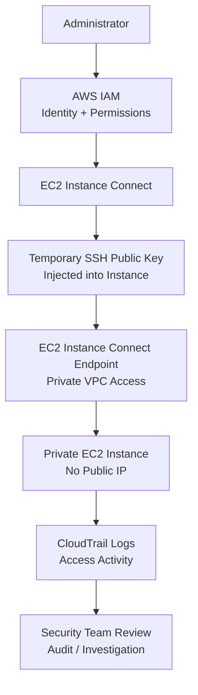

# EC2 Instance Connect

## What Is EC2 Instance Connect?

EC2 Instance Connect is a service that provides secure SSH access to Amazon EC2 instances using temporary SSH keys and IAM-based access control.

It simplifies secure administrative access by:
- reducing long-term SSH key management
- centralizing access control
- improving auditability
- integrating with IAM permissions

EC2 Instance Connect is commonly used to securely access:
- Linux EC2 instances
- private workloads
- administrative servers
- development systems

---

## Why EC2 Instance Connect Matters for Security

Traditional SSH access methods often introduce security risks such as:
- unmanaged SSH keys
- shared credentials
- long-lived access
- difficult auditing
- bastion host exposure

EC2 Instance Connect improves security by:
- using temporary SSH keys
- controlling access through IAM
- reducing permanent key storage
- improving visibility into administrative access

Modern AWS architectures increasingly prefer:
- temporary access models
- centralized identity-based access
- auditable administration workflows

---

## Core Concepts

- EC2 Instance Connect uses IAM permissions for SSH access
- temporary SSH keys are pushed to the instance when needed
- long-term SSH key distribution is reduced
- access can be centrally controlled
- CloudTrail records access activity
- Instance Connect Endpoint supports private connectivity

Think of EC2 Instance Connect as:

> A secure and temporary SSH access mechanism integrated with AWS IAM.

---

## Common Security Use Cases

### Secure SSH Access

Provides secure SSH access to EC2 instances without manually distributing permanent SSH keys.

---

### Temporary SSH Key Injection

Temporary SSH keys are:
- generated dynamically
- pushed briefly to the instance
- automatically expire

This reduces:
- credential sprawl
- unmanaged keys
- long-term access risks

---

### Reducing Bastion Host Usage

EC2 Instance Connect can reduce reliance on:
- bastion hosts
- jump servers
- publicly exposed SSH endpoints

---

### Centralized Access Control

IAM policies control:
- who can connect
- which instances are accessible
- administrative permissions

---

### Secure Administrative Access

Useful for:
- administrators
- operations teams
- incident response teams
- temporary troubleshooting access

---

### Auditable Access Workflows

Access attempts and API calls are logged in:
- AWS CloudTrail

Useful for:
- investigations
- compliance
- operational visibility

---

## How EC2 Instance Connect Works

### Basic Workflow

1. A user authenticates with AWS IAM
2. IAM permissions are validated
3. A temporary SSH key is pushed to the instance
4. The user connects through SSH
5. The temporary key expires automatically

---

### Simple Architecture

```text
Administrator
      ↓
AWS IAM Authentication
      ↓
EC2 Instance Connect
      ↓
Temporary SSH Key Injection
      ↓
Amazon EC2 Instance
```
---
### Example Use case: secure SSH access to a private EC2 instance without a bastion host.

This shows:
- IAM-based access control
- temporary SSH key usage
- private access through EC2 Instance Connect Endpoint
- no public IP requirement
- CloudTrail audit visibility

---

## Important Components

### IAM Policies

IAM controls:
- who can use EC2 Instance Connect
- which EC2 instances are accessible
- access permissions

Least privilege access is important.

---

### Temporary SSH Keys

Temporary keys:
- reduce persistent credential risks
- expire automatically
- are injected only when required

---

### Security Groups

Security groups still control:
- inbound SSH access
- allowed source traffic
- instance network exposure

---

### EC2 Metadata

The instance receives temporary SSH key information through the instance metadata path.

---

### Instance Connect Endpoint

EC2 Instance Connect Endpoint allows secure SSH access to private EC2 instances without requiring:
- public IP addresses
- bastion hosts

Very important for secure private architectures.

---

## Important Integrations

### AWS IAM

IAM controls:
- authentication
- authorization
- administrative access

---

### Amazon EC2

Used to securely access EC2 instances.

---

### AWS CloudTrail

CloudTrail logs:
- access attempts
- API actions
- Instance Connect activity

Useful for:
- auditing
- investigations
- compliance

---

### Amazon VPC

Instance Connect Endpoint supports:
- private VPC access
- internal administration
- secure connectivity

---

### Security Groups

Security groups control:
- allowed SSH traffic
- access restrictions
- inbound network rules

---

### AWS Systems Manager

Often compared with:
- Session Manager

Both improve secure administration but operate differently.

---

### AWS IAM Identity Center

Can integrate with centralized workforce identity management.

Useful in:
- enterprise environments
- multi-account architectures

---

## Security Features

### Temporary Access

Access is temporary rather than permanently configured.

This reduces:
- long-term credential exposure
- stale SSH keys
- unmanaged access

---

### IAM-Based Access Control

Administrative access is controlled through:
- IAM users
- IAM roles
- IAM policies

This centralizes access governance.

---

### Reduced Key Management

Teams no longer need to:
- distribute permanent SSH keys
- manually rotate keys
- manage large key inventories

---

### CloudTrail Logging

CloudTrail provides visibility into:
- access attempts
- user activity
- administrative operations

---

### Private Connectivity

Instance Connect Endpoint allows access to:
- private EC2 instances
- instances without public IP addresses

---

### Elimination of Shared SSH Keys

Improves accountability because:
- users authenticate individually
- access is tied to IAM identity
- activity can be audited

---

## Monitoring and Logging

### CloudTrail Events

CloudTrail records:
- SendSSHPublicKey API calls
- access attempts
- administrative activity

---

### Connection Auditing

Useful for:
- compliance reviews
- forensic investigations
- operational monitoring

---

### Login Tracking

Organizations can monitor:
- who connected
- when access occurred
- which instance was accessed

---

### IAM Policy Monitoring

Security teams should monitor:
- overly broad IAM permissions
- unauthorized access policies
- administrative access changes

---

## Cost and Performance Considerations

### Operational Simplicity

Reduces:
- key management overhead
- bastion maintenance
- administrative complexity

---

### Reduced Bastion Costs

Can reduce or eliminate:
- bastion host infrastructure
- public jump servers
- related operational costs

---

### Connectivity Requirements

SSH traffic still requires:
- network connectivity
- appropriate security group rules

---

### Regional Availability

Features may vary by Region.

Always verify current AWS support and capabilities.

---

## Service Comparisons

### EC2 Instance Connect vs Bastion Hosts

| EC2 Instance Connect | Bastion Host |
|---|---|
| temporary SSH access | persistent jump server |
| IAM-based access | key-based access |
| reduced operational overhead | requires maintenance |
| improved auditing | additional attack surface |

---

### EC2 Instance Connect vs Session Manager

| EC2 Instance Connect | Session Manager |
|---|---|
| uses SSH | no SSH required |
| requires SSH connectivity | works without inbound SSH |
| temporary SSH keys | browser/CLI session access |
| traditional SSH workflow | agent-based management |

---

### EC2 Instance Connect Endpoint vs Public SSH Access

| Instance Connect Endpoint | Public SSH Access |
|---|---|
| private connectivity | internet exposure |
| no public IP required | public IP commonly required |
| reduced attack surface | greater exposure risk |

---

## Common Exam Scenarios

### Scenario 1

A company wants secure SSH access without managing long-term SSH keys.

Answer:
Use EC2 Instance Connect.

---

### Scenario 2

A company wants administrators to access private EC2 instances without bastion hosts.

Answer:
Use EC2 Instance Connect Endpoint.

---

### Scenario 3

A security team wants centralized IAM-based control over EC2 administrative access.

Answer:
Use EC2 Instance Connect.

---

### Scenario 4

A company wants auditable temporary SSH access to EC2 instances.

Answer:
Use EC2 Instance Connect with CloudTrail logging.

---

### Scenario 5

A company wants administrative access without opening SSH to the internet.

Answer:
Use EC2 Instance Connect Endpoint or Systems Manager Session Manager.

---

## Common Exam Traps

### Trap 1 — Confusing Instance Connect with Session Manager

EC2 Instance Connect:
- still uses SSH

Session Manager:
- does not require SSH access

---

### Trap 2 — Forgetting Security Group Requirements

SSH access still requires:
- inbound security group rules
- appropriate network connectivity

---

### Trap 3 — Assuming Persistent SSH Keys

EC2 Instance Connect uses:
- temporary SSH keys

Not permanently stored keys.

---

### Trap 4 — Exposing SSH Publicly Unnecessarily

Modern architectures often prefer:
- private connectivity
- Instance Connect Endpoint
- Session Manager

instead of public SSH exposure.

---

### Trap 5 — Assuming IAM Alone Provides Network Access

IAM controls authorization.

Security groups and networking still control connectivity.

---

## Quick Revision Notes

- EC2 Instance Connect provides temporary SSH access
- integrates with IAM permissions
- reduces SSH key management
- supports CloudTrail auditing
- uses temporary SSH key injection
- still requires SSH connectivity
- Instance Connect Endpoint supports private access
- can reduce bastion host usage
- improves centralized administrative control
- Session Manager does not require SSH
