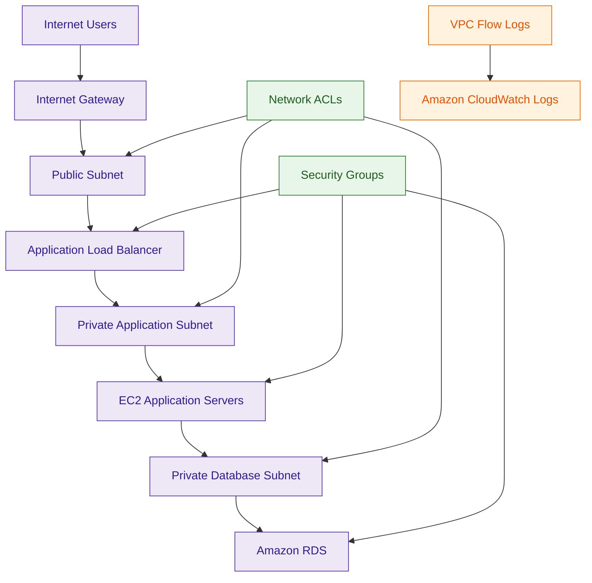
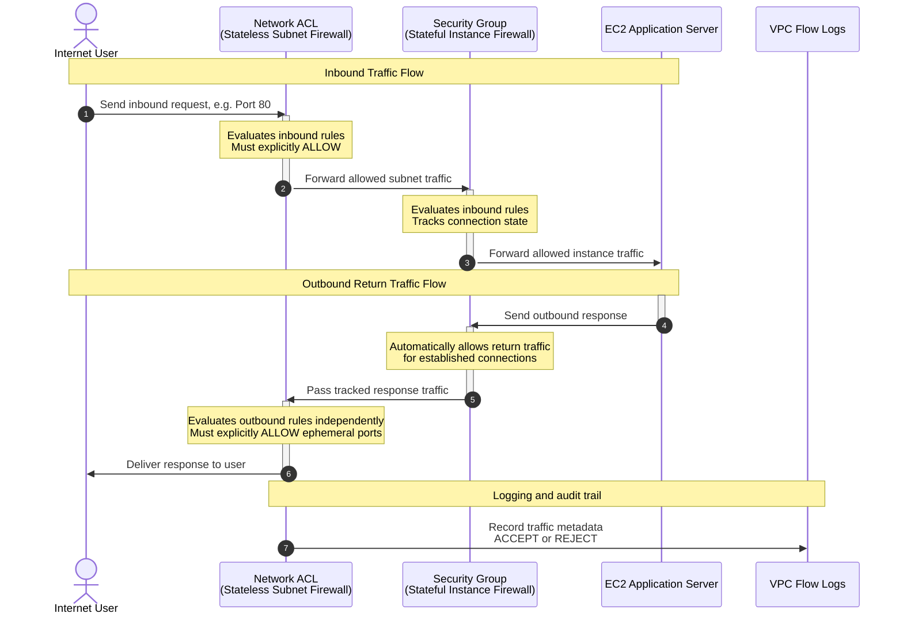

# Network Access Control Lists (Network ACLs / NACLs)

## What Are Network ACLs?

Network Access Control Lists (NACLs) are subnet-level stateless firewalls used within Amazon VPC.

NACLs control inbound and outbound traffic for entire subnets.

They allow organizations to define:

- allow rules
- deny rules
- subnet traffic filtering
- coarse-grained segmentation

Think of NACLs as:

> Stateless subnet firewalls for Amazon VPC environments.

---

## Why They Matter for Security

NACLs provide an additional security layer beyond Security Groups.

Security teams use NACLs for:

- subnet isolation
- explicit deny controls
- broad traffic filtering
- compliance segmentation
- network boundary enforcement

NACLs are commonly used to:

- block malicious IP ranges
- restrict subnet communication
- enforce segmentation boundaries
- implement defense-in-depth architectures

They are heavily used in:

- regulated environments
- enterprise networking
- layered security architectures
- hybrid connectivity environments

NACLs improve:

- subnet-level protection
- network governance
- segmentation assurance

---

## Core Concepts

- subnet-level firewall
- stateless traffic filtering
- supports allow and deny rules
- separate inbound and outbound rule sets
- sequential rule processing
- applies to all subnet resources
- coarse-grained traffic filtering
- defense-in-depth networking layer

---

## Important Integrations

### Amazon VPC

NACLs operate at the subnet level inside Amazon VPC.

---

### Security Groups

Security Groups provide stateful instance-level filtering.

NACLs and Security Groups commonly work together.

---

### Route Tables

Route tables determine traffic paths while NACLs determine whether traffic is allowed.

---

### Internet Gateways

NACLs commonly filter internet-facing subnet traffic.

---

### NAT Gateways

NACLs commonly protect private subnets using NAT Gateways.

---

### AWS Transit Gateway

NACLs can filter traffic flowing through centralized routing architectures.

---

### AWS Direct Connect

Supports hybrid traffic filtering between AWS and on-premises environments.

---

### AWS Site-to-Site VPN

NACLs can filter VPN-connected subnet traffic.

---

### VPC Flow Logs

Used for:

- traffic investigations
- denied traffic analysis
- troubleshooting

Very important operational integration.

---

## Security Features

### Stateless Firewall Behavior

NACLs are stateless.

This means:

- inbound and outbound traffic are evaluated independently
- return traffic must be explicitly allowed

Very important networking distinction.

---

### Subnet-Level Filtering

NACLs apply to:

- entire subnets

All resources inside the subnet inherit the same NACL behavior.

---

### Explicit Deny Rules

Unlike Security Groups, NACLs support:

- explicit deny rules

Very important segmentation capability.

Example:

- deny traffic from malicious IP ranges

---

### Sequential Rule Evaluation

NACL rules are processed in numerical order.

The first matching rule determines the result.

Very important operational behavior.

---

### Separate Inbound and Outbound Rules

NACLs maintain independent rule sets for:

- inbound traffic
- outbound traffic

Both directions must allow traffic for successful communication.

---

### Ephemeral Port Requirements

Because NACLs are stateless:

- return traffic requires ephemeral ports to be explicitly allowed

Example:

- inbound HTTP on port 80 allowed
- outbound ephemeral ports (1024-65535) must also be allowed

Otherwise:
- responses may fail unexpectedly

Very common troubleshooting scenario.

---

### Default vs Custom NACLs

Default NACLs:
- allow all inbound traffic
- allow all outbound traffic

Custom NACLs:
- deny all inbound traffic
- deny all outbound traffic

Rules must be explicitly configured.

---

### Catch-All Deny Rule

Every NACL includes a final unmodifiable `*` rule.

This rule acts as:

- catch-all deny
- final fallback rule
- default drop behavior

If traffic does not match any numbered rule above it, the `*` rule denies the traffic.

Very important troubleshooting concept.

---

### Rule Numbering Best Practice

NACL rules should commonly be numbered with spacing such as:

- 100
- 110
- 120

or:

- 100
- 200
- 300

This allows administrators to insert new rules later without rebuilding the full rule set.

Example:

- existing allow rule: 110
- emergency deny rule: 105

Because lower numbers evaluate first, the deny rule can override later allow rules.

---

### Subnet Association Behavior

A subnet can be associated with:

- exactly one NACL at a time

A single NACL can be associated with:

- multiple subnets

This makes NACLs useful for applying consistent subnet-level filtering across similar subnet groups.

---

### Coarse-Grained Segmentation

NACLs are commonly used for:

- broad subnet restrictions
- segmentation boundaries
- compliance enforcement

They are not typically used for fine-grained workload permissions.

---

### Defense-in-Depth Networking

Organizations commonly combine:

- NACLs
- Security Groups
- AWS Network Firewall
- routing controls

for layered network security.

---

## Architecture Example

### Layered VPC Network Security Architecture

**Use case:** layered VPC security architecture using subnet-level and instance-level filtering.

---

## Stateless Filtering Workflow

**Use case:** understanding stateless filtering and ephemeral port behavior.

---

## Network ACLs vs Security Groups

| Network ACLs | Security Groups |
|---|---|
| stateless firewall | stateful firewall |
| subnet-level filtering | instance-level filtering |
| supports allow and deny rules | supports allow rules only |
| rules evaluated sequentially | rules evaluated collectively |
| coarse-grained filtering | fine-grained workload protection |

Use NACLs when:

- filtering subnet traffic
- implementing explicit deny rules
- enforcing segmentation boundaries

Use Security Groups when:

- protecting workloads
- implementing least privilege access
- controlling instance communication

---

## Network ACLs vs AWS Network Firewall

| Network ACLs | AWS Network Firewall |
|---|---|
| subnet-level filtering | advanced managed firewall |
| basic allow and deny rules | deep packet inspection |
| stateless filtering | stateful traffic inspection |
| lightweight VPC protection | enterprise traffic inspection |

Use NACLs when:

- implementing basic subnet filtering
- creating broad segmentation controls
- blocking malicious IP ranges

Use Network Firewall when:

- performing IDS/IPS inspection
- inspecting traffic deeply
- implementing advanced firewall policies

---

## Common Exam Traps

### Trap 1 — Confusing NACLs and Security Groups

NACLs:
- stateless
- subnet-level

Security Groups:
- stateful
- instance-level

Very important distinction.

---

### Trap 2 — Forgetting Ephemeral Ports

Because NACLs are stateless:
- return traffic requires ephemeral port rules

Very common networking troubleshooting issue.

---

### Trap 3 — Assuming NACLs Automatically Allow Return Traffic

Unlike Security Groups:
- NACLs do not automatically allow response traffic

---

### Trap 4 — Forgetting Rule Order

NACL rules are processed sequentially.

Lower-numbered rules are evaluated first.

---

### Trap 5 — Forgetting Explicit Deny Capability

NACLs support:
- explicit deny rules

Security Groups do not.

---

### Trap 6 — Assuming NACLs Provide Fine-Grained Workload Control

NACLs:
- broad subnet filtering

Security Groups:
- workload-level permissions

---

### Trap 7 — Forgetting Default NACL Behavior

Default NACL:
- allows all traffic

Custom NACL:
- denies all traffic until configured

---

### Trap 8 — Assuming NACLs Replace Security Groups

Best practice:
- use both together

Defense-in-depth architecture pattern.

---

### Trap 9 — Forgetting the Final `*` Deny Rule

Every NACL ends with a final unmodifiable `*` rule.

If no numbered rule matches:
- traffic is denied

This is why missing ephemeral port rules can silently break return traffic.

---

## 5-Second Recall

### Identity

NACL = stateless subnet-level firewall for Amazon VPC

---

### Keywords

If the scenario mentions:

- subnet filtering
- explicit deny rules
- stateless firewall
- ephemeral ports
- sequential firewall rules
- broad segmentation

Answer:

→ Network ACLs

---

### Stateful Firewall Trigger

If the requirement involves:

- automatic return traffic handling
- instance-level filtering
- workload access control

Answer:

→ Security Groups

---

### Stateless Firewall Trigger

If the scenario involves:

- subnet-level controls
- explicit deny rules
- ephemeral port troubleshooting

Answer:

→ Network ACLs

---

### Deep Packet Inspection Trigger

If the requirement involves:

- IDS/IPS
- deep packet inspection
- multi-VPC traffic inspection

Answer:

→ AWS Network Firewall

---

### Need to block a malicious IP at subnet level?

→ Network ACLs

---

### Need dynamic workload-to-workload access?

→ Security Group referencing

---

### Need deep packet inspection across VPCs?

→ AWS Network Firewall

---

### Need layered VPC security?

→ NACLs + Security Groups

---

## Quick Revision Notes

- subnet-level stateless firewall
- supports allow and deny rules
- rules evaluated sequentially
- applies to entire subnet
- inbound and outbound rules evaluated independently
- return traffic requires ephemeral ports
- default NACL allows all traffic
- custom NACL denies all traffic until configured
- every NACL ends with a final `*` deny rule
- supports explicit deny rules
- Security Groups are stateful, NACLs are stateless
- one subnet can use only one NACL
- one NACL can protect multiple subnets
- commonly used for coarse-grained segmentation
- important defense-in-depth networking component
