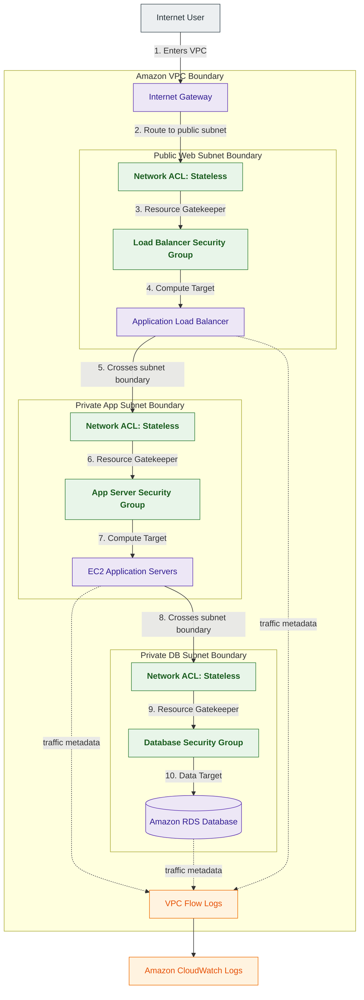
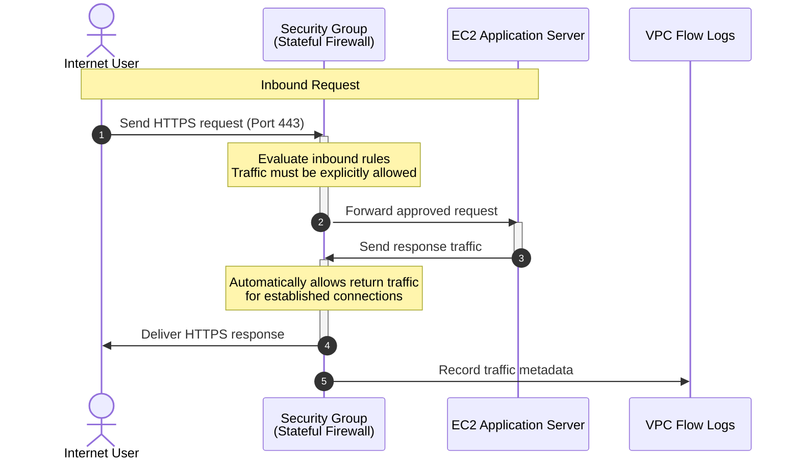

# Security Groups

## What Are Security Groups?

Security Groups are stateful virtual firewalls used within Amazon VPC to control network traffic for AWS resources such as:

- EC2 instances
- Elastic Network Interfaces (ENIs)
- RDS databases
- Lambda functions inside VPCs
- ECS and EKS workloads

Security Groups regulate:

- inbound traffic
- outbound traffic
- workload-level network access

Think of Security Groups as:

> Stateful workload-level firewalls for AWS resources.

---

## Why They Matter for Security

Security Groups are one of the most important AWS security controls.

They are foundational for:

- least privilege networking
- workload isolation
- application segmentation
- east-west traffic control
- cloud-native security architectures

Security teams use Security Groups to:

- restrict workload communication
- isolate application tiers
- reduce attack surface
- prevent unauthorized access
- implement zero-trust networking

Security Groups are heavily used in:

- production cloud environments
- private application architectures
- regulated workloads
- containerized environments

Almost every AWS workload depends on Security Groups for network protection.

---

## Core Concepts

- stateful virtual firewall
- workload-level traffic filtering
- supports allow rules only
- automatically tracks connection state
- attached to ENIs and workloads
- inbound and outbound rule sets
- supports Security Group referencing
- foundational AWS network security control

---

## Important Integrations

### Amazon EC2

Primary compute service protected by Security Groups.

---

### Elastic Network Interfaces (ENIs)

Security Groups are attached to ENIs.

All attached resources inherit Security Group behavior.

---

### Amazon RDS

Security Groups commonly restrict database access to approved application tiers.

---

### Elastic Load Balancing (ELB)

Security Groups control traffic to:

- Application Load Balancers
- Network Load Balancers

---

### AWS Lambda

Lambda functions inside VPCs use Security Groups for network access control.

---

### Amazon ECS and Amazon EKS

Security Groups commonly protect containerized workloads.

---

### Network ACLs (NACLs)

Provide subnet-level stateless filtering.

Security Groups and NACLs commonly work together.

---

### AWS Transit Gateway

Security Groups help control east-west communication across connected VPCs.

---

### VPC Flow Logs

Used for:

- traffic investigations
- denied traffic analysis
- troubleshooting

---

## Security Features

### Stateful Firewall Behavior

Security Groups are stateful.

This means:

- return traffic is automatically allowed for established connections

Example:

- inbound HTTPS request allowed
- response traffic automatically permitted

Very important networking distinction.

---

### Workload-Level Filtering

Security Groups operate at the workload level.

They commonly protect:

- EC2 instances
- databases
- load balancers
- container workloads

---

### Allow Rules Only

Security Groups support:

- allow rules only

They do not support:
- explicit deny rules

Anything not explicitly allowed is implicitly denied.

---

### Security Group Referencing

Security Groups can reference other Security Groups as traffic sources.

Example:

- database Security Group allows inbound traffic only from application Security Group

instead of:
- specific IP addresses

This enables:

- dynamic scaling
- identity-based segmentation
- simplified administration

Very important cloud-native networking concept.

---

### Inbound and Outbound Rules

Security Groups maintain separate rule sets for:

- inbound traffic
- outbound traffic

Both directions influence workload communication behavior.

---

### Automatic Return Traffic Handling

Security Groups automatically allow return traffic for established sessions.

Unlike NACLs:
- ephemeral ports do not require manual configuration

Very important operational distinction.

---

### Multiple Security Groups Per ENI

By default, AWS allows multiple Security Groups to be associated with a single ENI.

The effective permissions become:

- the logical OR (union) of all allowed rules

This enables modular security design patterns such as:

- shared baseline controls
- application-specific access
- environment segmentation

---

### Collective Rule Evaluation

Security Groups evaluate all rules collectively.

Because Security Groups support only allow rules:

- permissions are additive
- the effective rule set becomes the union of all allowed traffic

Example:

- Rule 1 allows 10.0.0.0/16
- Rule 2 allows 0.0.0.0/0

Result:
- internet-wide access becomes allowed

Very important least-privilege networking consideration.

---

### Default Deny Behavior

Security Groups start with:

- no inbound access allowed

Traffic must be explicitly permitted.

Very important least privilege security model.

---

### Dynamic Cloud-Native Security

Security Groups adapt well to:

- Auto Scaling
- ECS tasks
- EKS workloads
- ephemeral infrastructure

because rules can reference identities instead of static IP addresses.

---

### East-West Traffic Segmentation

Security Groups commonly control:

- application-to-database traffic
- workload-to-workload communication
- internal service access

Very important zero-trust architecture capability.

---

## Architecture Example

### Secure Multi-Tier Application Architecture

**Use case:** layered workload isolation using subnet-level NACL filtering and workload-level Security Groups.

---

## Stateful Traffic Workflow

**Use case:** understanding stateful Security Group traffic behavior.

---

## Security Group Referencing vs Static IP Firewalls

| Security Group Referencing | Static IP Firewalls |
|---|---|
| identity-based access model | IP-based access model |
| supports dynamic cloud scaling | requires IP tracking |
| ideal for Auto Scaling environments | operationally rigid |
| lower operational overhead | higher administrative complexity |

Use Security Group referencing when:

- workloads scale dynamically
- instances change frequently
- cloud-native segmentation is required

---

## Security Groups vs Network ACLs

| Security Groups | Network ACLs |
|---|---|
| stateful firewall | stateless firewall |
| workload-level filtering | subnet-level filtering |
| supports allow rules only | supports allow and deny rules |
| automatically handles return traffic | requires explicit ephemeral ports |
| fine-grained workload protection | coarse-grained subnet segmentation |

Use Security Groups when:

- protecting workloads
- implementing least privilege networking
- controlling application communication

Use NACLs when:

- enforcing subnet boundaries
- implementing explicit deny rules
- creating broad segmentation

---

## Security Groups vs AWS Network Firewall

| Security Groups | AWS Network Firewall |
|---|---|
| workload-level firewall | managed enterprise firewall |
| lightweight allow-based filtering | advanced traffic inspection |
| stateful access control | IDS/IPS and deep packet inspection |
| protects workloads directly | protects network traffic flows |

Use Security Groups when:

- controlling workload communication
- implementing least privilege access
- protecting EC2 and databases

Use Network Firewall when:

- inspecting traffic deeply
- enforcing enterprise firewall policies
- implementing IDS/IPS controls

---

## Common Exam Traps

### Trap 1 — Confusing Security Groups and NACLs

Security Groups:
- stateful
- workload-level

NACLs:
- stateless
- subnet-level

Very important distinction.

---

### Trap 2 — Forgetting Security Groups Are Stateful

Security Groups automatically allow:

- return traffic for established connections

Ephemeral ports do not require manual rules.

---

### Trap 3 — Assuming Security Groups Support Deny Rules

Security Groups:
- allow only

They do not support:
- explicit deny rules

---

### Trap 4 — Forgetting Security Group Referencing

Security Groups can reference:

- other Security Groups

Very important cloud-native security feature.

---

### Trap 5 — Assuming Rule Order Matters

Security Groups:
- evaluate all rules collectively

Unlike NACLs:
- rule order does not matter

---

### Trap 6 — Forgetting Rules Are Additive

Security Groups merge all allowed rules together.

The most permissive rule effectively wins.

Example:

- allow 10.0.0.0/16
- allow 0.0.0.0/0

Result:
- internet-wide access allowed

---

### Trap 7 — Assuming Public Subnet Means Public Access

A workload still requires:

- public IP
- allowed Security Group rules
- internet-routable path

before becoming publicly accessible.

---

### Trap 8 — Forgetting Default Deny Behavior

Security Groups deny inbound traffic unless explicitly allowed.

---

### Trap 9 — Assuming Security Groups Replace Defense-in-Depth

Best practice:
- combine Security Groups with:
  - NACLs
  - Network Firewall
  - routing controls

---

## 5-Second Recall

### Identity

Security Groups = stateful workload-level firewall for AWS resources

---

### Keywords

If the scenario mentions:

- workload firewall
- instance-level filtering
- stateful firewall
- least privilege networking
- Security Group referencing
- automatic return traffic

Answer:

→ Security Groups

---

### Stateful Firewall Trigger

If the requirement involves:

- automatic return traffic handling
- workload-level segmentation
- identity-based networking

Answer:

→ Security Groups

---

### Stateless Firewall Trigger

If the scenario involves:

- subnet filtering
- explicit deny rules
- ephemeral port configuration

Answer:

→ Network ACLs

---

### Cloud-Native Segmentation Trigger

If the requirement involves:

- dynamic scaling
- workload identity filtering
- SG-to-SG communication

Answer:

→ Security Group referencing

---

### Deep Inspection Trigger

If the requirement involves:

- IDS/IPS
- deep packet inspection
- enterprise traffic inspection

Answer:

→ AWS Network Firewall

---

### Need explicit deny rules?

→ Network ACLs

---

### Need workload-to-workload filtering?

→ Security Groups

---

### Need subnet segmentation?

→ Network ACLs

---

### Need least privilege workload access?

→ Security Groups

---

## Quick Revision Notes

- stateful workload-level firewall
- attached to ENIs and workloads
- supports allow rules only
- automatically allows return traffic
- supports Security Group referencing
- workload-focused network protection
- no explicit deny rules
- rules evaluated collectively
- effective permissions are additive
- supports multiple SGs per ENI
- foundational AWS least privilege networking control
- Security Groups are stateful, NACLs are stateless
- heavily used for east-west traffic segmentation
- foundational AWS workload security mechanism
