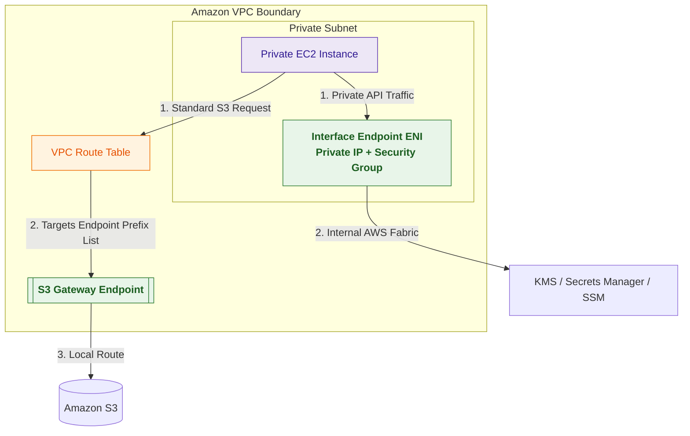
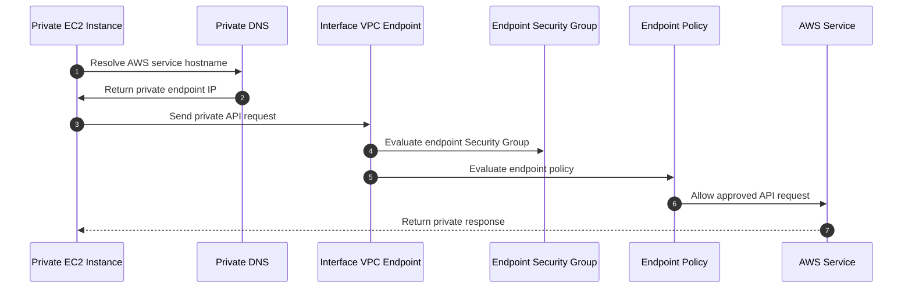

# VPC Endpoints

## What Are VPC Endpoints?

VPC Endpoints allow private connectivity from resources inside a VPC to supported AWS services without using the public internet.

They help workloads access services such as:

- Amazon S3
- DynamoDB
- Systems Manager
- Secrets Manager
- AWS KMS
- Amazon CloudWatch
- Amazon ECR

Think of VPC Endpoints as:

> Private connectivity paths from your VPC to AWS services.

---

## Why They Matter for Security

VPC Endpoints reduce exposure by avoiding:

- internet gateways
- public IP addresses
- NAT gateways for AWS service access
- public internet routing

Security teams use VPC Endpoints for:

- private AWS service access
- data exfiltration reduction
- least privilege networking
- secure private workloads
- regulated environments
- centralized VPC architectures

They are especially important when private instances need secure access to AWS APIs and services.

---

## Core Concepts

- private connectivity to AWS services
- traffic stays on AWS network
- no public IP required
- no internet gateway required
- reduces NAT Gateway dependency
- supports endpoint policies
- supports private service access
- foundational private subnet architecture component

---

## Types of VPC Endpoints

### Gateway Endpoints

Gateway Endpoints are used for:

- Amazon S3
- Amazon DynamoDB

They work through route table entries.

Key points:

- no ENI created
- no hourly endpoint charge
- route-table based
- highly common for private S3 access

---

### Interface Endpoints

Interface Endpoints are powered by AWS PrivateLink.

They create Elastic Network Interfaces inside your subnet.

Used for services such as:

- Systems Manager
- Secrets Manager
- KMS
- CloudWatch
- ECR
- STS
- many AWS APIs

Key points:

- uses ENIs with private IPs
- supports Security Groups
- has hourly and data processing charges
- enables private API access

---

## Important Integrations

### Amazon S3

Gateway Endpoints commonly provide private S3 access from private subnets.

S3 also supports Interface Endpoints for advanced hybrid and PrivateLink architectures.

---

### Amazon DynamoDB

Uses Gateway Endpoints for private DynamoDB access.

---

### AWS Systems Manager

Interface Endpoints allow private EC2 management without internet access.

Common required endpoints:

- `ssm`
- `ssmmessages`
- `ec2messages`

---

### AWS Secrets Manager

Interface Endpoints allow private secret retrieval.

---

### AWS KMS

Interface Endpoints allow private key API access.

---

### Amazon ECR

Interface Endpoints support private container image pulls for ECS and EKS workloads.

---

### Amazon CloudWatch

Interface Endpoints support private metric and log delivery.

---

### IAM and Endpoint Policies

Endpoint policies restrict which actions and resources can be accessed through the endpoint.

Very important data perimeter control mechanism.

---

## Security Features

### Private AWS Service Access

VPC Endpoints allow private workloads to access AWS services without public internet exposure.

This improves:

- confidentiality
- network isolation
- compliance posture

---

### Reduced NAT Gateway Dependency

Private workloads can access AWS services without routing through NAT Gateways.

This reduces:

- internet exposure
- routing complexity
- dependency on outbound internet paths

---

### Endpoint Policies

Endpoint policies control what actions are allowed through the endpoint.

Example:

- allow access only to approved S3 buckets
- restrict access to specific AWS accounts
- allow only approved API actions

Endpoint policies are very important for data perimeter architectures.

---

### Endpoint Policy Behavior

Endpoint policies use IAM policy logic.

This means:

- allowed actions must be explicitly permitted
- anything not allowed is implicitly denied
- explicit deny can also be used when needed

Common pattern:

- allow access only to approved S3 buckets
- implicitly block access to all other buckets

---

### Security Group Control

Interface Endpoints use ENIs and can have Security Groups.

This allows:

- workload-level access control
- inbound endpoint restrictions
- private API governance

Gateway Endpoints do not use Security Groups.

---

### Data Exfiltration Reduction

Endpoints can help restrict access to approved AWS services and resources.

Common pattern:

- private subnet
- S3 Gateway Endpoint
- endpoint policy allowing only approved bucket
- no internet egress

Very important security architecture pattern.

---

### Private DNS

Interface Endpoints commonly support private DNS.

This allows standard AWS service DNS names to resolve to private endpoint IPs.

Example:

- `secretsmanager.region.amazonaws.com`

resolves privately inside the VPC.

---

### Cross-VPC and Hybrid Access Behavior

Interface Endpoints can support access from:

- same VPC
- peered VPCs
- Transit Gateway-connected VPCs
- hybrid networks

Gateway Endpoints are route-table based and generally apply only within the VPC route tables where they are configured.

Very important distinction for enterprise networking designs.

---

## Architecture Example

### Private AWS Service Access Without Internet

**Use case:** private workloads securely accessing AWS services without internet gateways, NAT gateways, or public IPs.

---

## Private API Access Workflow

**Use case:** secure private API access using Interface Endpoints and Private DNS.

---

## Gateway Endpoints vs Interface Endpoints

| Gateway Endpoints | Interface Endpoints |
|---|---|
| S3 and DynamoDB only | most supported AWS services |
| route table target | ENI with private IP |
| no Security Groups | supports Security Groups |
| no hourly endpoint charge | hourly and data processing charges |
| route-based connectivity | PrivateLink-based connectivity |

Use Gateway Endpoints when:

- accessing S3 privately
- accessing DynamoDB privately
- minimizing endpoint costs

Use Interface Endpoints when:

- accessing AWS APIs privately
- using Systems Manager, KMS, Secrets Manager
- requiring Security Group controls

---

## VPC Endpoints vs NAT Gateway

| VPC Endpoints | NAT Gateway |
|---|---|
| private AWS service access | outbound internet access |
| traffic stays on AWS network | traffic exits to internet |
| service-specific connectivity | general outbound access |
| supports endpoint policies | no service-specific restrictions |
| reduces internet exposure | still requires public egress |

Use VPC Endpoints when:

- private workloads only need AWS service access
- internet access should be minimized
- data perimeter controls are required

Use NAT Gateway when:

- workloads require internet access
- external repositories are required
- non-AWS services must be reached

---

## VPC Endpoints vs AWS PrivateLink

| VPC Endpoints | AWS PrivateLink |
|---|---|
| endpoint resource in your VPC | underlying private connectivity technology |
| used to access AWS services privately | powers Interface Endpoints |
| includes Gateway and Interface endpoints | service-provider architecture |
| customer-facing VPC feature | backend connectivity model |

Use VPC Endpoints when:

- connecting workloads privately to AWS services

Use PrivateLink when:

- publishing private services
- building provider-consumer architectures

---

## Common Exam Traps

### Trap 1 — Confusing Gateway and Interface Endpoints

Gateway Endpoints:
- S3 and DynamoDB
- route-table based

Interface Endpoints:
- most AWS services
- ENI based
- powered by PrivateLink

Very important distinction.

---

### Trap 2 — Assuming VPC Endpoints Provide Internet Access

VPC Endpoints provide private access to supported AWS services.

They do not provide general internet access.

---

### Trap 3 — Forgetting Endpoint Policies

Endpoint policies restrict accessible resources and API actions.

Very important for least privilege and data perimeter designs.

---

### Trap 4 — Assuming Gateway Endpoints Use Security Groups

Gateway Endpoints:
- do not use Security Groups

Interface Endpoints:
- support Security Groups

---

### Trap 5 — Forgetting Private DNS

Without private DNS enabled, applications may need endpoint-specific DNS names.

Very important operational detail.

---

### Trap 6 — Using NAT Gateway When Endpoint Is Better

If workloads only need AWS service access, VPC Endpoints are usually more secure and efficient than NAT Gateway.

---

### Trap 7 — Forgetting Systems Manager Endpoint Requirements

Private EC2 instances using Systems Manager commonly require:

- `ssm`
- `ssmmessages`
- `ec2messages`

Without these, Session Manager connectivity may fail.

---

### Trap 8 — Assuming Gateway Endpoints Work Across Peering or Transit Gateway

Gateway Endpoints are route-table based and generally used only inside the VPC where they are configured.

Interface Endpoints are better suited for:

- centralized architectures
- Transit Gateway environments
- peered VPCs
- hybrid access models

Very important enterprise networking distinction.

---

## 5-Second Recall

### Identity

VPC Endpoints = private connectivity from VPCs to AWS services

---

### Keywords

If the scenario mentions:

- private AWS service access
- no internet gateway
- no public IP
- endpoint policy
- private API access
- PrivateLink ENI

Answer:

→ VPC Endpoints

---

### S3 or DynamoDB Trigger

If the requirement involves:

- private S3 access
- private DynamoDB access
- route-table endpoint

Answer:

→ Gateway Endpoint

---

### Private AWS API Trigger

If the requirement involves:

- private Systems Manager access
- private Secrets Manager access
- private KMS access
- private CloudWatch access

Answer:

→ Interface Endpoint

---

### Internet Access Trigger

If the requirement involves:

- external websites
- public repositories
- non-AWS endpoints

Answer:

→ NAT Gateway

---

### Need private EC2 management without internet?

→ Systems Manager Interface Endpoints

---

### Need endpoint-level access restrictions?

→ Endpoint Policies

---

### Need private service publishing?

→ AWS PrivateLink

---

## Quick Revision Notes

- VPC Endpoints provide private AWS service connectivity
- traffic stays on AWS network
- no public IP required
- no internet gateway required
- Gateway Endpoints support S3 and DynamoDB
- Interface Endpoints use PrivateLink and ENIs
- Interface Endpoints support Security Groups
- Gateway Endpoints use route tables
- endpoint policies restrict actions and resources
- private DNS simplifies API access
- reduces NAT Gateway dependency
- improves data perimeter security
- Interface Endpoints support hybrid and centralized architectures
- foundational secure private subnet architecture feature
